# 🏆 Why Sonoran CAD?

## What is Sonoran CAD?

<figure>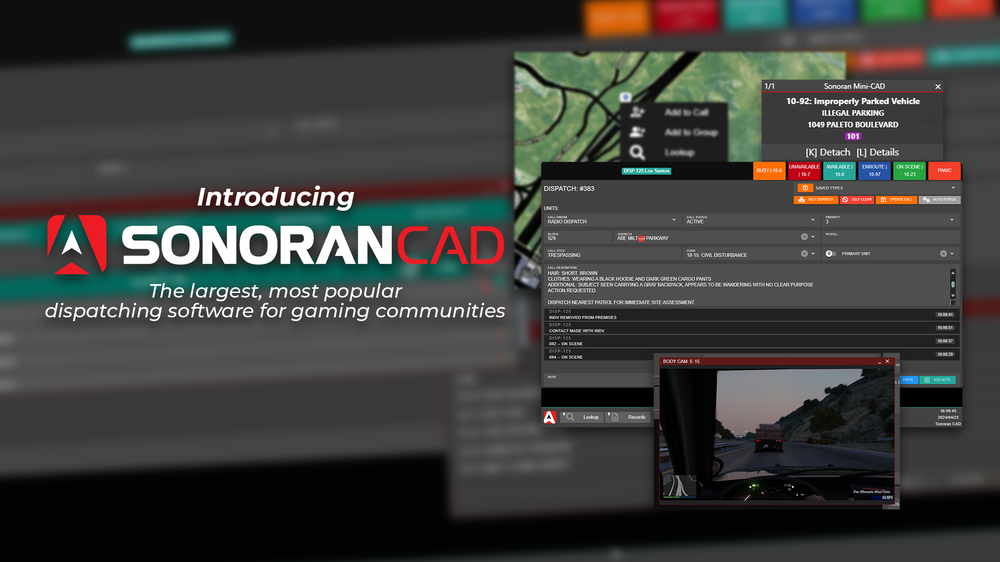<figcaption></figcaption></figure>

Sonoran CAD is the largest, most popular dispatch and records management system for gaming communities.

With seamless integrations for FiveM, ER:LC on Roblox, and more, it delivers unmatched power, speed, and customization—taking your roleplay experience to the next level.


[getting-started](tutorials/getting-started/)


### 📱 Downloadable Apps

In addition to our web version, you can download Sonoran CAD on the [iOS App Store](https://apps.apple.com/us/app/sonoran-cad/id1496539456), the [Google Play Store](https://play.google.com/store/apps/details?id=sonorancadmdt.app\&hl=en_US), or for [Windows Desktop](https://github.com/Sonoran-Software/SonoranCAD_Windows/releases/latest/download/Sonoran-CAD.exe).\
\
It's never been more easy to access your community's CAD system, regardless of what platform you're on!

<figure>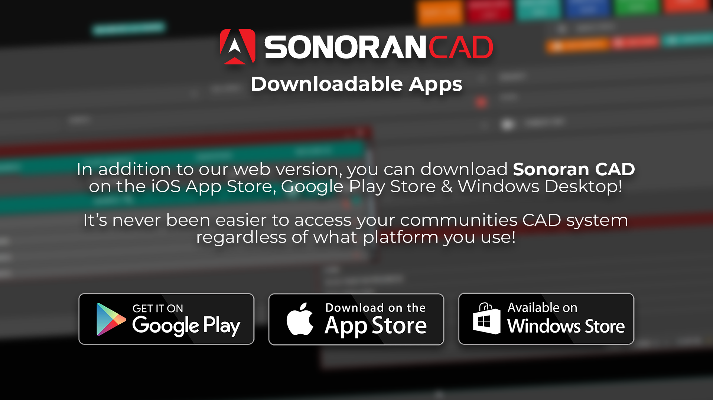<figcaption>
Sonoran CAD - Downloadable Apps
</figcaption></figure>

### 💾 Database Sync

Tired of having to manually register civilians? With Sonoran CAD's [Database Sync](integration-plugins/database-sync-and-merge/), all of your in-game characters, licenses, and vehicle registrations are automatically in your CAD!

<figure>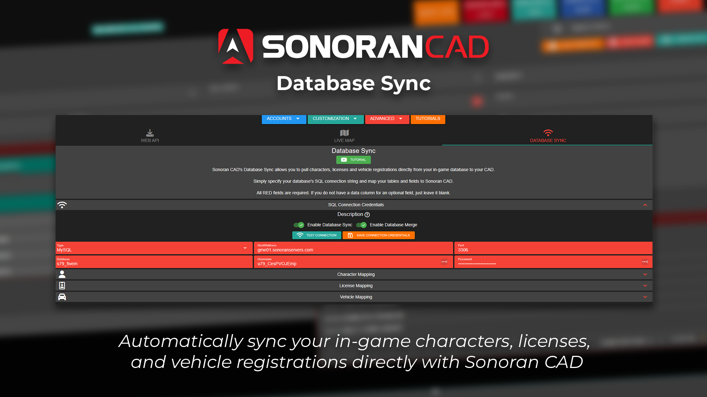<figcaption>
Sonoran CAD - Database Sync
</figcaption></figure>

### 🎮 FiveM In-Game Integration Plugins

Sonoran CAD's integration framework includes [**over a dozen drag-and-drop plugins**](integration-plugins/in-game-integration/fivem-installation/available-plugins/) for your game server!

<figure>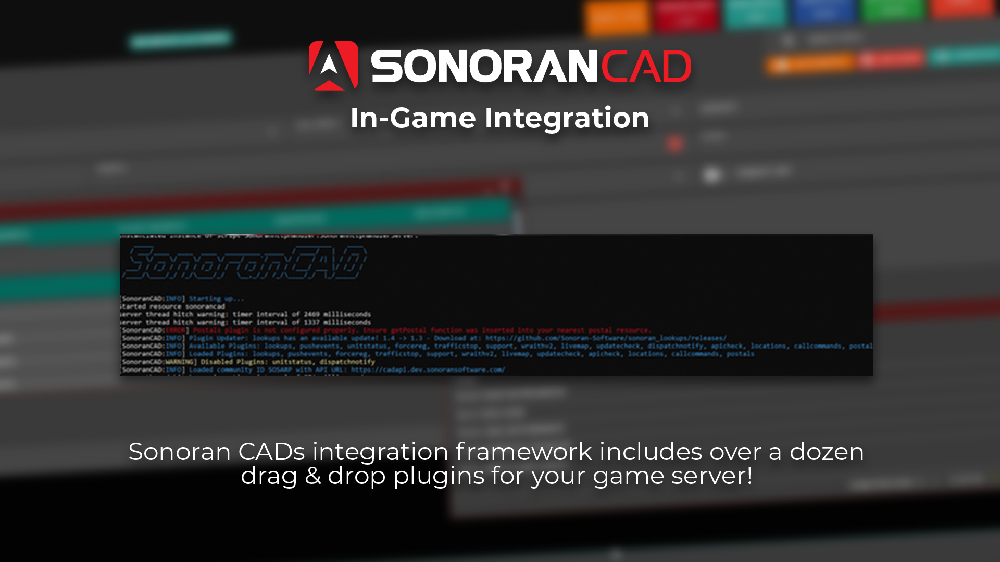<figcaption>
Sonoran CAD - In Game Integration
</figcaption></figure>

### 💬 Discord Permission Integration 

Our official [Discord bot](https://app.gitbook.com/@sonoran/s/sonoran-software/~/drafts/-Maqgxy_VS4uxPXm0a98/integration-plugins/discord-bot) automatically **syncs Discord roles with CAD account permissions**. This allows you to easily grant and remove permissions from a user's CAD account all through Discord!‌

​[Discord webhooks](https://app.gitbook.com/@sonoran/s/sonoran-software/~/drafts/-Maqgxy_VS4uxPXm0a98/integration-plugins/discord-webhooks) instantly notify your community when changes are made, calls are placed, units toggle their panic status, and more!

<figure>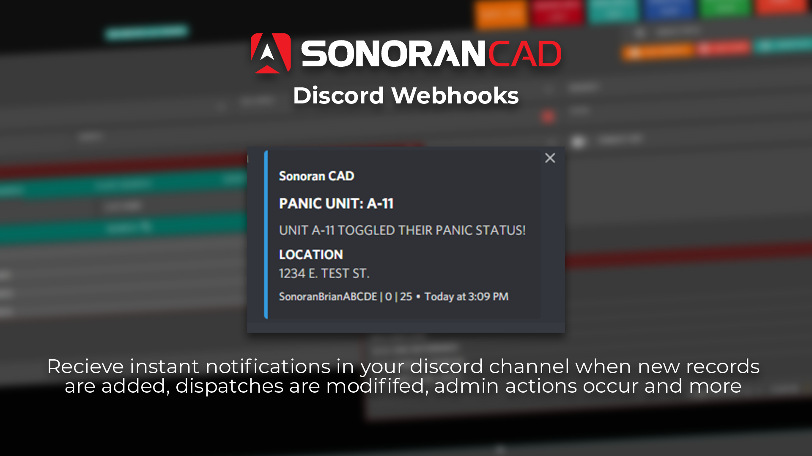<figcaption>
Sonoran CAD - Discord Webhooks
</figcaption></figure>

### 🌎 Full Translation and Locality Support

Only Sonoran CAD supports full [i18n localization](broken-reference). Regardless of your community's native language, Sonoran CAD supports it!\
\
Sonoran CAD is currently fully translated in Chinese, Russian, Spanish, Polish, Italian, German, Arabic, and more! Anyone is allowed to [contribute to our GitHub translation files](broken-reference).

Sonoran CAD also offers vast [geographical location](tutorials/customization/geographical-settings.md) support for non-American communities.

<figure>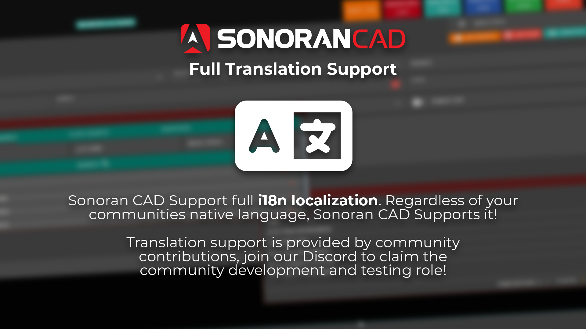<figcaption>
Sonoran CAD - Translations
</figcaption></figure>

### 🎥FiveM Live Bodycam Footage In-CAD

Sonoran CAD's [bodycam system](integration-plugins/in-game-integration/fivem-installation/available-plugins/bodycam.md) offers live image feeds from in-game, right in the CAD!

<figure><figcaption></figcaption></figure>

### 📍 FiveM Live Map

Sonoran CAD's custom[ live map plugin](integration-plugins/in-game-integration/fivem-installation/available-plugins/live-map.md) allows you to edit and view live unit information, emergency call blips, smart road signs, and more!

<figure>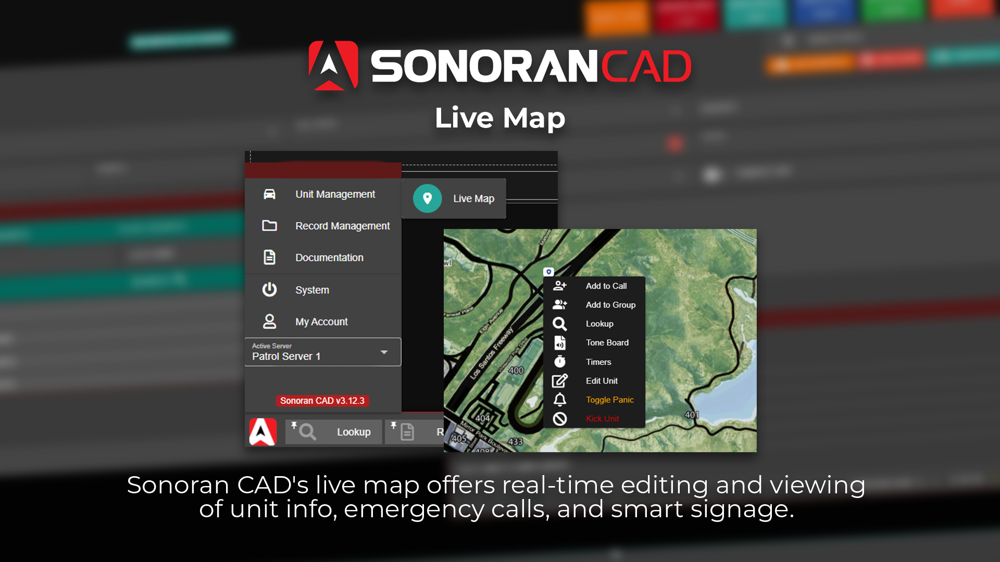<figcaption>
Sonoran CAD - Live Map
</figcaption></figure>

### [🛑](https://emojipedia.org/stop-sign/) FiveM Smart Signs Integration

We've partnered up with London Studios to integrate their Smart Signs script directly with Sonoran CAD! You can customize in-game roadway signs right from Sonoran CAD!

[Learn more about this free script included with Sonoran CAD Pro!](integration-plugins/in-game-integration/fivem-installation/available-plugins/smart-signs.md)

[View our showcase video on Smart Signs!](https://www.youtube.com/watch?v=ihfVSiB8oB8)

<figure><figcaption>
Sonoran CAD x London Studios
</figcaption></figure>

### 🚔 [FiveM ERS Integration](integration-plugins/in-game-integration/fivem-installation/available-plugins/ers.md)

Does your community play Emergency Response Simulator?

[Sonoran CAD's ERS integration](integration-plugins/in-game-integration/fivem-installation/available-plugins/ers.md) allows dispatchers to create callouts from the live map, lookup character records, and more!

<figure><figcaption>
Sonoran CAD x ERS
</figcaption></figure>

### 🚒 FiveM Station Alert Integration

We've partnered up with Inferno Collection to integrate their Station Alert script directly with Sonoran CAD! Dispatchers can toggle station doors, lights, and text-to-speech messages right from Sonoran CAD!

[Learn more about this free script included with Sonoran CAD Pro!](integration-plugins/in-game-integration/fivem-installation/available-plugins/station-alert.md)

<figure><figcaption>
Sonoran CAD x Inferno Collection
</figcaption></figure>

### [💻](https://emojipedia.org/laptop/) FiveM Mini CAD

Easily view and attach to calls, talk to other officers, and more all from the [in-game mini CAD](integration-plugins/in-game-integration/fivem-installation/available-plugins/tablet.md)!

<figure>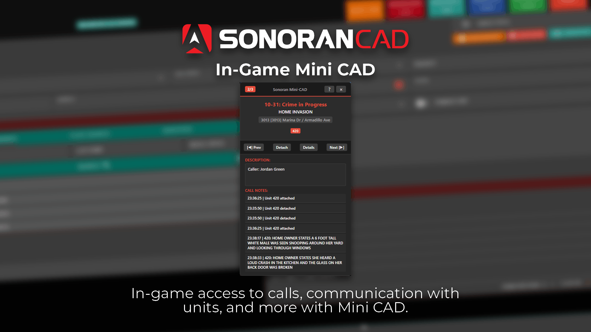<figcaption>
Sonoran CAD Mini-CAD
</figcaption></figure>

### 📞 [FiveM Local Callers](integration-plugins/in-game-integration/fivem-installation/available-plugins/local-callers.md)

Nearby civilian witnesses will place an emergency call during car jackings, weapon brandishing, death, and more. Stop or cut their information short by killing them in time!

<figure>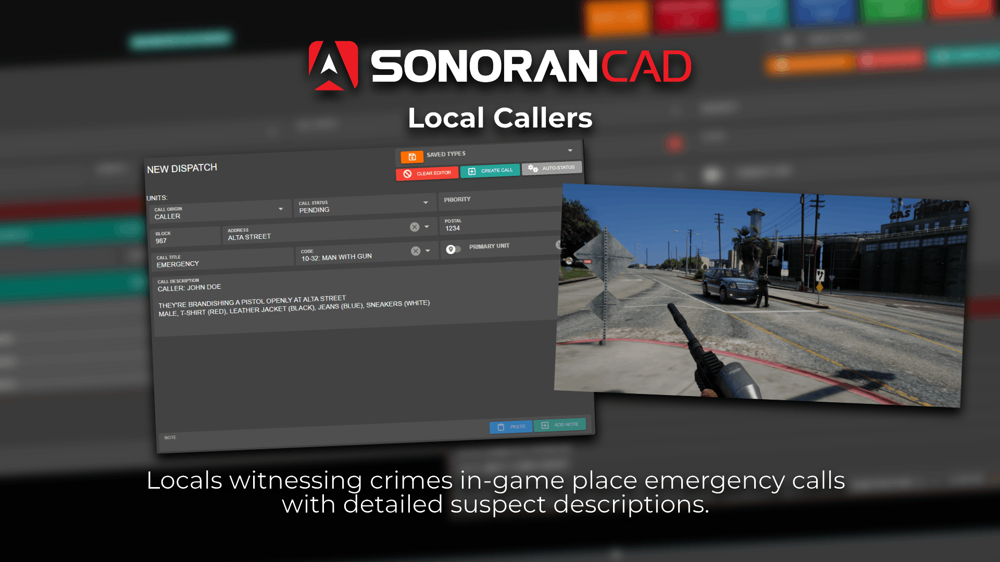<figcaption>
Sonoran CAD - Local Callers
</figcaption></figure>

### 📺 Twitch Bodycam, Bot, and Smart Lighting

<figure>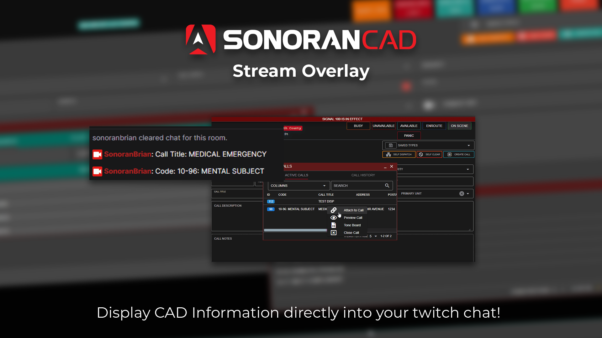<figcaption>
Sonoran CAD - Stream Overlay
</figcaption></figure>

 (1) (1).png>)

Sonoran CAD also offers a [customizable stream overlay and Twitch bot](integration-plugins/twitch-overlay-and-bot.md) to display your unit and attached call information in real time!

### &#x20;ER:LC Roblox Integration

.png>)

Do you play Roblox? Sonoran CAD is integrated with Emergency Response Liberty County!

Update your unit locations in real time, run name and plate searches, create automated traffic stops, and more!

### 💻 Multitasking Window and Tab System

Only Sonoran CAD lets you easily multitask and open multiple search windows, records, penal codes references, ten code lists, and more! Our workflow allows you to handle even the most complicated and demanding patrols.

[Every panel and window can be locked into position and customized.](tutorials/customization/customizing-your-layout.md)

Drag-and-drop allows you to easily view calls, attach units, and more!

<figure>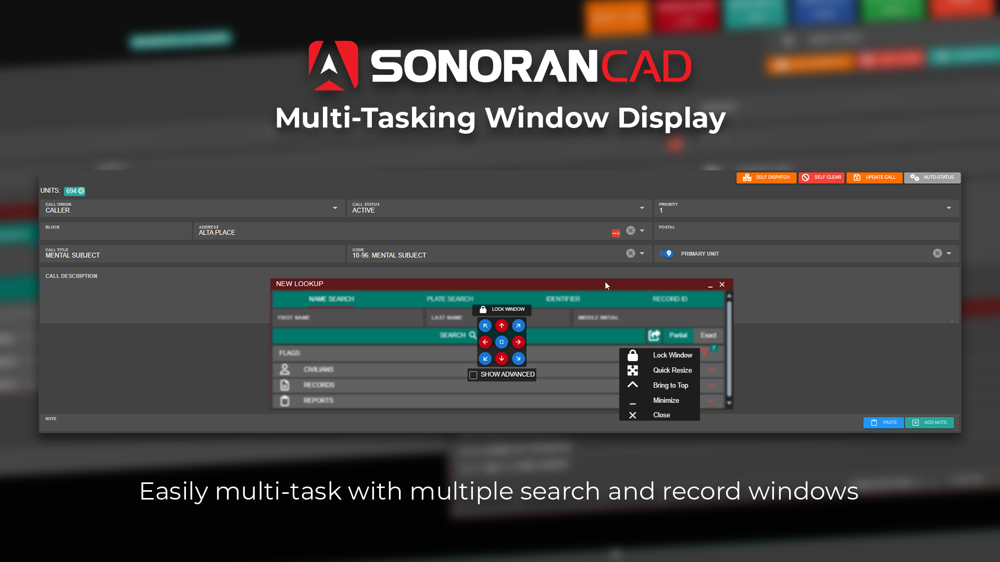<figcaption>
Sonoran CAD - Custom Layouts
</figcaption></figure>

### 🎤 [TeamSpeak 3 Integration](broken-reference)

Enforce security in your TeamSpeak 3 channels by requiring them to be signed into the CAD. Additionally, kick users from secured TS channels when they log off.

### 🔢 [Stream Deck Integration](integration-plugins/stream-deck-integration.md)

Check out our official [Stream Deck profiles](integration-plugins/stream-deck-integration.md) to change your unit status, panic, open a lookup, and more from a physical button. Along with the [Sonoran CAD desktop application](download/), these actions can be done even while the app is minimized.

<figure>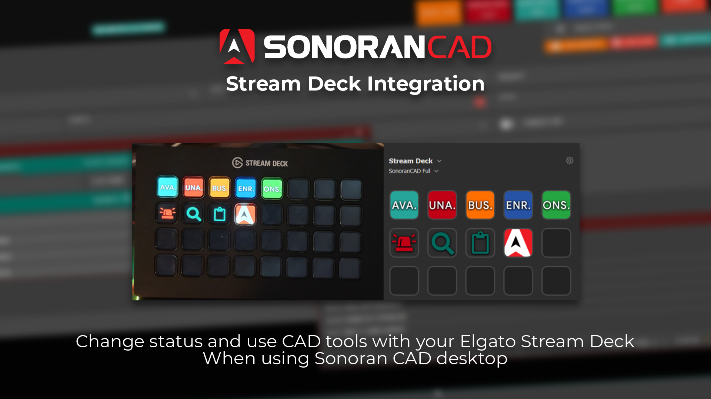<figcaption>
Sonoran CAD - Stream Deck Profile
</figcaption></figure>

### 📖 API Integration

In addition to over a dozen drag-and-drop integration [plugins](integration-plugins/in-game-integration/fivem-installation/available-plugins/), you can write your own integration plugins using our [API documentation](api-integration/).

We've complied extensive documentation for over two-dozen API endpoints and server [push events](api-integration/push-events/)!

Easily integrate external scripts with our [LUA and JS export examples](api-integration/api-examples/)!

<figure>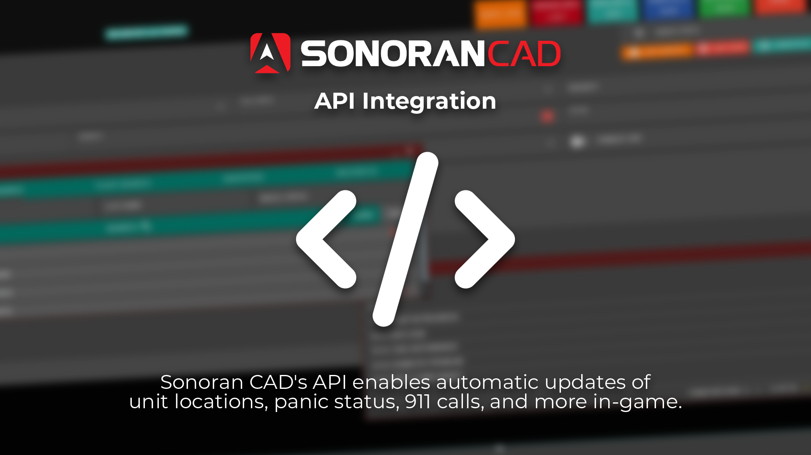<figcaption>
Sonoran CAD - API Integration
</figcaption></figure>

### 📝 Custom Records and Reports

Create your very own [custom report and record formats](tutorials/customization/creating-custom-record-and-report-types.md) for your community to use!

Whether it's your own firearms registration system, an in-depth vehicle accident report format, or a custom incident record, Sonoran CAD allows you to customize it all.

You can even index specific record fields for [custom search types](tutorials/customization/custom-search-types.md). Allowing you to run a lookup on your record's custom ID numbers, phone numbers, and more!

<figure>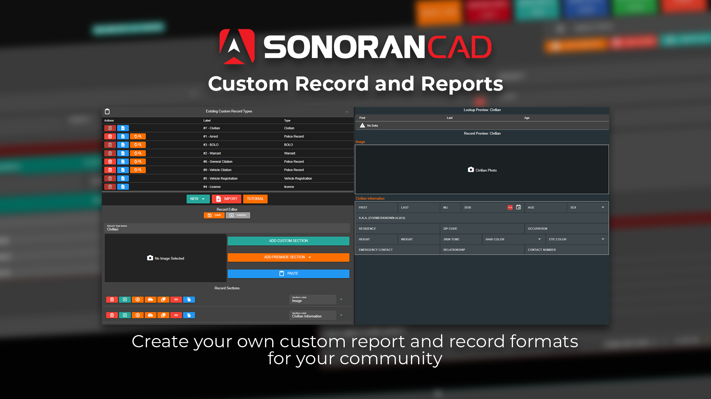<figcaption>
Sonoran CAD - Custom Reports
</figcaption></figure>

### [🧑‍🎨️ Scene Diagram Builder](tutorials/records-management/scene-diagram-builder.md)

Create detailed scene diagrams in custom reports!

<figure><figcaption>
Sonoran CAD - Diagram Builder
</figcaption></figure>

### 📧 Custom Branding

Sonoran CAD enables you to place your community's name and [branding](tutorials/customization/community-branding-and-info.md) in the CAD, [customize user account emails](tutorials/customization/custom-emails.md), host a [custom login page](tutorials/customization/custom-login-page.md) on **your own domain**, and more!

### 🧍 Self-Dispatch

Don't have a dedicated dispatcher for your community?\
Sonoran CAD allows your units to easily [self-dispatch](tutorials/dispatching/self-dispatch.md), attach to calls, preview other open calls, and more!

### 🖨️ PDF Records

Looking to store official criminal records or prior call logs in a PDF format? Sonoran CAD allows you to easily view and [print records to PDF](tutorials/records-management/pdf-records.md).

<figure>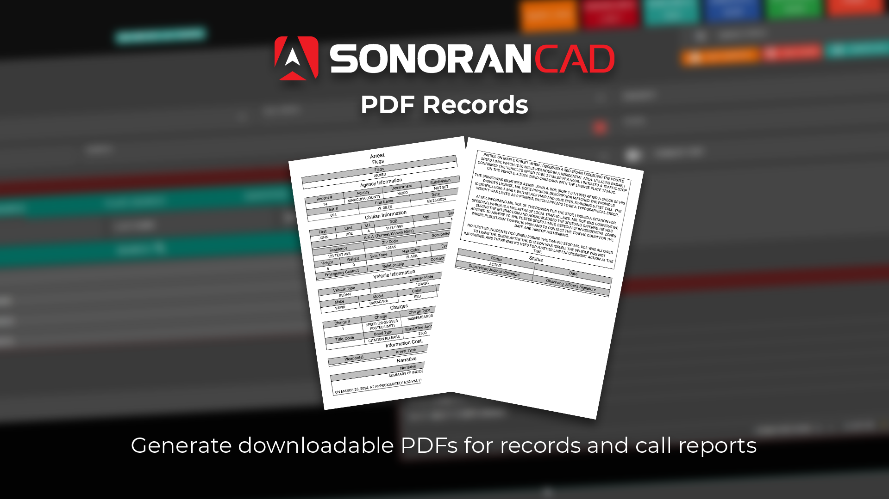<figcaption>
Sonoran CAD - PDF Records
</figcaption></figure>

### 🏠 Auto Suggested Street Names and Addresses

Sonoran CAD allows you to upload a [custom spreadsheet with your game's street names and addresses](tutorials/customization/addresses-and-street-names.md). Dispatchers in the call editor can quickly and easily search and filter these names automatically.

<figure>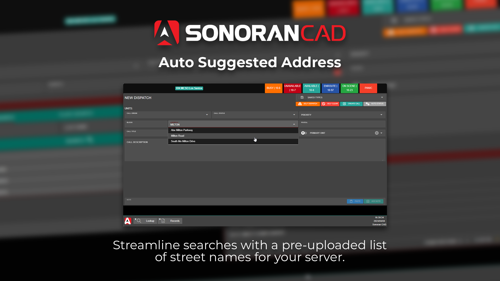<figcaption>
Sonoran CAD - Street Addresses
</figcaption></figure>

### ⌨️ Global Hotkeys

Only Sonoran CAD allows you to configure customizable [hotkeys](tutorials/other-features/configurable-hotkeys.md) for quick actions in the CAD. With our [Desktop application](download/), hotkeys are even registered globally and do not require the application to be visible or in-focus to trigger commands.

.png>)

### 📦 Easy Migration

Sonoran CAD allows you to easily migrate your [10-codes ](tutorials/customization/10-codes.md#import-10-codes-from-a-spreadsheet-csv)and [penal codes](tutorials/customization/penal-codes.md#import-from-spreadsheet-csv) by importing directly from a spreadsheet (CSV) or JSON file. Fully [customizable record formats/templates](tutorials/customization/sharing-custom-records.md) can also be exported and shared between communities.

### 🎤 Voice Commands

Common tasks are made even easier with our [voice commands](tutorials/other-features/voice-commands.md). Sonoran CAD allows you to easily lookup a civilian's name, a vehicle license plate, or trigger a panic tone completely hands free!

### 📋 Frequent Updates

As shown in our [changelog](roadmap/roadmap-and-changelog/changelog.md), new features, fixes, and suggestions are added all the time!
