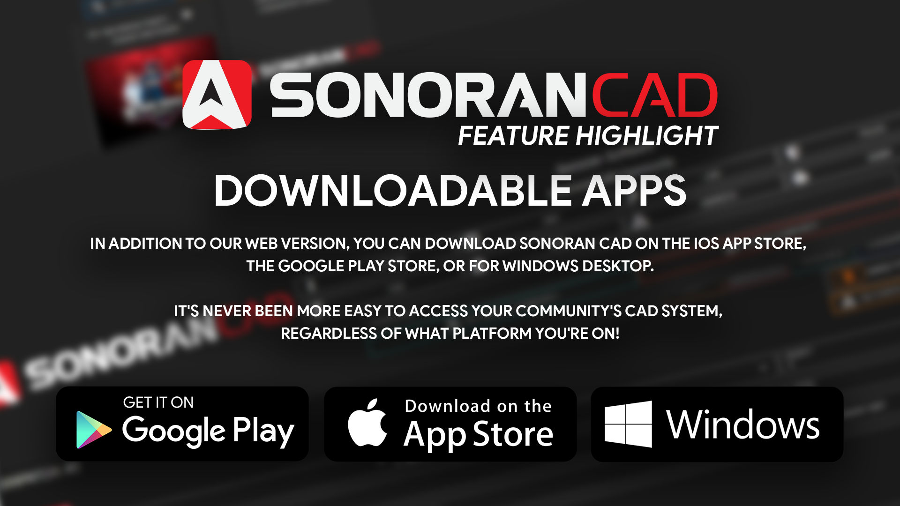

# 📱Download The App

<figure><figcaption></figcaption></figure>

<table data-header-hidden><thead><tr><th width="200">Website</th><th>iOS App Store</th></tr></thead><tbody><tr><td>Website</td><td>iOS App Store</td></tr><tr><td>iOS App Store</td><td><a href="https://apps.apple.com/us/app/sonoran-cad/id1496539456">Download</a></td></tr><tr><td>Google Play Store</td><td><a href="https://play.google.com/store/apps/details?id=sonorancadmdt.app&#x26;hl=en_US">Download</a></td></tr><tr><td>Windows</td><td><a href="https://github.com/Sonoran-Software/SonoranCAD_Windows/releases/latest/download/Sonoran-CAD.exe">Download</a></td></tr><tr><td>macOS</td><td><a href="https://github.com/Sonoran-Software/SonoranCAD_MacOS/releases/latest/download/Sonoran-CAD-universal.dmg">Download</a></td></tr></tbody></table>


**For users wanting in-game use via the Steam browser, you may experience issues.**

[Please click here for our official method](steam-browser-workaround.md).


.png>)

### MacOS & Windows Desktop

Our MacOS and  Windows desktop application allows you to access [global hotkeys](../tutorials/other-features/configurable-hotkeys.md) regardless of whether or not the app is in-focus. You can even configure these on your stream deck or custom key binds to set your status, toggle your panic status, open lookup windows, and more!

### iOS and Android

Only Sonoran CAD has dedicated [iOS ](https://apps.apple.com/us/app/sonoran-cad/id1496539456)and [Android ](https://play.google.com/store/apps/details?id=sonorancadmdt.app\&hl=en_US)applications to access your community's CAD with a mobile native experience. Download it today for your tablet or mobile device!
