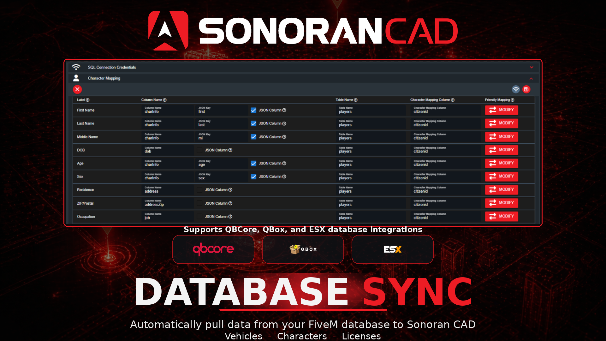

# Database Sync and Merge


Database Sync requires the **Plus** version or higher of Sonoran CAD.

Additional features like Database Merge and Friendly Mapping require the **Pro** version of Sonoran CAD.

For more information, see our [pricing](../../pricing/faq/) or view how to check your community [limits](../../tutorials/getting-started/view-your-limits.md).



Looking for VPS, web, or dedicated hosting? Check out our official [server hosting](https://docs.sonoransoftware.com/promotions/fivem-hosting)!


<figure><figcaption></figcaption></figure>

## What is DB Sync?

Database Sync allows you to search all in-game characters, licenses, and vehicle registrations stored in your FiveM database—without manually creating records in Sonoran CAD.

When a lookup is performed, Sonoran CAD securely queries your FiveM framework’s database and displays the results using your custom record templates.

## Configuring DB Sync

### 1. Enter Connection Credentials

In order for Sonoran CAD to read your in-game database, you must configure the connection information.



**Rocket Node Hosting - Database Credentials**

**1. Login**

Login to your RocketNode game panel and navigate to your FiveM Server.

**2. Select the Database**

On the left sidebar select **Databases** > **...** menu > **Details**

<figure><figcaption></figcaption></figure>

**3. Copy Connection Credentials**

Enter the following items from the RocketNode database details panel into Sonoran CAD

* **Endpoint**
  * This includes the "Host" and "IP" portions for Sonoran CAD. From the image below, the Sonoran CAD **Host** would be `db-ash-06.apollopanel.com` and the **Port** would be `3306`.
* **Username**
  * Direct copy from RocketNode to the Sonoran CAD's **Username** field.
* **Password**
  * Direct copy from RocketNode to the Sonoran CAD's **Password** field.
* **Database**
  * Outside of the database details window the database name can be clicked to be copied and pasted into the Sonoran CAD **Database** field (image 2).

<div><figure><figcaption></figcaption></figure> <figure><figcaption></figcaption></figure></div>



**Zap Hosting - Database Credentials**

**1. Login**

Login to your Zap Hosting Account and Navigate to your FiveM Server.

**2. View the Tools Section**

Scroll down until you see **TOOLS** on the left hand side of your screen and select **`Databases`.**

 (3) (3) (3) (1) (1) (1) (1) (1) (1) (1) (1) (1) (1).png>)

**3. View Database Credentials**

In the Center of your screen you will see you're database Credentials.

.png>)

**4. Set DB Credentials in Sonoran CAD**

Database Translation Information

| Zap Hosting | SonoranCAD   |
| ----------- | ------------ |
| Server/IP   | Host/Address |
| Database    | Database     |
| User        | Username     |
| Password    | Password     |


See [Database Sync and Merge Connection Credentials](./#written-configuration-guide) to figure out how to add Credentials to your CAD Instance using the information above.




**HeidiSQL - Database Credentials**

**1. Login to your database using HeidiSQL.**

**2. Open the User Manager**

At the top of your screen click `Tools` and then `User Manager.`\
Then, click `Add` at the top left.

.png>)

**3. Enter the Account Information**

Enter a user name, password, and enter `%` in the From host field. This will allow external IPs (Sonoran CAD) to connect to your database.

Under `Allow Access To` select `Add Object`

.png>)

**4. Select the Database**

Select the name of your database, then hit `Ok`.

.png>)

**5. Select the Permissions**

Check off the `EXECUTE`, `SELECT`, and `SHOW VIEW` read permissions. Then press `Save`.

.png>)

**6. Save the user and set credentials in Sonoran CAD**

You will now want to go to [http://whatsmyip.org](http://whatsmyip.org) and get your Public IP Address to use as your Host.

Database Translation Information

| HeidiSQL  | SonoranCAD   |
| --------- | ------------ |
| Host      | Host/Address |
| User name | Username     |
| Password  | Password     |
| Database  | Database     |


See [Database Sync and Merge Connection Credentials](./#written-configuration-guide) to figure out how to add Credentials to your CAD Instance using the information above.




**phpMyAdmin - Database Credentials**

**1. Navigate to your phpMyAdmin Web Panel**

**2. Navigate to User Accounts**

At the top of your screen click on **`User Accounts`**.

.png>)

**3. Create a new user account**

.png>)

**4. Fill out the account information**

The `Host Name` field should be set as `Any Host` and the value as `%`. This will allow external IPs (Sonoran CAD) to connect to your database.

.png>)

**5. Once created, edit the user account privileges**

 (1) (1).png>)

**6. Select your specific database**

.png>)

**7. Select only the required permissions**

`SELECT` and `SHOW VIEW` will ensure this account can only read from your database.

.png>)

**8. Save the user and set credentials in Sonoran CAD**

You will now want to go to [http://whatsmyip.org](http://whatsmyip.org) and get your Public IP Address to use as your Host.

Database Translation Informatio&#x6E;**:**

| phpMyAdmin | SonoranCAD   |
| ---------- | ------------ |
| Host       | Host/Address |
| Database   | Database     |
| User name  | Username     |
| Password   | Password     |


See [Database Sync and Merge Connection Credentials](./#written-configuration-guide) to figure out how to add Credentials to your CAD Instance using the information above.




<details>

<summary>Manual Port Forwarding</summary>

If your database port has not already been opened, you will need to forward/open this port.\
Typically, the default MySQL port is `3306`.

To check if your MySQL port has been properly opened, [visit a port checking utility](https://www.yougetsignal.com/tools/open-ports/) and enter your MySQL server's IP address and port.

**If you are unsure how to open a port, you will need to contact your hosting provider.**

</details>

<details>

<summary>IP Whitelisting</summary>

## IP Whitelisting

My community wants to whitelist **only** the Sonoran CAD IP address to connect on this SQL user account. How can I do this?

You may whitelist the following IPs:

```
34.173.36.190
```

Last Updated : 1/15/2026

</details>

### 2. Combine API and DB Sync Records

<details>

<summary>Combine API and DB Sync Records</summary>

When a community uses database sync, all record lookups run against that community’s external database. Some communities may also want to include CAD records created through [integrations such as ERS](../in-game-integration/available-plugins/ers.md). Enabling this option allows lookups to return both in-game data, such as characters, licenses, and vehicles, and API-created characters and vehicles from ERS.

To enable this, turn on **Include CAD API records in DB Sync lookups**.

<figure><figcaption></figcaption></figure>

</details>

### 3. Automatic AI Setup

<details>

<summary>Automatic AI Setup</summary>

Sonoran CAD's automatic AI setup handles all of the configuration for you. Once your connection credentials are entered correctly, select **AI Automatic Setup** to complete the full configuration.

The AI will automatically add any primary key columns if missing, will update your license record for any additional types, and will configure friendly mapping values if your community is on the Pro version. This process typically takes 60-90 seconds.

Once completed, the AI will inform you of any missing columns (record fields that don't exist in your database) and will save the new configuration.

Next, run a lookup in the police or dispatch panel to test searching for exisitng in-game characters, licenses, and vehicle registrations.

<figure><figcaption></figcaption></figure>

<div><figure><figcaption></figcaption></figure> <figure><figcaption></figcaption></figure> <figure><figcaption></figcaption></figure></div>


</details>

## Database Merge

<details>

<summary>Database Merge</summary>

For security, Sonoran CAD’s database sync is read-only. It retrieves information from your in-game database but never modifies it. Available fields—such as vehicle color, hair color, and other character details—are automatically loaded into your custom record templates.

If your database does not contain the information required for certain custom fields, those fields will appear blank. Database Merge allows you to manually complete these records without changing your in-game database.

When you enter information into a blank field, Sonoran CAD saves the additional data separately. During future lookups, it automatically combines your in-game database information with the manually entered CAD data to display a more complete record.

Database Merge is available exclusively to Pro communities and can be enabled from the Connection Credentials tab.

<figure><figcaption></figcaption></figure>

</details>

## Friendly Mapping

<details>

<summary>Friendly Mapping</summary>

Friendly mapping allows you to convert any raw database value to a more user friendly value.

\
Ex:&#x20;

* `drive_license` in your database is converted to `Driver's License`.
* `color1` in your database is converted to `Brown`.


To manually configure friendly mapping on a field, select the **Modify** button under the **Friendly Mapping** column. Enter in a raw database value and the friendly value that should be replaced.

<figure><figcaption></figcaption></figure>

</details>
