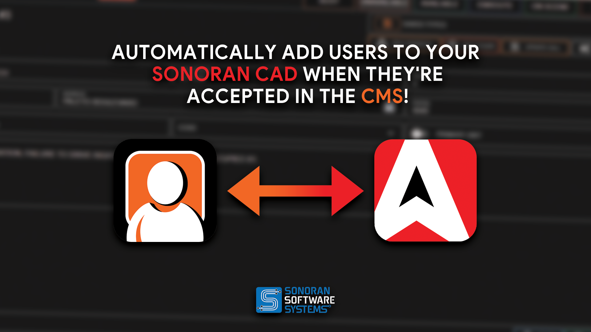

# Discord Bot Integration


For the Discord x CAD [Permissions Synchronization](../features/permissions-synchronization.md) feature you will need **either**: 

\- The **Free** version (CAD and CMS) with [Sonoran CMS](https://info.sonorancms.com/integration-capabilities/sonoran-cad-sync)!\
or\
\- The **Plus** version of Sonoran CAD\
\
For more information, see our [pricing](../pricing/faq/) or view how to check your community [limits](../tutorials/getting-started/view-your-limits.md).


<figure><figcaption></figcaption></figure>

### Getting Started

Get started with SonoranBot today by inviting it to your Discord:


[Getting Started](https://app.gitbook.com/s/gJnyZgUQPWpA5p9njAAR/tutorials/getting-started)


### CAD Integration

Learn more about SonoranBot's CAD integration features:


[Sonoran CAD Integration](https://app.gitbook.com/s/gJnyZgUQPWpA5p9njAAR/tutorials/sonoran-cad-integration)


### Settings

Configure SonoranBot's settings in your server:


[Settings](https://app.gitbook.com/s/gJnyZgUQPWpA5p9njAAR/tutorials/usage/settings)


### Commands

Reference a list of bot commands:


[Commands](https://app.gitbook.com/s/gJnyZgUQPWpA5p9njAAR/tutorials/usage/commands)

