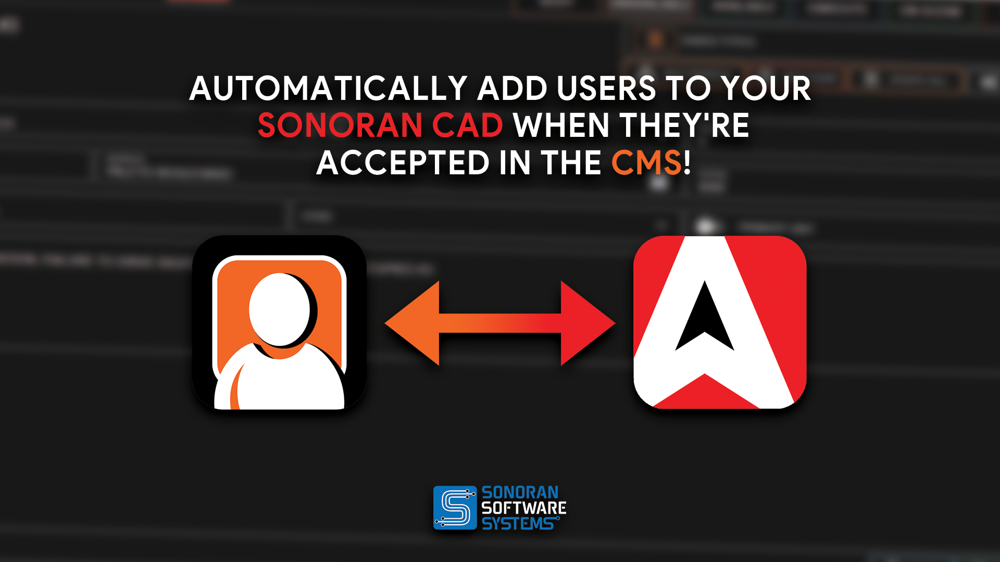
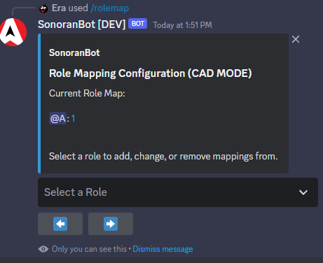
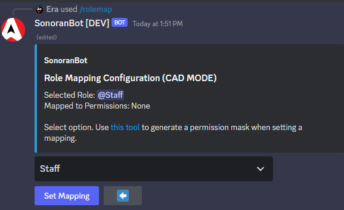
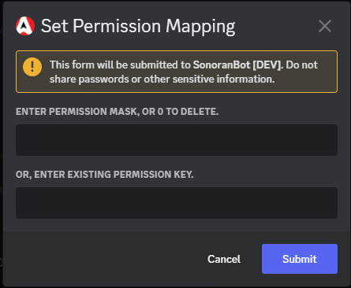
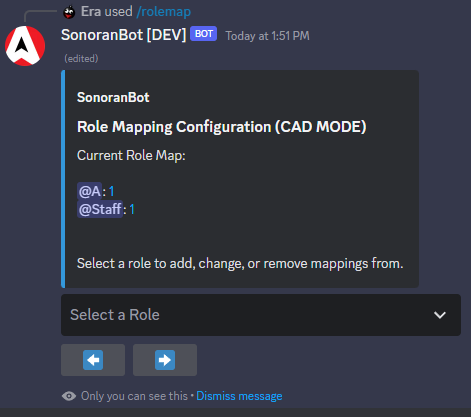
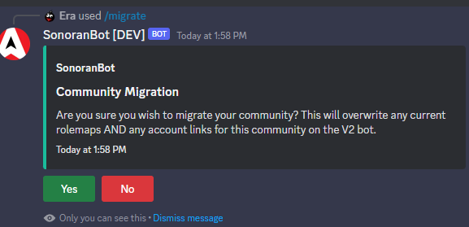

# Permissions Synchronization


This feature requires the **Plus** version of Sonoran CAD to function.&#x20;

For more information, see our [pricing](../../../pricing/faq/) or view how to check your community [limits](../../../tutorials/getting-started/view-your-limits.md).


## Manage with Sonoran CMS!

In addition to automatically adding users when applications are accepted, [Sonoran CMS](https://info.sonorancms.com/why-choose-sonoran-cms/why-choose-sonoran-cms) can also manage your community's CAD permissions!

[Learn more today!](https://info.sonorancms.com/why-choose-sonoran-cms/why-choose-sonoran-cms)

<figure><figcaption>
Sonoran CMS x Sonoran CAD
</figcaption></figure>

<figure><figcaption></figcaption></figure>

## Getting Started


You must be an **Administrator** on the Discord server in order to set up this process.


The bot provides a brand new menu to assist you with assigning roles to permissions.

<figure><figcaption></figcaption></figure>

Select a role:

<figure><figcaption></figcaption></figure>

Clicking "Set Mapping" will present an option to specify a code (using the linked tool) or an existing permission key. Enter "0" as the permission mask to delete the current mapping instead.

<figure><figcaption></figcaption></figure>

Successfully entering this information will bring you back to the main role mapping screen with the new permission set.

<figure><figcaption></figcaption></figure>

### User Setup

1. Every user in the Discord will get their[ Secret ID from their Settings page](../../../sonoran-cad/api-integration/getting-started/account-secret-id.md).
2. Every user in the Discord will then use `/linkme <secretid>` to link their Sonoran CAD account to their current Discord account. This will automatically populate their API ID.
3. Community members can use the `/syncme` command in Discord to force a permissions sync.
4. Communities should **no longer use public permission keys in the CAD**, as the bot will automatically remove CAD permissions from users if they don't have a Discord role for it.

Now, whenever a role is added or removed, the bot will automatically update the user's permissions to match! If the user ever leaves the server, the bot will immediately remove all permissions from their account, although they will still be in the community.

### Changing your Account Secret ID

Sometimes, you may wish to change your secret ID. If you do so from the [Settings page](../../../sonoran-cad/api-integration/getting-started/account-secret-id.md), you must use the `/changesecret <new key>` command or the bot will remove all your permissions on Sonoran CAD (if the optional security setting below is enabled).

### Optional Security Setting

By default, the bot will not remove permissions from users who do not have a matching secret key to their Discord ID. This can be enabled by setting `stripUnmappedUsers` to true with the `s!setting` command.

### Best Practices and FAQ

* It is advised to not sync potentially dangerous permissions (such as Admin Access permissions) with Discord roles **unless** you trust staff with that role, or it's just you.
* The community owner is completely ignored during the synchronization process.
* "Principle of Least Privilege" should be exercised during this setup. Don't give out permissions you don't think users performing the role would need.
* Discontinue use of permission keys ASAP. The bot "takes over" synchronization and will remove permissions granted by permission keys if they don't have a role that grants it.
  * Same goes for manual permission grants, **unless there is no role granting that permission**.

### ADVANCED: Migration from Legacy SonoranBot

Until the old bot is fully decommissioned, a /migrate command is provided to allow admins to move existing role mappings and account links to the new bot to ensure a smooth transition.&#x20;

<figure><figcaption></figcaption></figure>

Clicking yes will initiate the process and you will be prompted when completed. On larger communities, this can take several seconds to complete. **This feature will migrate all existing linked guilds and their role mappings** and only can be used once.
