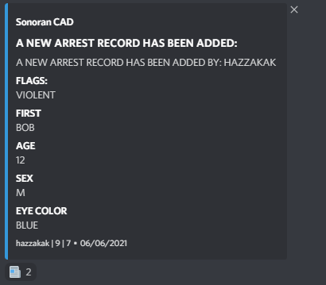

# Webhook Actions


Due to the API calls, this feature requires the **Plus** version of SonoranCAD or higher.


## Using Webhook Actions

When a Discord webhook is fired, SonoranBot will add a reaction allowing you to react for a specific action.

### Available Reactions

| Webhook           | Reaction Description                                                                                                                                                                                                                   |
| ----------------- | -------------------------------------------------------------------------------------------------------------------------------------------------------------------------------------------------------------------------------------- |
| New Dispatch      | 
React to attach to the dispatch call in the CAD.

Remove the reaction to detach.
                                                                                                                                           |
| Modified Dispatch | 
React to attach to the dispatch call in the CAD.

Remove the reaction to detach.
                                                                                                                                           |
| New Record        | 

Automatically populates a record search with the record being the result. Depending on the record, related records will also appear in the search. Must be in one of the menus (such as Police or DMV) for this to work.
 |
| Modified Record   | 

Automatically populates a record search with the record being the result. Depending on the record, related records will also appear in the search. Must be in one of the menus (such as Police or DMV) for this to work.
 |

### Setting Up

1. Configure [Webhooks](../../discord-webhooks.md) to the channel you desire.
2. Give the bot access to the channel these webhooks are going to. It needs at least the ability to read the channel and add reactions to messages.

## Reaction Examples

### Call Attachment

.png>)

### Opening a Record

