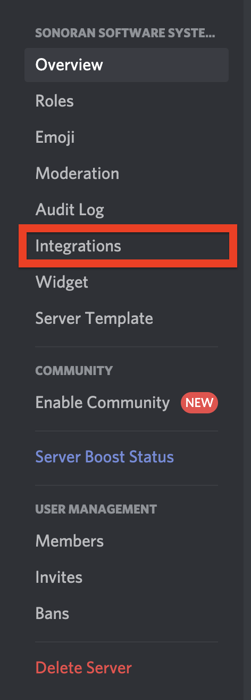
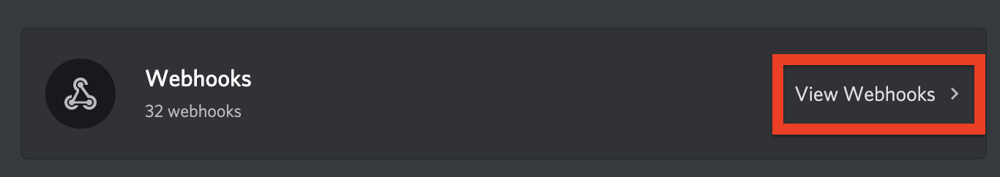
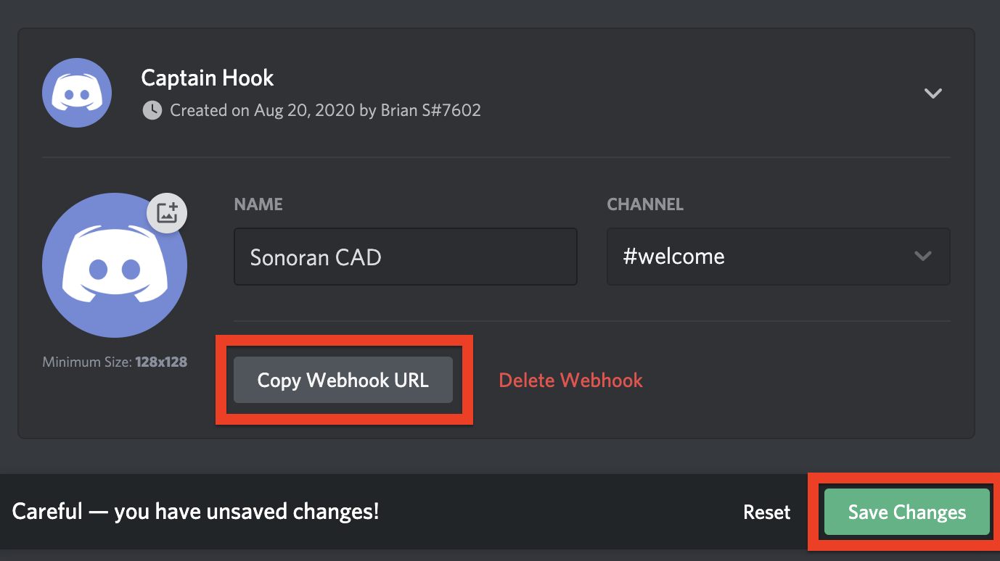

# Discord Webhooks


The free version of Sonoran CAD is limited to one \(1\) Discord webhook.  
For more information, see our [pricing](../pricing/faq/) or view how to check your community [limits](../tutorials/getting-started/view-your-limits.md).



Currently, Discord webhooks can only be created using the Desktop version of Discord.


### 1. Open your Server Settings

Open the "Server Settings" panel in the top right of your Discord server.

### 2. Open your Discord Integrations

In the server settings panel, select the “Integrations” tab.

### 3. View your Webhooks

On the right, click to view all of your current Discord webhooks.

### 4. Create a New Webhook URL

Select the "New Webhook" button.

### 5. Customize the New Webhook

Here, you can set the Webhook name, channel and icon.

Press the "Copy Webhook URL" button to copy the webhook's URL.  
Press the "Save Changes" button to save your new webhook in Discord.

### 6. Configure the Sonoran CAD Webhook


New webhooks are created as "discord.com" which is currently unsupported. Please change the URLs of the generated webhooks to "discordapp.com" so they will function.


In the Sonoran CAD Admin panel, select “Advanced &gt; Discord Integration”  
Paste your Webhook URL in the desired webhook configuration box.  
Toggle the desired notification events for the specific webhook. Press the “Save Configuration” button.


_Note:_ Some webhooks allow you to customize the notification settings even further. For example, you can specify to only receive a webhook when a police record is added, edited or removed.


### Footer Metadata

Webhook footers contain metadata that can be pulled from a bot for further integration.  
These follow the format: `USERNAME or ID` \| `TYPE` \| `ID`

| Type | ID Value |
| :--- | :--- |
| 0: UNIT\_PANIC | Identifier ID |
| 1: TEN\_CODES |  |
| 2: PENAL\_CODES |  |
| 3: SIGNAL | Signal Value |
| 4: ACCOUNT |  |
| 5: NEW\_DISPATCH | Call ID |
| 6: EDIT\_DISPATCH | Call ID |
| 7: CLOSE\_DISPATCH | Call ID |
| 8: EMERGENCY | Call ID |
| 9: RECORD\_ADD | Record ID |
| 10: RECORD\_EDIT | Record ID |
| 11: RECORD\_REMOVE | Record ID |

