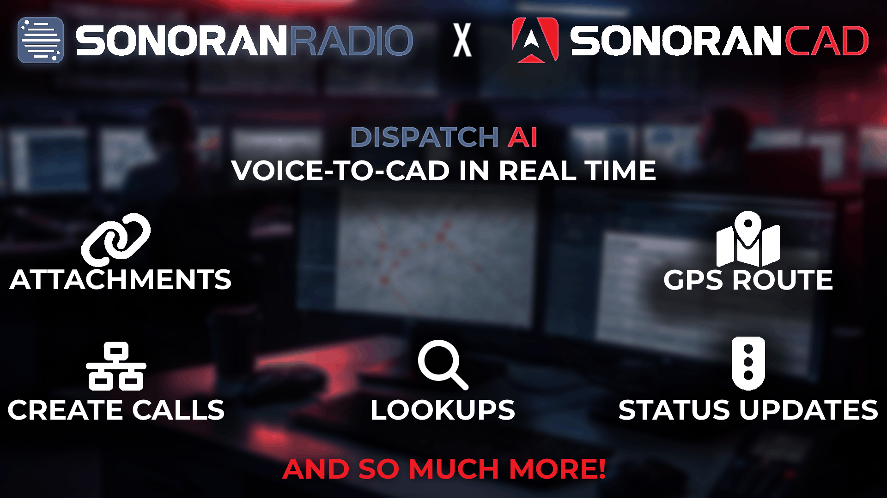

# ✨ Dispatch AI

<figure><figcaption></figcaption></figure>

Dispatch AI is our most advanced integration to date—bringing a real-time AI dispatcher directly into your community’s CAD.

When paired with [Sonoran Radio](https://docs.sonoransoftware.com/radio), units can create calls, run license plates, update their status, and more—all automatically through their radio transmissions.

**Learn more about Dispatch AI:**


[Dispatch AI](https://app.gitbook.com/s/fCk5zoeun5gx3ujYW6eg/tutorials/integrations/dispatch-ai)

