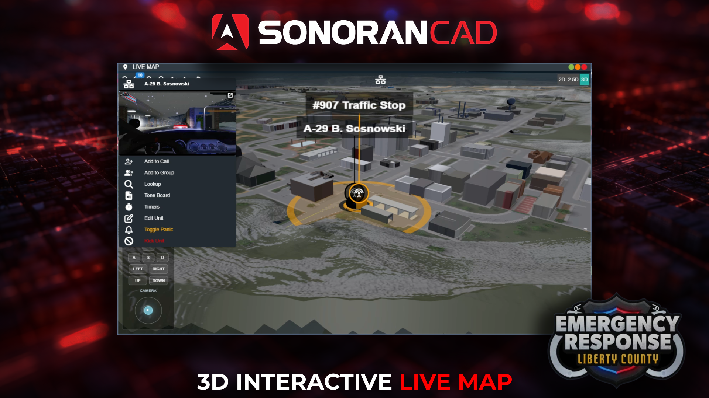

# 3D Live Map

## ER:LC Live Map

Sonoran CAD includes an interactive 2D and 3D live map that displays unit locations, bodycams, emergency calls, dispatch calls, and more in real time.

<figure><figcaption></figcaption></figure>

## Configuring the Live Map

Configuring the Live Map

Once your ER:LC community has been linked, navigate to **Admin** > **Advanced** > **In-Game Integration** > **ER:LC** > **Live Map** > **Enable**

<figure><figcaption></figcaption></figure>

## CAD Permission Requirements

In order to appear on the live map, players must have a [linked Roblox account](getting-started.md#linking-your-roblox-account).

In order to access the live map, players must have the **Live Map** permission.

## Usage

### Accessing the Live Map

Accessing the Live Map

The live map can be found in the task bar by searching, or going to **Unit Management** > **Live Map**

Additionally, you can select the map pin icon on any unit, emergency call, or dispatch call that has a location from in-game to open the map and zoom to their location.

### Using the Live Map

#### 2D and 3D Mode

Change the map view from 2D, 2.5D, or 3D via the top right.

#### Unit Blips

Units will appear on the map if they have a [linked Roblox account](getting-started.md#linking-your-roblox-account) and are active on the CAD police, fire, EMS, or dispatch page.

Click on a unit to view their bodycam and access other options for dispatch calls, lookups, tone board, timers, etc.

#### Emergency Calls

When an [emergency call is made from in-game](emergency-calls.md) a blip will appear on the map. Select the blip to view the call and open it in your call editor.

#### Dispatch Calls

Dispatch calls created from an [in-game emergency call](emergency-calls.md) or an [in-game traffic stop](traffic-stops.md) will automatically have location data showing a blip on the map. Select the call blip to open it in the editor or close it.

## Roblox Custom Maps

Roblox Custom Maps

Sonoran CAD allows any Roblox game to also send and update live map positions.

* [ER:LC](../roblox-er-lc/)
  * ER:LC map option available in the admin panel, or - upload a modified map with the same dimensions 3120x3120
* [Maple County | Fall Update](https://www.roblox.com/games/8416011646/Maple-County-FALL-UPDATE)
  * Requires a custom map upload from the game

To upload a custom live map for Roblox

* **Admin** > **Advanced** > **In-Game Integration** > **ER:LC** > **Live Map** > Toggle **Official ER:LC Live Map** to **Custom Roblox Map**

For Roblox Developers

Maple County has recently added Sonoran CAD live map access to their Roblox game mode.\
To do the same for your game:

1. Send Unit Location API updates with the `coordinate` `x` and `y` values
2. Convert (if needed) your `coordinate` `x` and `y` values so that the top left of your map image is `{0,0}`
3. Export your square map to a single image and upload to the Sonoran CAD community in the admin panel under `In-Game Integration` > `Live Map` > Game as `Roblox` > Type as `Custom` > `Upload` > `Save`

 (1) (1) (1) (1) (1).png>)

For more help, reach out to our [support team](https://support.sonoransoftware.com).

