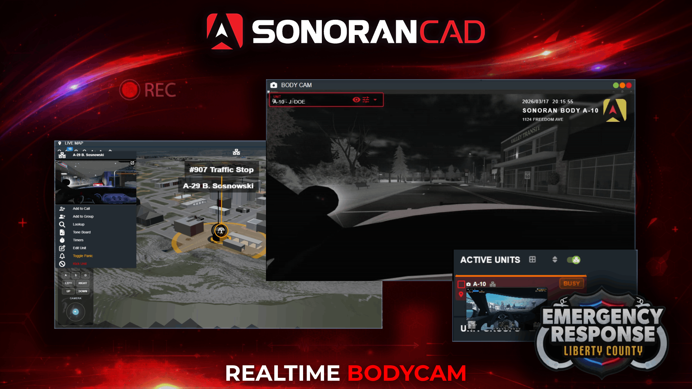
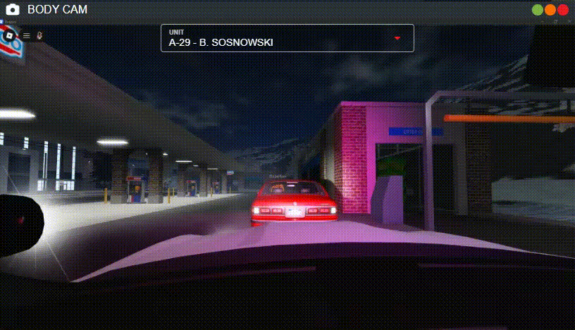
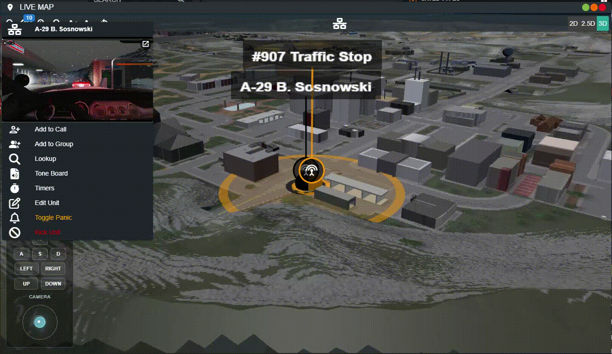

# Bodycam


Bodycam streams in the web and desktop applications are transmitted through **secure relay-based peer-to-peer connections** that prevent IP address exposure between participants.


## ER:LC Bodycam

Stay connected to in-game units with live bodycam video feeds integrated directly into the CAD.

<figure><figcaption></figcaption></figure>

## Configuring the Bodycam

### 1. Optional: Download the App

While the bodycam system works inside of a web browser, you can also download the [Windows or OSX desktop application](../../download/) for the best experience.

### 2. Select the Roblox Game

Once inside of the police, fire, EMS, or dispatch panel click on your unit header to open the unit editor > **Bodycam Source** > **Roblox** > **Start**

Once configured and started, if using the desktop application, your bodycam will automatically select the same window and start the next time you use the application.


Do to graphics settings and drivers, some users may experience **white flashing in the Roblox app** when using **window** share mode.

To resolve this, share the entire **screen** instead of just the Roblox application.


<figure><figcaption></figcaption></figure>

### 3. Bodycam Options

#### Shadow Recording

Shadow recording continuously buffers the last 0–60 seconds of footage. When you activate recording, that buffered footage is automatically included at the beginning of the clip.

By default, this is set to **30 seconds**.

Additionally, you can configure the total recording length with a maximum of 120 seconds (two minutes).

<figure><figcaption></figcaption></figure>

#### Sound Effects

Users can also enable or disable sound effects. When enabled, a long tone will play when the bodycam is turned on or off. Additionally, a short tone will repeat periodically to remind the user that their camera is on.

<figure><figcaption></figcaption></figure>

## Using the Bodycam

### Via Active Units

Via Active Units

In the active units panel hover over the flashing camera icon to preview a unit's bodycam. Or, click on the icon to open the dedicated viewer.

<figure><figcaption></figcaption></figure> <figure><figcaption></figcaption></figure>

### Via Live Map

Via Live Map

In the [2D or 3D live map](3d-live-map.md), click on a unit to view the bodycam. Click on the bodycam inside the menu to open the dedicated viewer.

<figure><figcaption></figcaption></figure>

### Via Manual Bodycam Window

Via Manual Bodycam Window

Additionally, search or select the **Bodycam** window in the taskbar. Once opened, use the unit select dropdown to change the viewer to different bodycam streams.

<figure><figcaption></figcaption></figure>

## Overlay Options

Overlay Options

When viewing a bodycam, you can optionally toggle the text overlay and video effects on or off.

<figure><figcaption></figcaption></figure>

## Recording

Sonoran body cameras support recording for later playback and download.

#### Via Hotkey

Desktop users can toggle recording using a customizable hotkey in the **Settings** menu.

#### Manual Start/Stop

Users viewing a bodycam can press the manual **Start Recording** and **Stop Recording** button at the bottom of the viewer.

### Recording Limits


Bodycam recordings are currently in early-access. These limits are subject to change at any time.


Recordings are retained for 24 hours before being automatically deleted. Daily recording limits (applied to the entire community) vary by subscription tier:

* Free: 10 minutes/day community-wide
* Standard: 100 minutes/day community-wide
* Pro: 1,000 minutes/day community-wide

### Viewing Recordings

Dispatchers can search and view recorded bodycams by opening the **Body Cam Recordings** window in the taskbar.

<figure><figcaption></figcaption></figure>
