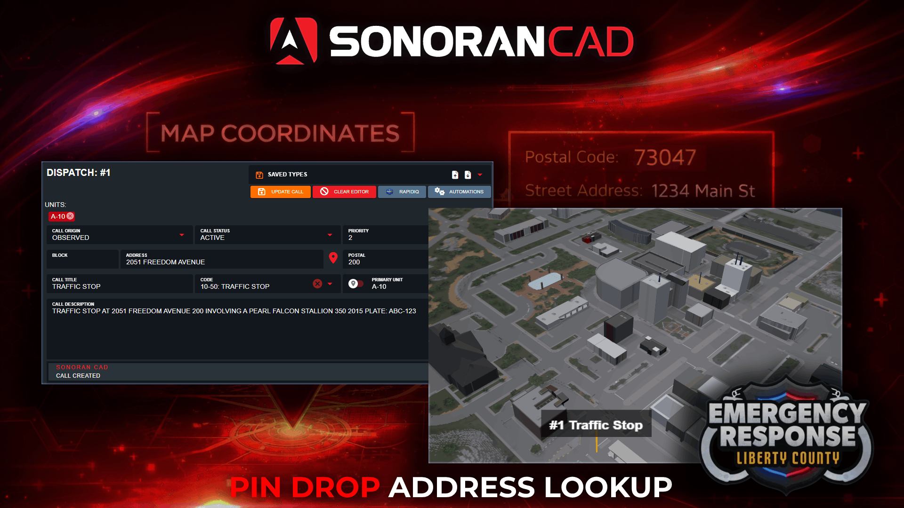

# Call Editor Pin Drop

## Call Editor Pin Drop

Select the pin icon in the dispatch call editor to open the live map. Select any location on the map to auto-fill the postal code, street address, and building number.

<figure><figcaption></figcaption></figure>

## Using the Pin Drop

In the dispatch call editor, select the **Pin** icon inside of the **Address** box. This will automatically open the live map window and place it into pin drop mode. Click anywhere on the map and your call editor will be automatically updated with:

* Nearest Postal Code
* Optional: Nearest Building Number
* Street Address

## Manual Address Entry

Additionally, communities can import a custom list of addresses. ER:LC communities can [copy and import this custom CSV file](https://docs.google.com/spreadsheets/u/1/d/1jDUxfCffxyGHoXQ-rpzrWRNFEhDmMs3-TA9U-mdNBjg/copy) to populate the address field dropdown.


[addresses-and-street-names.md](../../tutorials/customization/addresses-and-street-names.md)

