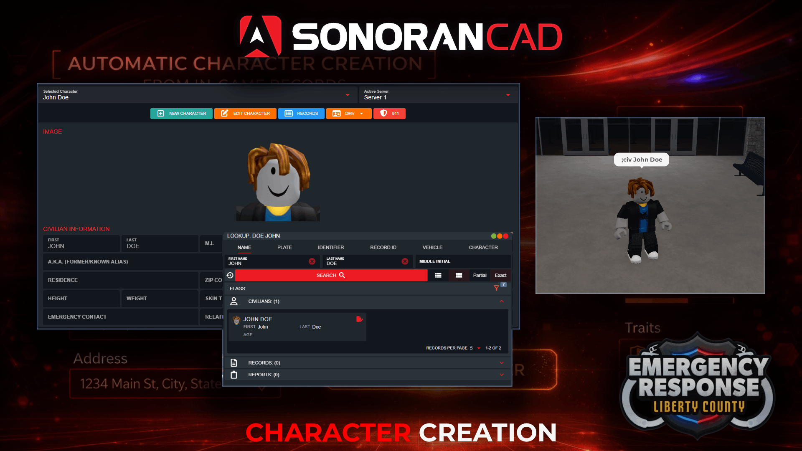

# Character Creation

## ER:LC Character Creation

<figure><figcaption></figcaption></figure>

Use customizable in-game commands allowing users to register their character in the CAD, no account or CAD access required!

Once created, their civilian character will be searchable and can be used to [automatically register their vehicle](vehicle-registrations.md).

## In-Game Registration Command Configuration

Register a character via a custom in-game command.

### Persistent Character Creation

In-Game Persistent Character Creation Command

When the character creation command is ran a new character will be created in the CAD. The character will include the first name, last name, and avatar photo.

If the user already has an in-game character created, it will be replaced by this new character.

### Temporary Registration

In-Game Temporary Registration Command

Running the temporary character creation command will perform the same actions as above. However, the civilian character record will be automatically **deleted after 24 hours**.

## Using the In-Game Commands

When in-game, users can run the customizable character creation commands followed by the **First** and **Last** name.

Ex: `;civ John Doe`

Once the character has been created in the CAD, users will be notified by an optional in-game message.

Once a character has been created, users can [register their vehicle with a single command](vehicle-registrations.md).
