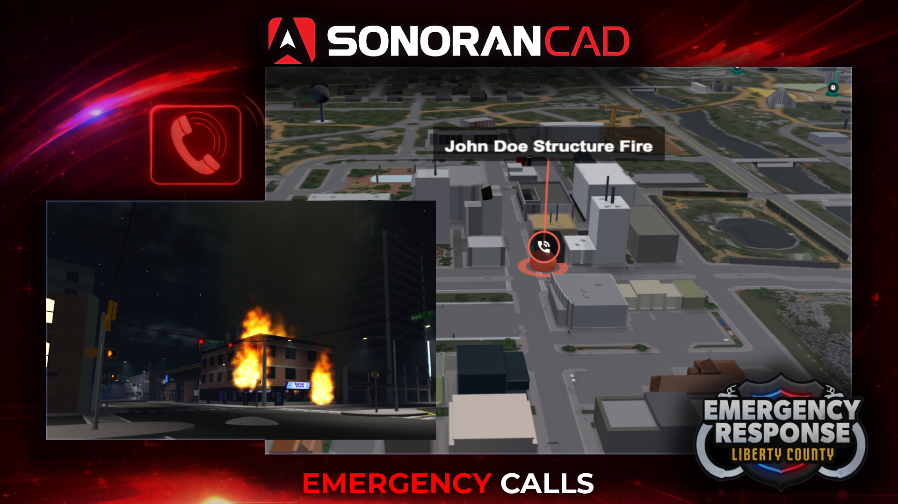

# Emergency Calls

## ER:LC Emergency Calls

Submit emergency calls from in-game and see them appear instantly on the 3D live map and dispatch panel.

<figure><figcaption></figcaption></figure>

## Emergency Call Command Configuration

When the emergency call command is ran a new emergency call will be created in the CAD.

This call will contain the user's currently selected character first name, last name, and entered call description. Additionally, this emergency call will be placed on the [live map](3d-live-map.md).

## CAD Permission Requirements

In order to use this command in-game, players must have a [linked Roblox account](getting-started.md#linking-your-roblox-account) with the **Civilian Page** permission to create an emergency call.

## Using the In-Game Commands


_Note: Due to ER:LC's API rate limits, commands can take **up to 30 seconds** to be applied._


When in-game, users can run the customizable emergency call command followed by the call description.

The emergency call will be displayed in the dispatch panel and on the [live map](3d-live-map.md).

Ex: `:log 911 Help, my friend fell and broke his arm!`
