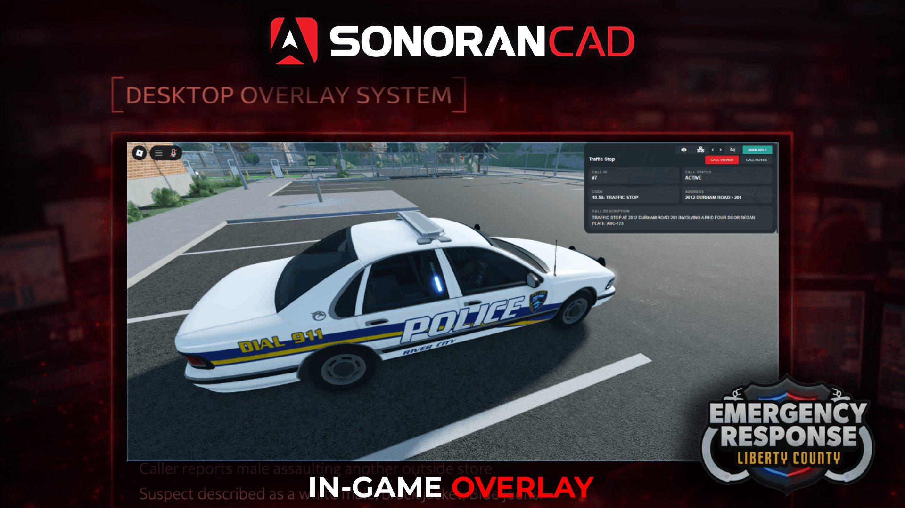

# In-Game Overlay

## In-Game Overlay

<figure><figcaption></figcaption></figure>

## Using the In-Game Overlay

### Configuring the Hotkey

The in-game overlay is toggled via custom hotkey. Hotkeys can be configured by searching for **Settings** in the taskbar. Once in the settings window select **Hotkeys** > **Desktop Overlay** to configure.

<figure><figcaption></figcaption></figure> <figure><figcaption></figcaption></figure>

### Overlay Buttons

The overlay offers several buttons at the top right.

#### Visibility

Click the **Eye** icon to make the overlay window more or less transparent.

#### Self-Dispatch

Click the **Self Dispatch** button to toggle on access to dispatching features:

* Previous/Next Call
* Attach/Detach from Call

Users must have the **Self Dispatch** permission in order to toggle this on.

#### **Include Emergency Calls**

When enabled (requires **Self Dispatch**) emergency calls will also be displayed in the overlay. Pressing the **Attach** button (enter) will automatically convert the emergency call to a dispatch call, attaching your unit.

<figure><figcaption></figcaption></figure>

#### Previous/Next Call

When **Self Dispatch** is enabled, use the left and right arrow keys (or icons) to page between active dispatch calls.

#### Attach/Detach from Call

When **Self Dispatch** is enabled, use the **enter** key or press the attach/detach icon to attach or detach from the selected dispatch call.

#### Call Notes

Click the **Call Notes** button to view the notes tab. Enter in text for live-chat while on a dispatch call.
