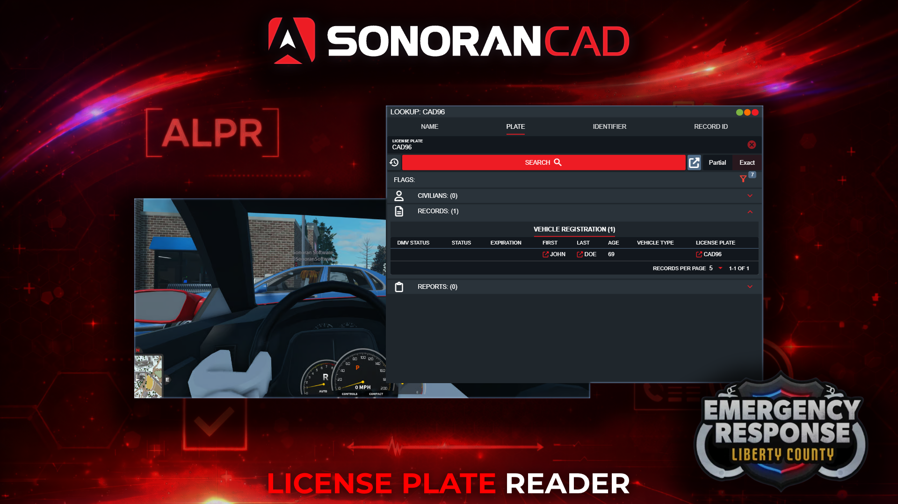
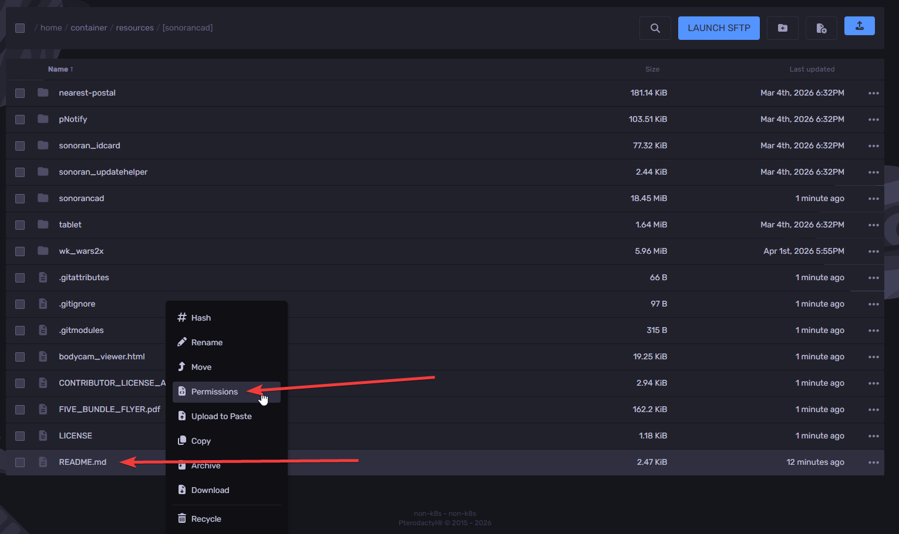

# Plate Reader

## Plate Reader

The ER:LC plate reader offers a desktop hotkey to search for the nearest player inside of a vehicle. Once found, a plate search lookup will be automatically opened in your CAD screen.

<figure><figcaption></figcaption></figure>

## Configuration

### 1. Download the Desktop Application

In order to use hotkeys, download the Windows or OSX desktop application.

### 2. Configure your Hotkey

In the taskbar search or open **System** > **Settings** > **Hotkeys** > **ER:LC** > and set the **Plate Reader** hotkey.

#### 3. Utilize the Hotkey

Once in-game, press your desktop hotkey to run a plate search.

* The vehicle must be nearby with a player in it
* The player must have a [linked Roblox account](getting-started.md#linking-your-roblox-account) and a [registered vehicle](vehicle-registrations.md)

<figure><figcaption></figcaption></figure> <figure><figcaption></figcaption></figure>

