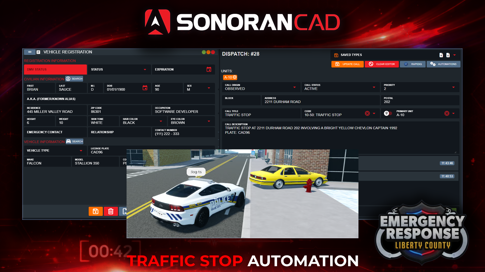

# Traffic Stops

## Traffic Stop Integration

<figure><figcaption></figcaption></figure>

When the the traffic stop command is used a dispatch call will be created in the CAD.

This call will:

* Attach the unit that performed the command
* Include the unit's address and postal code
* [Display on the live map](3d-live-map.md)
* Include the vehicle's make, model, year, color, and license plate in the [customizable description template](traffic-stops.md#dispatch-description)
* [Include the customizable 10-code](traffic-stops.md#id-10-code)
* Automatically search the license plate

## Traffic Stop Command Configuration

### Command

Customize the command from `;ts` to something custom.

### Dispatch Description

When the traffic stop call is created, the call description can contain customizable information about the vehicle, license plate, and more. Select the `</>` icon to view available variables, click-to-copy, and paste them into the description.

#### 10-Code

When the traffic stop call is created, it will use the selected [custom 10-code](../../tutorials/customization/10-codes.md).

## CAD Permission Requirements

In order to use this command in-game, players must have a [linked Roblox account](getting-started.md#linking-your-roblox-account) with the **DMV Police** or **Dispatch** permissions to create a traffic stop call.

## Using the Desktop Hotkey

### 1. Download the Desktop Application

In order to use hotkeys, download the Windows or OSX desktop application.

### 2. Configure your Hotkey

In the taskbar search or open **System** > **Settings** > **Hotkeys** > **ER:LC** > and set the **Traffic Stop** hotkey.

#### 3. Utilize the Hotkey

Once in-game, press your desktop hotkey to generate a traffic stop.

* The vehicle must be nearby with a player in it
* The player must have a [linked Roblox account](getting-started.md#linking-your-roblox-account) and a&#x20;

## Using the In-Game Commands

The CAD will automatically find the closest vehicle to the unit. The call will automatically include the vehicle description, plate, and location.

Ex: `;ts`

## Result

Once the hotkey or in-game command has been ran, a traffic stop call will be generated with the details, a plate lookup will open, and the call will be visible on the [live map](3d-live-map.md).

<figure><figcaption></figcaption></figure> <figure><figcaption></figcaption></figure>

