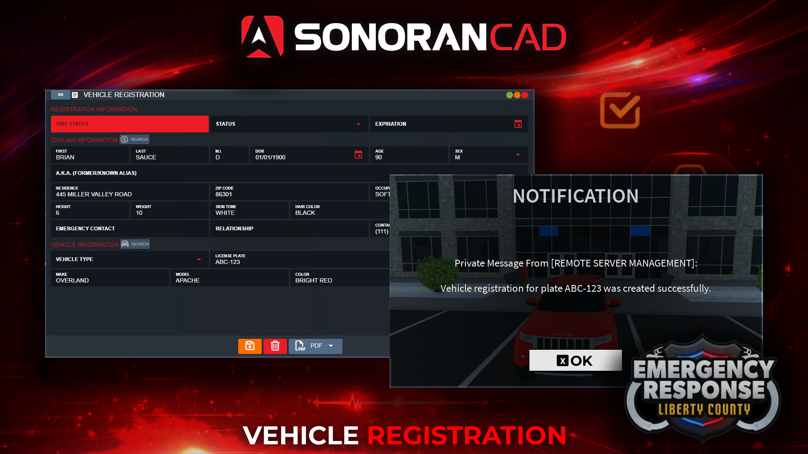

# Vehicle Registrations

## ER:LC Vehicle Registration

Automatically register vehicles using an in-game command!

<figure><figcaption></figcaption></figure>

## Civilian Panel Access

Automatically register your current vehicle via the civilian panel.

Civilian Panel Automatic Registration

Users can automatically register their current vehicle via the civilian panel.

1. Create and Select a Character

Create and select the character you wish to register the vehicle to.

2. Trigger ER:LC Automatic Registration

* **Civilian** > **DMV** > **ER:LC Automatic Registration**

3. View the Registration

* Select the **Records** button to search and view your new vehicle registration.

## In-Game Registration Command Configuration

Register a vehicle via a custom in-game command.

### Persistent Registration

In-Game Persistent Registration Command

When the registration command is ran a new vehicle registration will be created under the user's currently selected character in the CAD. The registration information will include the character information, license plate, make, and color.

If the user already has this license plate registered under any of their characters, the registration will be moved to the currently selected character and the vehicle information will be updated.

### Temporary Registration

In-Game Temporary Registration Command

Running the temporary registration command will perform the same actions as above. However, the registration record will be automatically **deleted after 24 hours**.

#### Note: Vehicle Registration Persistence

Vehicles purchased in public ER:LC servers persist their license plate across public and private servers. If a vehicle is purchased in a private server, vehicles are not persisted and are removed when the user leaves the game. For private server vehicles, it is best to use the temporary registration command.

## CAD Permission Requirements

In order to use this command in-game, players must have a [linked Roblox account](getting-started.md#linking-your-roblox-account) with the **DMV Record Add** and **DMV Record Edit** permissions to add or update vehicle registrations.

## Using the In-Game Commands

When in-game, users can run the customizable vehicle registration commands followed by the license plate on the vehicle.

Ex: `;register`

Once the registration has been created in the CAD, users will be notified by an optional in-game message.

<figure><figcaption></figcaption></figure> <figure><figcaption></figcaption></figure> <figure><figcaption></figcaption></figure>

## Troubleshooting

### Registration Fields Blank

Registration Fields Blank

In order for Sonoran CAD to know where to place information (license plate, color, etc.) in your custom record fields, the field IDs must match.

<figure><figcaption></figcaption></figure>

| Field ID | Use                                              |
| -------- | ------------------------------------------------ |
| `plate`  | 
License Plate Ex: <code>ABC-123</code>
 |
| `make`   | 
Vehicle Name Ex: <code>Captain</code>
  |
| `model`  | 
Vehicle Model Ex: <code>Chevlon</code>
 |
| `year`   | 
Vehicle Year Ex: <code>1992</code>
     |
| `color`  | 
Vehicle Color Ex: <code>Crimson</code>
 |

