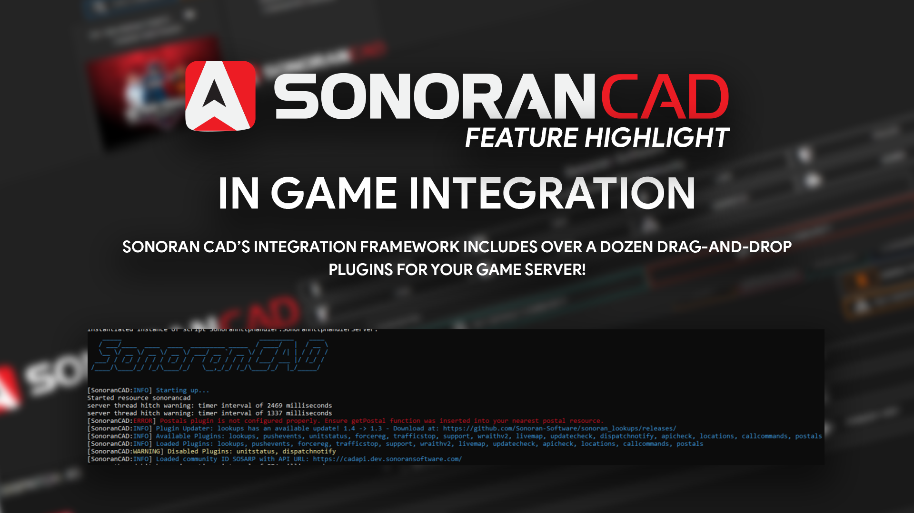

# In-Game Integration


Looking for VPS, web, or dedicated hosting? Check out our official [server hosting](../../other-products/server-hosting.md)!


<figure><figcaption></figcaption></figure>

### Framework Installation Guide

All Sonoran CAD submodules require our API framework installation. Installing our framework is easy! Learn more below.


[fivem-installation](fivem-installation/)


### Submodule Installation Guide

All Sonoran CAD submodules follow a standard installation process. Learn more about installing submodules for your community below.


[submodule-configuration](fivem-installation/submodule-configuration/)


### Available Submodules

View our vast array of our integration submodules, ready for drag-and-drop installation for your server!


[available-plugins](fivem-installation/available-plugins/)


### Developer Documentation

Looking to write your own submodules for Sonoran CAD? Learn more about writing your own integration submodules and accessing our API documentation.


[api-integration](../../sonoran-cad/api-integration/)


