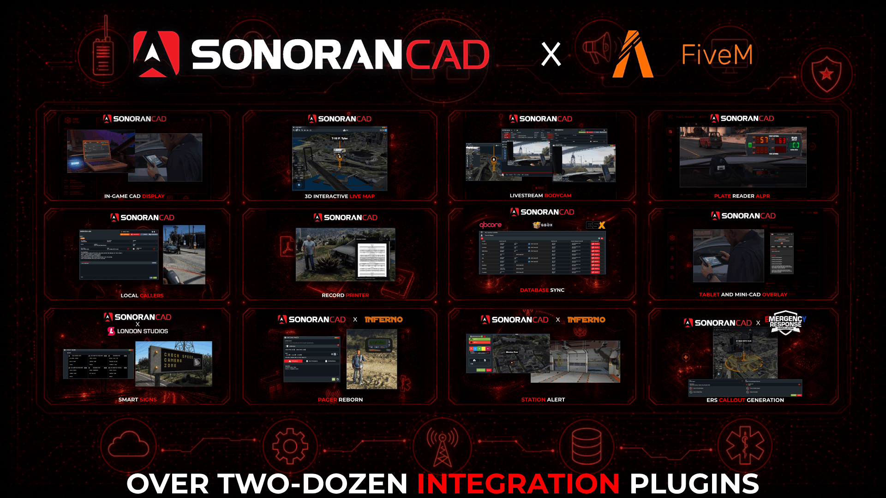
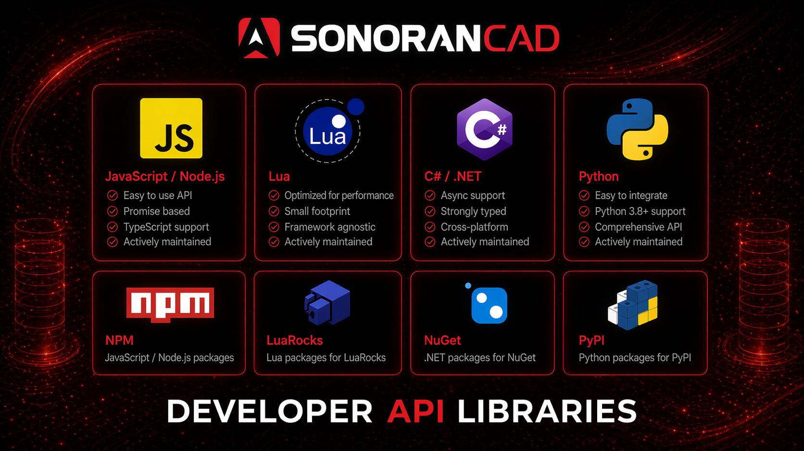

# 🎮 FiveM


Looking to host your FiveM server? Check out our official [server hosting](https://docs.sonoransoftware.com/promotions/fivem-hosting)!


<figure><figcaption></figcaption></figure>

### FiveM Installation

From one-click installation options to pre-configured resource downloads, we've made integration setup a breeze!

Learn more about installing the resource below.


[fivem-installation](fivem-installation/)


### FiveM Submodules

The Sonoran CAD FiveM resource is packed with over a dozen submodules. Each submodule offers unique feature customization.

<table data-view="cards"><thead><tr><th></th><th data-hidden data-card-cover data-type="image">Cover image</th><th data-hidden data-card-target data-type="content-ref"></th></tr></thead><tbody><tr><td>Body Camera</td><td><a href="../../.gitbook/assets/livestream_bodycam_promo (1).png">livestream_bodycam_promo (1).png</a></td><td><a href="available-plugins/bodycam.md">bodycam.md</a></td></tr><tr><td>CAD Display</td><td><a href="../../.gitbook/assets/sonoran_cad_display_promo.png">sonoran_cad_display_promo.png</a></td><td><a href="available-plugins/cad-display.md">cad-display.md</a></td></tr><tr><td>Call Commands</td><td><a href="../../.gitbook/assets/sonoran_call_commands_promo (1).png">sonoran_call_commands_promo (1).png</a></td><td><a href="available-plugins/call-commands.md">call-commands.md</a></td></tr><tr><td>Call Templates</td><td><a href="../../.gitbook/assets/sonoran_call_templates_promo.png">sonoran_call_templates_promo.png</a></td><td><a href="available-plugins/call-templates.md">call-templates.md</a></td></tr><tr><td>Civilian Integration</td><td><a href="../../.gitbook/assets/civilian_id_promo_corrected.png">civilian_id_promo_corrected.png</a></td><td><a href="available-plugins/civilian-integration.md">civilian-integration.md</a></td></tr><tr><td>Database Sync</td><td><a href="../../.gitbook/assets/database_sync_promo.png">database_sync_promo.png</a></td><td></td></tr><tr><td>Dispatch Notify</td><td><a href="../../.gitbook/assets/dispatch_notify_promo.png">dispatch_notify_promo.png</a></td><td><a href="available-plugins/dispatch-notify.md">dispatch-notify.md</a></td></tr><tr><td>ERS Integration</td><td><a href="../../.gitbook/assets/sonoran_ers_integration_promo.png">sonoran_ers_integration_promo.png</a></td><td><a href="available-plugins/ers.md">ers.md</a></td></tr><tr><td>Framework Support</td><td><a href="../../.gitbook/assets/sonoran_framework_support_promo.png">sonoran_framework_support_promo.png</a></td><td><a href="available-plugins/framework-support-esx-qbcore-and-auto-fines/">framework-support-esx-qbcore-and-auto-fines</a></td></tr><tr><td>Force Register</td><td><a href="../../.gitbook/assets/forcereg_promo.png">forcereg_promo.png</a></td><td><a href="available-plugins/forcereg.md">forcereg.md</a></td></tr><tr><td>Kick</td><td><a href="../../.gitbook/assets/cad_promo_kick.png">cad_promo_kick.png</a></td><td><a href="available-plugins/kick.md">kick.md</a></td></tr><tr><td>LB Phone App</td><td><a href="../../.gitbook/assets/cad_promo_lb.png">cad_promo_lb.png</a></td><td><a href="available-plugins/lb-phone-app.md">lb-phone-app.md</a></td></tr><tr><td>Local Callers</td><td><a href="../../.gitbook/assets/sonoran_local_callers_promo.png">sonoran_local_callers_promo.png</a></td><td><a href="available-plugins/local-callers.md">local-callers.md</a></td></tr><tr><td>Live Map</td><td><a href="../../.gitbook/assets/sonoran_3d_live_map_promo.png">sonoran_3d_live_map_promo.png</a></td><td><a href="available-plugins/live-map.md">live-map.md</a></td></tr><tr><td>Pager Reborn</td><td><a href="../../.gitbook/assets/pager_reborn_promo_x.png">pager_reborn_promo_x.png</a></td><td><a href="available-plugins/pager-reborn.md">pager-reborn.md</a></td></tr><tr><td>Record Printer</td><td><a href="../../.gitbook/assets/record_printer_promo.png">record_printer_promo.png</a></td><td><a href="available-plugins/record-printer.md">record-printer.md</a></td></tr><tr><td>Smart Signs</td><td><a href="../../.gitbook/assets/smart_signs_promo.png">smart_signs_promo.png</a></td><td><a href="available-plugins/smart-signs.md">smart-signs.md</a></td></tr><tr><td>Sonoran Radio</td><td><a href="../../.gitbook/assets/sonoran_radio_promo (1).png">sonoran_radio_promo (1).png</a></td><td><a href="available-plugins/sonoran-radio-sonrad.md">sonoran-radio-sonrad.md</a></td></tr><tr><td>Station Alert</td><td><a href="../../.gitbook/assets/station_alert_promo.png">station_alert_promo.png</a></td><td><a href="available-plugins/station-alert.md">station-alert.md</a></td></tr><tr><td>Tablet &#x26; Mini-CAD</td><td><a href="../../.gitbook/assets/cad_promo_tablet_mini_cad.png">cad_promo_tablet_mini_cad.png</a></td><td><a href="available-plugins/tablet.md">tablet.md</a></td></tr><tr><td>Unit Status</td><td><a href="../../.gitbook/assets/unit_status_promo.png">unit_status_promo.png</a></td><td><a href="available-plugins/unit-status.md">unit-status.md</a></td></tr><tr><td>Vehicle Register</td><td><a href="../../.gitbook/assets/cad_promo_vehicle_register.png">cad_promo_vehicle_register.png</a></td><td><a href="available-plugins/vehreg.md">vehreg.md</a></td></tr><tr><td>WraithV2</td><td><a href="../../.gitbook/assets/wraith_plate_reader_promo.png">wraith_plate_reader_promo.png</a></td><td><a href="available-plugins/wraithv2.md">wraithv2.md</a></td></tr></tbody></table>


[submodule-configuration](submodule-configuration/)


### Developer Documentation

<figure><figcaption></figcaption></figure>

### API Documentation

View our API endpoints, documented with examples for all code libraries, raw requests, rate limit information, and more.


[api-integration](../../api-integration/)


### FiveM Developer Documentation

In addition to the official API libraries, FiveM developers can access exports and functions from the official resource.


[framework-development-documentation](framework-development-documentation/)

