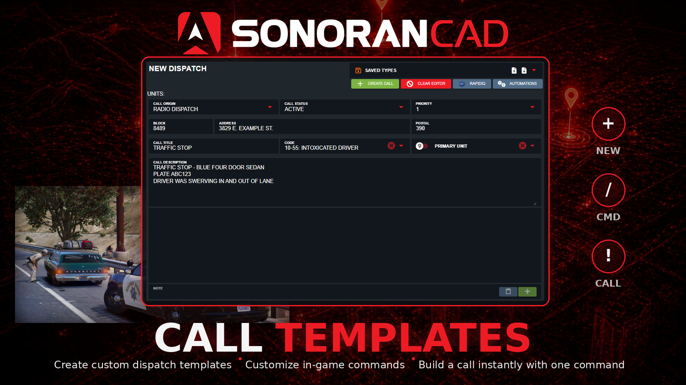

# Call Templates

<figure><figcaption></figcaption></figure>

## Call Templates

This submodule lets communities export custom dispatch call templates from the CAD, define a custom in-game command, and generate dispatch calls using that command.

## Activation Guide

### 1. Download and Install the Resource


This submodule is already **enabled by default** when installing the [Sonoran CAD FiveM resource](../fivem-installation/).

\
The [locations submodule](locations.md) includes required logic to send location data and is **already enabled by default**. Keep this submodule enabled to maintain functionality.

\
The [postals submodule](postals.md) is optional and also enabled by default. Keep this submodule enabled if you wish to include postal code information with emergency calls.


### 2. Adjust the Configuration

The CAD display settings are stored inside of the `/configuration/calltemplates_config.lua` file.

### 3. Ensure Players are Linked

Ensure the player has already [linked their CAD](../link-user-in-game.md) for this integration to work.

### Configuration

a. Main Configuration

| Option                     | Description                                                                           | Default                                                                                                                                                               |
| -------------------------- | ------------------------------------------------------------------------------------- | --------------------------------------------------------------------------------------------------------------------------------------------------------------------- |
| `callTypeDirectory`        | Location of the call type JSON file                                                   | `submodules/calltemplates/calltypes`                                                                                                                                  |
| `defaultOrigin`            | Call origin used if the template does not specify one                                 | 
Default: <code>2</code> Options: - <code>0</code>: Caller - <code>1</code>: Radio Dispatch - <code>2</code>: Observed - <code>3</code>: Walk Up
 |
| `defaultStatus`            | Call status used if the template does not specify one                                 | 
Default: 1 Options: - <code>0</code>: Pending - <code>1</code>: Active - <code>2</code>: Closed
                                                    |
| `defaultPriority`          | Call priority used if the template does not specify one                               | `1`                                                                                                                                                                   |
| `reloadTemplatesOnEachUse` | When true, templates are re-read every command execution (useful while editing files) | `false`                                                                                                                                                               |

b. Call Type Configuration

In the `calltemplates_config.lua` file you will find a section named `commands` . In here, you can configure each custom command that will be used to create a call. Below you will find the options you can use during configuration.

| Option               | Type    | Description                                                                                                      |
| -------------------- | ------- | ---------------------------------------------------------------------------------------------------------------- |
| `command`            | String  | The name of the command                                                                                          |
| `callTypeFile`       | String  | The name of the associated JSON file for the call type                                                           |
| `descriptionPrefix`  | String  | The prefix of the call description                                                                               |
| `suggestionText`     | String  | The command suggestion text                                                                                      |
| `includeWraithPlate` | Boolean | Attach locked plate from wraithv2 if available                                                                   |
| `includePlayerUnit`  | Boolean | Attach the player's unit to the call                                                                             |
| `useAcePermissions`  | Boolean | Require an ace permission to utilize the command. The ace permission is `command.commandName` \| Ex. `comand.ts` |

#### c. Add Call Type JSON Files

Each call type requires a JSON file to be added to the directory `submodules/calltemplates/calltypes`. You can either configure this file yourself or you can download it from Sonoran CAD. This [guide](../../../tutorials/dispatching/creating-a-call.md#import-export-saved-call-types) will explain how to create and export call types.

## Usage

By default, this submodule comes with a `/ts` (traffic stop) and `/towrq` (tow request) commands.

Example:

`/ts Blue four door sedan, occupied x1`

* Creates a dispatch call with the presets for a traffic stop.
* Adds `Blue four door sedan, occupied x1` to the description.
* Pre-fills the call's address and postal location with your in-game location.
