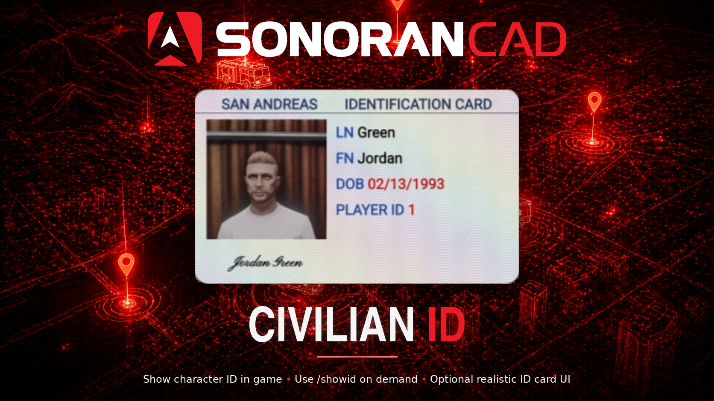

# Civilian Integration



## Activation Guide

### 1. Download and Install the Resource


This submodule is already **enabled by default** when installing the [Sonoran CAD FiveM resource](../fivem-installation.md).


### 2. Adjust the Configuration

The CAD display settings are stored inside of the `/configuration/civintegration_config.lua` file.

### 3. Ensure Players are Linked

Ensure the player has already [linked their CAD](../link-user-in-game.md) for this integration to work.

## Configuration

<details>

<summary><code>civintegration_config.lua</code></summary>

| Option         | Description                                                                                                                                                                                                                                                                            | Default Value |
| -------------- | -------------------------------------------------------------------------------------------------------------------------------------------------------------------------------------------------------------------------------------------------------------------------------------- | ------------- |
| cacheTime      | Time to cache characters in seconds                                                                                                                                                                                                                                                    | 3600          |
| allowCustomIds | Allow players to use /setid to set a custom name.                                                                                                                                                                                                                                      | true          |
| allowPurge     | Allow players to use /refreshid to "purge" their character list from cache.                                                                                                                                                                                                            | true          |
| enableIDCardUI | <p><strong>Recommended</strong>: Allows for a more realistic identification ui with /showid<br><br><strong>IF USING:</strong> Please ensure you start the resource <code>sonoran_idcard</code> <strong>BEFORE</strong> <code>sonorancad</code> in your server resource start order</p> | false         |

</details>

## Usage

#### Commands

In-game commands can be used to

* `/civid show` Show the ID of your currently selected character in the CAD to the nearest player.
  * If using the `/civid set` command, it will show your manually configured character info instead of from the CAD.
* `/civid set` Manually enter character information for your ID.
* `/civid reset` Result the manually entered character information for your ID.
* `/civid refresh` Removes the "cached" characters for the client. This allows players to swap characters in the CAD without relogging or waiting for the cache timer.
* `/civid help` Displays a list of commands.

<figure><figcaption></figcaption></figure>

### Export

You can use this export to fetch all characters for a specific player ID. This is a server-side export only.

```lua
Function: "GetCharacters"
Parameters:
    player: the player ID
    callback: function to call after fetching the data. Returns an array of character objects.

Example:
    exports["sonorancad"]:GetCharacters(playerId, function(result)
        -- do stuff with result, an array of character objects
    end)
```

This function can also be used in other submodules (without the export bit).
