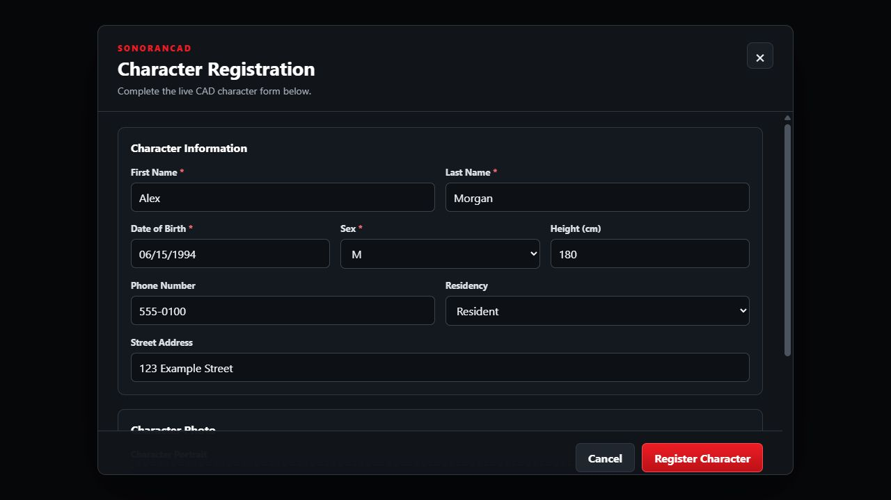
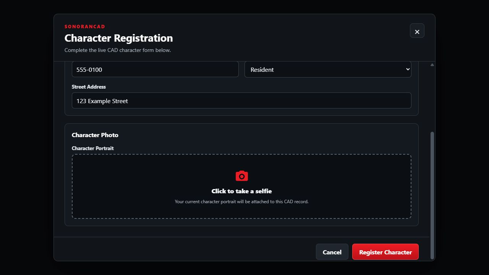

# Civilian Registration (CivReg)

Civilian Registration connects an in-game character portrait to Sonoran CAD. Its behavior follows your community's CAD database sync configuration automatically.

When CAD character database sync is disabled, run `/civreg` to open **Character Registration**, complete your community's character form, and create a civilian on the linked CAD account. When CAD character database sync is enabled, `/civreg` captures the current framework character's portrait and stores it in the framework database for CAD to read.

In API mode, the form loads your community's live character template, including its sections, field labels, choices, required fields, and visibility rules. QBCore or supported ESX identity information can prefill the form, and image fields let players capture their current in-game character's portrait.

<figure><figcaption><p>Character Registration interface with a sample template and fictional character details.</p></figcaption></figure>


Screenshots show the API-mode registration interface rendered in a browser preview with sample data. Your community's fields and layout depend on its CAD template. Database mode captures the portrait without opening this form.


## Activation Guide

### 1. Install or Update Sonoran CAD for FiveM

Follow the [FiveM installation guide](../fivem-installation/) and use a resource version that includes `sonorancad/submodules/civreg`. The submodule is bundled with the Sonoran CAD resource; its supplied configuration has `enabled = true`.

Keep the installation guide's startup configuration in `server.cfg`:

```cfg
exec @sonorancad/sonorancad.cfg
```

Your base resource must be connected to the correct CAD community with a working API configuration. See [installation troubleshooting](../fivem-installation/troubleshooting/) if the resource cannot connect.

CivReg checks the community's [database sync configuration](../../../api-integration/api-endpoints-v2/general/configuration/get-database-sync-configuration.md) once when the resource starts. Restart `sonorancad` after enabling or disabling CAD character database sync so CivReg selects the correct mode.

### 2. Configure the Submodule

Open `sonorancad/configuration/civreg_config.lua`. If only `civreg_config.dist.lua` exists, copy it to `civreg_config.lua` before editing. Keep `enabled = true` and `templateId = 7` for civilian character registration.

Save your changes and restart the `sonorancad` resource. See [Submodule Configuration](../submodule-configuration/) for general configuration instructions.

### 3. Configure Database Sync Mode, If Enabled

If both **Database Sync** and its **Character** mapping are enabled in CAD, CivReg uses database mode automatically. Complete these steps:

1. Start QBCore or ESX before `sonorancad`.
2. Start `oxmysql` or `mysql-async` before `sonorancad`.
3. In CAD's character database sync mapping, map the `sonoran_mugshot` database column to the character template's **Image** field.
4. Confirm the character ID mapping uses the same value as QBCore `players.citizenid` or ESX `users.identifier`.
5. Restart `sonorancad`.

On every start in database mode, CivReg runs `ADD COLUMN IF NOT EXISTS` to add a nullable `sonoran_mugshot MEDIUMTEXT` column. `MEDIUMTEXT` is required because a base64 portrait can exceed the 65,535-byte capacity of MySQL `TEXT`.

The standard database targets are:

| Framework | Character table | Character ID column | Portrait column |
| --- | --- | --- | --- |
| QBCore | `players` | `citizenid` | `sonoran_mugshot` |
| ESX | `users` | `identifier` | `sonoran_mugshot` |

If your framework uses a customized table or character ID column, update `databaseSync.qbCore` or `databaseSync.esx` in `civreg_config.lua`. Keep the portrait column named `sonoran_mugshot`, then use that column in the CAD field mapping.


In database mode, CivReg does not create a second character through the CAD API. If the database migration cannot run, portrait updates stop and the server reports `ERR-CR-106`.


### 4. Link Players to CAD

Each player must [link their CAD account in-game](../link-user-in-game.md) before using `/civreg`. In API mode, the new character belongs to that linked account. In database mode, the link lets CAD character selection target the correct online player. Players do not need an online emergency unit.

### 5. Review Your Character Template

In CAD, open **Admin > Customization > Custom Records** and review the civilian character template. The built-in character template ID is `7`. See [Creating Custom Record and Report Types](../../../tutorials/customization/creating-custom-record-and-report-types.md) for editing fields and sections.

In API mode, the form uses the template from CAD, so you do not need to maintain a separate list of form fields in the submodule configuration. Review required fields, dropdown options, read-only settings, masks, and dependencies before players use it. Add an editable **Image** field if players should attach a portrait, and make that field required if a portrait is mandatory.

In database mode, add an **Image** field and map it to `sonoran_mugshot` in the CAD DB Sync character mapping. Other character fields continue to come from the database mappings you already configured.

In API mode, templates are cached for **60 seconds** by default. After saving a template change, allow the cache to expire, then close and reopen `/civreg` to load the updated form. An already-open form does not refresh automatically.

### 6. Configure Optional Autofill and Portrait Uploads

For identity autofill, follow [Framework Autofill](#framework-autofill). For templates with image fields, review [Portrait Uploads](#portrait-uploads) and the image size limit.

## Player Guide

### Register a Character in API Mode

1. Join the server and complete the [CAD account link](../link-user-in-game.md).
2. Run `/civreg`, or your server's configured registration command.
3. Review any prefilled details and complete the remaining fields. A red `*` marks required player input. Follow the displayed format for dates and other masked fields.
4. Scroll through the form. Additional fields or sections may appear when you change an answer.
5. If the form includes a portrait field, select **Click to take a selfie**. Wait for the preview; click it again to retake the portrait if needed.
6. Select **Register Character** and wait for the result. On success, the form closes and a confirmation notification appears. The new civilian is saved to your linked CAD account.

Each successful API-mode submission creates a **new character**. Use CAD to manage existing characters and select the civilian you want to use with other integrations.

### Update a Character Portrait in Database Mode

1. Load the intended QBCore or ESX character in FiveM.
2. Complete the CAD account link.
3. Run `/civreg`.
4. Wait for the success notification confirming that the portrait was updated.

The command captures the active in-game character and updates only the matching framework row. It does not open the registration form or create a CAD API record.

CivReg also listens for CAD's `EVENT_CHAR_SELECTED` push event. When the linked player is online and selects a database sync character in CAD, CivReg captures the current in-game portrait and writes it to the exact sync ID supplied by CAD. Ensure [push events](../../../api-integration/push-events/) can reach the game server for this automatic refresh.

### Take a Character Selfie

In API mode, the selfie control captures your current FiveM character's headshot. It uses the character you are playing when you click the control. Each editable image field has its own capture button, and the preview lets you review or retake that field's image before submitting.

<figure><figcaption><p>Scroll to an image field and select Click to take a selfie to capture your current in-game character.</p></figcaption></figure>

If capture fails, the form displays an error and lets you try again. Wait for an active capture to finish before registering.

### Correct or Cancel a Form

If a required value is missing or a value does not match its format, the form displays an error. Correct the field and submit again. A failed registration leaves the form open so you can review the message.

Select **Cancel**, the **×** button, or press **Escape** to close the form before submitting. Closing discards the unfinished form; reopening starts a new registration. Closing controls are disabled while a submission is pending.

A registration session expires after **10 minutes**. If it expires, close the form, reopen the command, and enter the details again.

## Template Behavior

| Template setting or field | In-game behavior |
| --- | --- |
| Sections, labels, and field widths | The form follows the template's section order, labels, and field sizes. Narrow displays stack fields vertically. |
| Required fields | Editable required fields receive a red `*` and must be completed when visible. |
| Text and multi-line text | Players enter the value directly. Text values are limited to 8,000 characters; a mask may impose a shorter limit. |
| Dates and masks | The form uses the configured format, such as `MM/DD/YYYY`, and checks the entered value against it. |
| Dropdowns and checkboxes | Choices come from the template. Checkbox fields support multiple selections. |
| Status | Uses the template's choices. If none are supplied, the form offers Pending, Approved, and Rejected. |
| Field and section dependencies | Show or hide content based on another field's selected value. Hidden answers and portraits are excluded from the submission. |
| Read-only fields | Players cannot edit them. The form uses available prefilled or template values. |
| Random fields | Automatically populated from the template value or mask and locked for editing. |
| Supervisor fields | Omitted from the player's registration form. |
| Labels, record IDs, and unit fields | Display-only or disabled. Unit fields are not a substitute for civilian identity autofill. |
| Image fields | Editable images become selfie controls. Read-only images cannot be captured. |

Address fields accept typed text in this form. Specialized CAD editors such as address search, record linking, charges, and diagrams are not provided by the registration interface.

## Framework Autofill

Autofill is optional. Players can complete the registration form without a framework. To prefill supported identity values:

1. Configure and enable [Framework Support (ESX/QBCore)](framework-support-esx-qbcore-and-auto-fines/).
2. Start the supported framework before Sonoran CAD and set `usingQBCore` appropriately in `frameworksupport_config.lua`.
3. Match `autofillFieldIds` in `civreg_config.lua` to your character template's **Field Mapping ID** values.
4. Restart Sonoran CAD and open a new registration form while playing a loaded framework character.

The left-hand keys describe the identity values supplied by the framework. The right-hand strings identify the destination fields in CAD:

```lua
autofillFieldIds = {
    first = "first",
    last = "last",
    dob = "dob",
    sex = "sex",
    height = "height",
    phone = "phone",
    nationality = "nationality"
},
```

For example, if your first-name field has the custom Field Mapping ID `givenName`, change only that entry to `first = "givenName"`. These mappings control autofill; they do not create or rename template fields.

| Identity value | Default destination | Notes |
| --- | --- | --- |
| First name | `first` | Available framework first name. |
| Last name | `last` | Available framework last name. |
| Date of birth | `dob` | Dates supplied as `YYYY-MM-DD` or `YYYY/MM/DD` are converted when the CAD field uses `MM/DD/YYYY`. |
| Sex | `sex` | Values `0`, `m`, or `male` become `M`; `1`, `f`, or `female` become `F`. Match your template's choices to those values. |
| Height | `height` | Copied as supplied; the submodule does not convert height units. |
| Phone number | `phone` | Filled when the framework supplies a supported phone value. |
| Nationality | `nationality` | Filled when available from the framework. |

Only values supplied by the framework and mapped to an existing template field are prefilled. Missing values leave the template's default or an empty field for the player to complete. Prefilled fields remain editable unless marked read-only in CAD. These autofill settings apply to the API-mode form. Database mode updates only the `sonoran_mugshot` column; your existing CAD DB Sync mappings supply the remaining character fields.

## Portrait Uploads

Captured portraits use **base64 image data**, including the PNG or JPEG data prefix. API mode uploads the base64 data directly with the character registration. Database mode stores the same value in `sonoran_mugshot` for CAD DB Sync to read. Neither mode requires a public image URL, reverse proxy, or saved image file on the game server.

The server validates each portrait before sending it to CAD or the framework database. `maxSelfieBytes` limits the decoded image size to **1 MiB** by default. If an image is invalid or too large, retry the capture. API mode displays the validation error in the form.

### Updating from URL-Based Portraits

The old `selfieBaseUrl` setting is ignored and can be removed from `civreg_config.lua`. Previously created records keep their original image URLs. Preserve `sonorancad/filestore/civreg` and its existing public route while those records use it; updating the submodule does not convert existing portraits. The resource continues to serve those older files.

## Configuration Reference

Edit `sonorancad/configuration/civreg_config.lua` and restart the resource after changes.

| Option | Default | Description |
| --- | --- | --- |
| `enabled` | `true` | Enables civilian registration. |
| `commandName` | `"civreg"` | Chat command without the leading `/`. Changing it changes the command players use. |
| `templateId` | `7` | CAD character template ID. Keep `7` for civilian registration; selecting a different record type changes what is submitted to CAD. |
| `templateCacheSeconds` | `60` | Shared template cache duration in seconds. `0` disables caching; frequent requests can hit the CAD template endpoint's rate limit. |
| `maxSelfieBytes` | `1024 * 1024` | Maximum decoded size of each base64 portrait upload: 1 MiB by default. |
| `databaseSync.qbCore.tableName` | `"players"` | QBCore character table updated in database mode. |
| `databaseSync.qbCore.characterIdColumn` | `"citizenid"` | QBCore column matched to the DB Sync character ID. |
| `databaseSync.esx.tableName` | `"users"` | ESX character table updated in database mode. |
| `databaseSync.esx.characterIdColumn` | `"identifier"` | ESX column matched to the DB Sync character ID. |
| `autofillFieldIds` | Mapping shown above | Maps supported framework identity values to CAD Field Mapping IDs. |
| `notificationOverride` | `"none"` | Uses the global notification choice when `none`. Supported overrides listed in the configuration are `ox_lib`, `lation_ui`, `pnotify`, and `chat`. |
| `language` | English strings below | Customizes command help, form labels, and the success notification. |

Leave `pluginName = "civreg"`, `pluginAuthor = "SonoranCAD"`, and `configVersion = "1.1"` as supplied. These identify the submodule and its configuration version.

### Language Settings

| Key in `language` | Default text |
| --- | --- |
| `helpMsg` | `Register a new civilian character in CAD` |
| `title` | `Character Registration` |
| `subtitle` | `Complete the live CAD character form below.` |
| `selfieAction` | `Click to take a selfie` |
| `selfieHint` | `Your current character portrait will be attached to this CAD record.` |
| `submit` | `Register Character` |
| `cancel` | `Cancel` |
| `loading` | `Loading the live CAD template...` |
| `success` | `Character registered successfully in CAD.` |
| `databaseSyncSuccess` | `Character portrait updated successfully.` |

`loading` is included in the supplied configuration but is not currently displayed by the form. Some validation messages and the `Submitting...` text are built into the interface and are not changed by this language table.

## Troubleshooting

| Problem | What to check |
| --- | --- |
| The command is unavailable | Confirm `civreg` is installed, the active configuration is named `civreg_config.lua`, `enabled` is `true`, and you are using the configured `commandName`. Restart the resource after configuration changes. |
| `/civreg` does not open the form | When CAD character database sync is enabled, this is expected. The command captures the active framework character and shows a success notification after updating its portrait. |
| Database mode reports `ERR-CR-106` | Start QBCore or ESX and `oxmysql` or `mysql-async` before `sonorancad`. Confirm the configured character table and ID column exist, and allow the database user to alter and update that table. |
| The portrait column exists but CAD shows no image | In the CAD character DB Sync mapping, map `sonoran_mugshot` to an **Image** field. Confirm the character ID mapping matches `citizenid` or `identifier`, then select the character again. |
| Selecting a CAD character does not refresh its portrait | Confirm the player is online and linked to that CAD account, the selected record is a DB Sync character, and CAD push events can reach the server. |
| The player is asked to link CAD | Complete [Link User In-Game](../link-user-in-game.md) with the intended CAD account, then retry. |
| Repeated commands do nothing | Requests have a three-second cooldown. In API mode, a form already open will not reopen; close the current form and wait before retrying. |
| Template changes are missing | Save the template in CAD, wait for `templateCacheSeconds` to pass, then reopen the form. |
| Autofill is missing or incorrect | Check that Framework Support is enabled, the framework character is loaded, and each destination Field Mapping ID exists. Review date formats, sex choices, and height units. |
| A field or section is missing | Review its dependency rules and whether the field is supervisor-only. |
| A field cannot be edited | Check read-only settings and whether the field is an automatically managed field such as a random value or ID. |
| Selfie capture fails | Retry with the intended character fully loaded. If it persists, check client errors and that the Sonoran CAD UI files are up to date. |
| A portrait is rejected as invalid or too large | Retake it and review the displayed error. Check `maxSelfieBytes` for the decoded size limit. |
| A portrait is missing from an older URL-based CAD record | Open its saved URL externally. Check the original public route and that the file still exists in `filestore/civreg`. See [Updating from URL-Based Portraits](#updating-from-url-based-portraits). |

### Registration Error Codes

| Code | Meaning | Resolution |
| --- | --- | --- |
| [ERR-CR-101](../fivem-installation/troubleshooting/error-codes.md#err-cr-101) | The live CAD character template could not be loaded. | Check the CAD connection and template ID, then retry. If requests are rate limited, keep template caching enabled and wait before retrying. |
| [ERR-CR-102](../fivem-installation/troubleshooting/error-codes.md#err-cr-102) | The form expired or contains invalid fields or portrait data. | Correct the displayed validation error. Retake an invalid portrait and check `maxSelfieBytes`. If the form expired, close and reopen the registration command; sessions last 10 minutes. |
| [ERR-CR-105](../fivem-installation/troubleshooting/error-codes.md#err-cr-105) | CAD could not create the character. | Review the accompanying API failure in the server console, confirm the linked account and template, and correct the reported issue before retrying. |
| [ERR-CR-106](../fivem-installation/troubleshooting/error-codes.md#err-cr-106) | CivReg could not initialize or update the DB Sync portrait column. | Check the framework, SQL resource, table and ID column configuration, and database permissions. |

`ERR-CR-103` and `ERR-CR-104` apply to older versions that hosted portrait files. Current base64 uploads do not use those paths; see the [error-code reference](../fivem-installation/troubleshooting/error-codes.md#civilian-registration-errors) when troubleshooting an older installation.

## Related Submodules

* [Civilian Integration](civilian-integration.md) retrieves civilian information and provides the in-game ID commands.
* [Vehicle Register (VehReg)](vehreg.md) registers the vehicle a player is sitting in to their selected CAD character.
* [Framework Support (ESX/QBCore)](framework-support-esx-qbcore-and-auto-fines/) supplies optional identity information for autofill.
