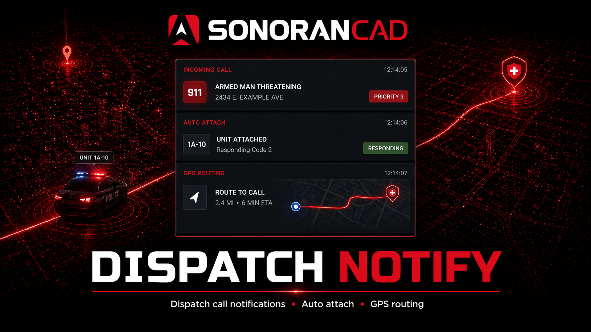

# Dispatch Notify

<figure><figcaption></figcaption></figure>

This submodule:

* Notifies officers of incoming calls
* [Allows officers to attach to calls via command](dispatch-notify.md#2-officer-attaches-to-the-call)
* Automatically routes attached units to the postal code
* Unit GPS routing is updated whenever the dispatch postal is updated
* [Allows the call postal and GPS routing to be automatically updated to the primary unit's location](dispatch-notify.md#primary-unit-tracking-pursuit)
* Notifies the civilian making the emergency call when an officer is en-route.

## Activation Guide

### 1. Download and Install the Resource


This submodule is already **enabled by default** when installing the [Sonoran CAD FiveM resource](../fivem-installation.md).

\
The [locations submodule](locations.md) includes required logic to send location data and is **already enabled by default**. Keep this submodule enabled to maintain functionality.

\
The [call commands submodule](call-commands.md) includes required logic to create emergency calls and is **already enabled by default**. Keep this submodule enabled to maintain functionality.

\
The [postals submodule](postals.md) is optional and also enabled by default. Keep this submodule enabled if you wish to include postal code information with emergency calls.


### 2. Adjust the Configuration

The CAD display settings are stored inside of the `/configuration/dispatchnotify_config.lua` file.

### 3. Ensure Players are Linked

Ensure the players have already [linked their CAD](../link-user-in-game.md) for this integration to work.

### Configuration

Review the `dispatchnotify_config.lua` file to configure the submodule to behave how you like. The file is well documented. Please review **all** the settings!

<code>dispatchnotify_config.lua</code>

| Config Value                  | Description                                                                                                                                                                                                                                                                                                                                                                                                                               |
| ----------------------------- | ----------------------------------------------------------------------------------------------------------------------------------------------------------------------------------------------------------------------------------------------------------------------------------------------------------------------------------------------------------------------------------------------------------------------------------------- |
| enableUnitNotify              | Enable incoming 911 call notifications                                                                                                                                                                                                                                                                                                                                                                                                    |
| emergencyCallType             | Specifies what emergency calls are displayed as. Some countries use different numbers (like 999)                                                                                                                                                                                                                                                                                                                                          |
| civilCallType                 | Specifies non-emergency call types. If unused, set to blank ("")                                                                                                                                                                                                                                                                                                                                                                          |
| dotCallType                   | Some communities use 511 for tow calls. Specify below, or set blank ("") to disable                                                                                                                                                                                                                                                                                                                                                       |
| respondCommandName            | Command to respond to calls with                                                                                                                                                                                                                                                                                                                                                                                                          |
| enableUnitResponse            | 
Enable call responding (self-dispatching)

If disabled, running commandName will return an error to the unit
                                                                                                                                                                                                                                                                                                                  |
| dispatchDisablesSelfResponse  | If a dispatcher is detected to be online, automatically disable the response command.                                                                                                                                                                                                                                                                                                                                                     |
| dispatchDisablesUnitNotify    | If a dispatcher is detected to be online, automatically suppress incoming 911 call notifications to units.                                                                                                                                                                                                                                                                                                                                |
| enableUnitNotifyToggleCommand | Enable an in-game command to override unit 911 notifications                                                                                                                                                                                                                                                                                                                                                                              |
| unitNotifyToggleCommand       | In-game command to override unit 911 notifications                                                                                                                                                                                                                                                                                                                                                                                        |
| unitNotifyToggleAce           | Ace permission allowed to use the command. Leave blank ("") to allow anyone to use the command                                                                                                                                                                                                                                                                                                                                            |
| enableCallerNotify            | Enable "units are on the way" notifications                                                                                                                                                                                                                                                                                                                                                                                               |
| notifyMethod                  | 
<strong>chat</strong>: Sends a message in chat

<strong>pnotify</strong>: Uses pNotify to show a notification

<strong>custom</strong>: Use the custom event <code>SonoranCAD::dispatchnotify:IncomingCallNotify</code>instead (Provides single parameter) - The message.
                                                                                                                                                |
| unitNotifyMethod              | 
<strong>chat</strong>: Sends a message in chat

<strong>pnotify</strong>: Uses pNotify to show a notification

<strong>ox_lib:</strong> Uses ox_lib to show a notification

<strong>lation_ui:</strong> Uses lation UI to show a notification

<strong>custom</strong>: Use the custom event

<code>SonoranCAD::dispatchnotify:IncomingCallNotify</code>instead (Provides single parameter) - The message
 |
| notifyMessage                 | 
NotifyMessage: Message template to use when sending to the player

You can use the following replacements:

<strong>{officer}</strong> - officer name
                                                                                                                                                                                                                                                                    |
| incomingCallMessage           | 
How should officers be notified of a new 911 call? Parameters: <strong>{location}</strong> - location of call (street + postal) <strong>{description}</strong> - description as given by civilian <strong>{caller}</strong> - caller's name <strong>{callId}</strong> - ID of the call so LEO can respond with /r911 <strong>{command}</strong> - The command to use
                                                |
| unitDutyMethod                | 
How to detect if units are online? <strong>incad</strong>: units must be logged into the CAD <strong>permissions</strong>: units must have the "sonorancad.dispatchnotify" ACE permission (see docs) <strong>esxjob</strong>: requires esxsupport submodule, use jobs instead for on duty detection <strong>custom</strong>: Use custom function (defined below as unitDutyCustom)
                                     |
| esxJobsAllowed                | What jobs should count as being on duty?                                                                                                                                                                                                                                                                                                                                                                                                  |
| waypointType                  | 
Customise the title of a call made in the CAD <strong>postal</strong>: set gps to caller's postal (less accurate, more realistic) - REQUIRES <a href="postals.md">CONFIGURED POSTAL </a>SUBMODULE <strong>exact</strong>: set gps to caller's position (less realistic) <strong>none</strong>: disable waypointing
                                                                                                        |
| waypointFallbackEnabled       | Fall back to postal if exact coordinates cannot be found (for self-generated calls)                                                                                                                                                                                                                                                                                                                                                       |
| callTitle                     | 
Type of waypoint to use when officer is attached <strong>Default</strong>: OFFICER RESPONSE
                                                                                                                                                                                                                                                                                                                                     |
| sendNotesToUnits              | Enable "the sending of notes to units" notifications                                                                                                                                                                                                                                                                                                                                                                                      |
| notifyMessage                 | 
NotifyMessage: Message template to use when sending to the player

You can use the following replacements:

<strong>{callid}</strong> - The CAD Call ID

<strong>{note}</strong> - The Note Added
                                                                                                                                                                                                                   |
| enableAddNote                 | Enable "the adding of the notes" notifications                                                                                                                                                                                                                                                                                                                                                                                            |
| addNoteCommand                | Command to add notes to a call with                                                                                                                                                                                                                                                                                                                                                                                                       |
| enableAddPlate                | Enable "the adding of plates that are locked" notifications - REQUIRES [CONFIGURED WRAITHV2 ](/broken/pages/-M7U3aBbrsfrj1Cmeqmm)SUBMODULE                                                                                                                                                                                                                                                                                                |
| addPlateCommand               | Command to add plates to a call with                                                                                                                                                                                                                                                                                                                                                                                                      |

## Commands

In-game commands can be used to

* `/dn respond [id`] Respond/Attach to the newly created dispatch call ID
* `/dn notify [on/off/auto]` - Toggle chat alerts on, off, or auto (using the configuration file's default)
* `/dn note [text]` Add a note to the current dispatch call
* `/dn plate` Adds your currently locked license plate number as a note from the [Wraith ALPR](wraithv2.md) submodule
* `/dn gps` Toggles on/off automatic GPS routing to the call's postal code

<figure><figcaption></figcaption></figure>

## Dispatch Call Responding

### 1. Civilian Places a 911 Call

This call can be placed from the Civilian menu of the CAD, or via the `/911` command in-game, supplied by the [callcommands](call-commands.md) submodule.

### 2. Officer Attaches to the Call

The unit will see a notification message of the incoming call, complete with the command to run in order to attach.

<figure><figcaption></figcaption></figure>

## Primary Unit Tracking (Pursuit)

Dispatch notify can also be used to track the primary unit on a call. This will automatically update the postal code on the dispatch call to the primary unit's current location. This is highly useful for pursuits, where additional units need to catch up and join the chase.

### 1. Toggle Unit Tracking for the Primary Unit

Dispatchers (or self-dispatch) can set the primary unit to any unit currently attached to the call. The slider next to the Primary Unit box will toggle tracking mode. When enabled, the postal will automatically update based on the primary unit's location and be sent to all attached units.

<figure><figcaption></figcaption></figure>

## Troubleshooting

* No notifications for 911 calls
  * Units must be logged into the CAD (by default) or meeting the requirements depending on how the submodule is configured.
  * If using pNotify notifications, ensure that resource is running.
* Units do not automatically attach to calls
  * Ensure the players have already [linked their CAD](../link-user-in-game.md) for this integration to work.
* Caller is not notified when units attach to the call
  * If the caller ever leaves the server and rejoins, this feature does not work.
  * If dispatch created the call within the CAD, there is no way to notify a caller.
  * Ensure you are not overriding the 911 command (default `/911`) with another resource.
