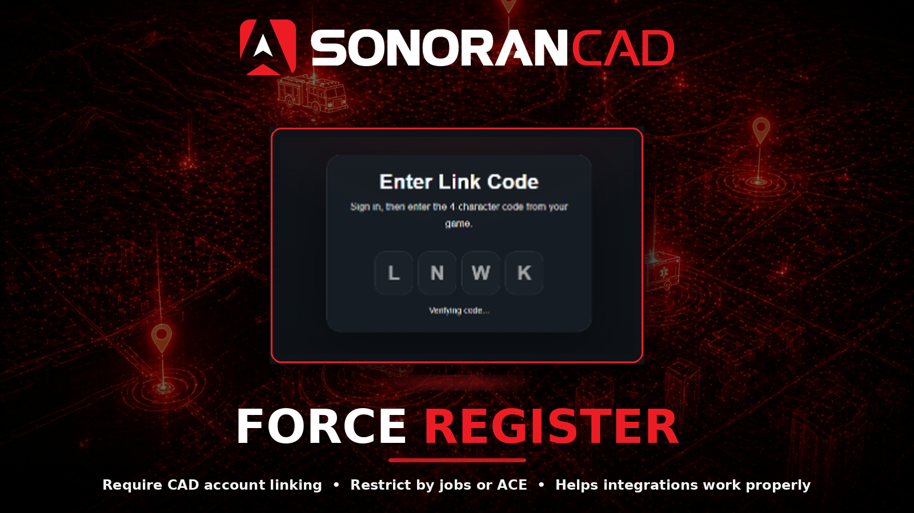

# Force Register (ForceReg)

<figure><figcaption></figcaption></figure>

## Activation Guide

### 1. Download and Install the Resource


This submodule is already **enabled by default** when installing the [Sonoran CAD FiveM resource](../fivem-installation.md).


### 2. Adjust the Configuration

The CAD display settings are stored inside of the `/configuration/forcereg_config.lua` file.

### 3. (OPTIONAL) Utilize the Tablet's Auto Link

The [tablet resource](tablet.md) can be configured to automatically link the user when they login, removing the need for users to manually type this in.

## Configuration

<details>

<summary><code>forcereg_config.lua</code></summary>

| Option            | Description                                                                                                                          | Default Value                                                                                    |
| ----------------- | ------------------------------------------------------------------------------------------------------------------------------------ | ------------------------------------------------------------------------------------------------ |
| captiveOption     | The mode to use for telling players to sign up.                                                                                      | Nag                                                                                              |
| captiveMessage    | Message to show to the player.                                                                                                       | See Config                                                                                       |
| verifyMessage     | Message to show how to confirm the player registered.                                                                                | See Config                                                                                       |
| whitelist.enabled | Restrict forcing registration to only the configured people                                                                          | `false`                                                                                          |
| whitelist.mode    | What the whitelist will use to check if a player is whitelisted                                                                      | <p><code>qb-core</code><br>Options: <code>qb-core</code>, <code>esx</code>, <code>ace</code></p> |
| whitelist.aces    | Ace permissions that will pass the whitelist and will get the ForceReg notifications if `whitelist.mode` is set to `ace`.            | `forcereg.whitelist`                                                                             |
| whitelist.jobs    | QBCore of ESX jobs that will pass the whitelist and get the ForceReg notifications if `whitelist.mode` is set to `qb-core` or `esx`. | `police`                                                                                         |

</details>

## Commands

In-game commands can be used to

* `/link` Opens the link menu in-game

<figure><figcaption></figcaption></figure>

## Modes

In the configuration file, the `captiveOption` can be set to `Nag` or `Freeze`. This changes the behavior of the [link menu](forcereg.md#link-menu) popup.

<details>

<summary>Nag Mode</summary>

When the `captiveOption` is set to `Nag` an in-game text message will display at the top, informing the user to run the `/link` command to connect to the CAD.

<figure><figcaption></figcaption></figure>

</details>

<details>

<summary>Freeze Mode</summary>

When the `captiveOption` is set to `Freeze` the link menu will be automatically displayed and users will be unable to close it until they have linked their CAD account.

</details>

### Link Menu

The link menu displays a code and button to link. Selecting the **Link CAD** button will automatically open sonorancad.com/id in an external browser, with the code already entered.

If the user is not yet logged into Sonoran CAD in their browser, they must do so first.

After linking, the user will be automatically joined to the CAD community if not already.

<figure><figcaption></figcaption></figure>

### Event

This event is sent to the **client** after the check is completed.

```lua
Event: "SonoranCAD::forcereg:PlayerReg"

Parameters:
    identifier: The identifier checked
    exists: true/false, if the identifier is linked to a CAD account
```
