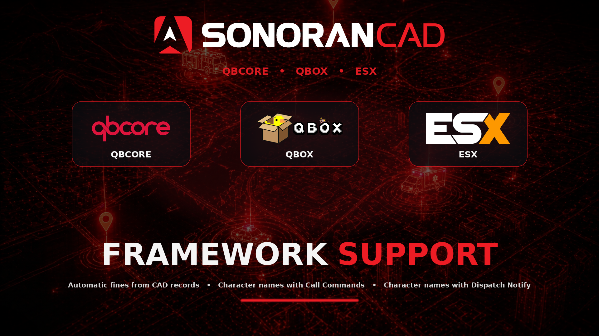

# Framework Support (ESX/QBCore) and Auto Fines


ESX v2 is not supported by this submodule and will not function. Only ESX v1 is supported.


<figure><figcaption></figcaption></figure>

## Activation Guide

### 1. Download and Install the Resource


This submodule is already **enabled by default** when installing the [Sonoran CAD FiveM resource](../../fivem-installation/).


### 2. Adjust the Configuration

The CAD display settings are stored inside of the `/configuration/frameworksupport_config.lua` file.

### 3. Ensure Players are Linked

Ensure the players have already [linked their CAD](../../link-user-in-game.md) for this integration to work.

### Configuration

Review the `frameworksupport_config.lua` file to configure the submodule to behave how you like. The file is well documented. Please review **all** the settings!

<code>frameworksupport_config.lua</code>

| Config Value             | Description                                                                                                                                                                                          |
| ------------------------ | ---------------------------------------------------------------------------------------------------------------------------------------------------------------------------------------------------- |
| identityType             | Newer ESX version use license instead of steam for identity.                                                                                                                                         |
| usePrefix                | Some ESX versions don't use the prefix (such as license:abc) with the identity, set to false to disable the prefix.                                                                                  |
| usingQBCore              | If you are using QBCore set this to true.                                                                                                                                                            |
| usingQBManagement        | Set to true if you want to use qb-management accounts to receive fine payments.                                                                                                                      |
| qbManagementAccountNames | A table of department abbreviations to qb-management account names, see examples present in config                                                                                                   |
| qbNotifyFinedPlayer      | Set to true to notify only the fined individual of the fine                                                                                                                                          |
| qbFineMessage            | The message sent to notify the user of the fine. The placeholders are $AMOUNT and $OFFICER\_NAME where $AMOUNT is the fine total and $OFFICER\_NAME is the Unit Name of the officer issuing the fine |
| issueFines               | Whether to issue fines to players for finable reports/forms                                                                                                                                          |
| fineNotify               | Whether to send a message in chat when a player is issued a fine                                                                                                                                     |
| fineableForms            | A list of the names of forms that should issue fines to players.                                                                                                                                     |
| legacyESX                | 
Set to true if default settings do not get character name properly (older esx_identity/ESX legacy versions)  created for and tested with: ESX v1.1.0 esx_identity v1.0.2
          |

### Auto-Fines

Civilians in-game can be automatically fined for the crimes they commit based on fineable forms submitted.

To do so, simply enable `issueFines` in the config and add a list of custom record types to the `fineableForms` array.

Ex: `fineableForms = {"Arrest Report", "Speeding Citation"}`

The fines are pulled from your custom records:

* `Charges` section -> `Fine` field
* `Speed` section -> `Fine` field

## Usage

This submodule can be used to issue fines to players when reports/records are entered into the CAD that include fines. You can configure the reports/records that are finable in the configuration. This submodule also adds support for ESX that other submodules can take advantage of. Currently, the following submodules are supported:

* [dispatchnotify](../dispatch-notify.md)
  * Adds the ability to show character names in dispatch responses (officer names)
  * Adds the ability to restrict functionality to certain jobs (like police). See the [dispatchnotify documentation](../dispatch-notify.md) for how to do this.
* [callcommands](../call-commands.md)
  * Adds the ability to show character names for the caller when they use /911. This is automatic when the submodule is installed.
* [livemap](../live-map.md)
  * Adds the ability to show character names on the map.

### Legacy ESX Support


Legacy ESX Support utilizes MySQL-Async in order to get character information from your database directly. ESX requires this in older versions so this shouldn't be an issue.


This is mainly for ESX v1 releases that were made before the character system implementation using only the `users` database table. These versions of ESX used the `users` table only for player information of active characters and a `characters` table that held all character information (active and secondary characters of your players).

Due to different handling of character information such as first name and last names, this option allows you to use esxsupport submodule with older "Legacy" ESX v1 releases.

Simply set `legacyESX` to true in your `config_esxsupport.lua`
