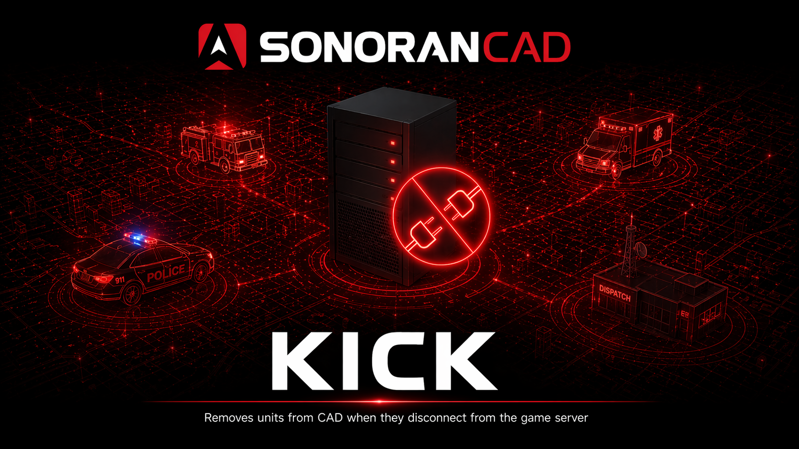

# Kick

<figure><figcaption></figcaption></figure>

## Activation Guide

### 1. Download and Install the Resource


This submodule is already **enabled by default** when installing the [Sonoran CAD FiveM resource](../fivem-installation.md).


### 2. Adjust the Configuration

The CAD display settings are stored inside of the `/configuration/kick_config.lua` file.

### 3. Ensure Players are Linked

Ensure the players have already [linked their CAD](../link-user-in-game.md) for this integration to work.

## Usage

When a [linked player](../link-user-in-game.md) disconnects from the FiveM server, their unit will be automatically disconnected from the CAD.
