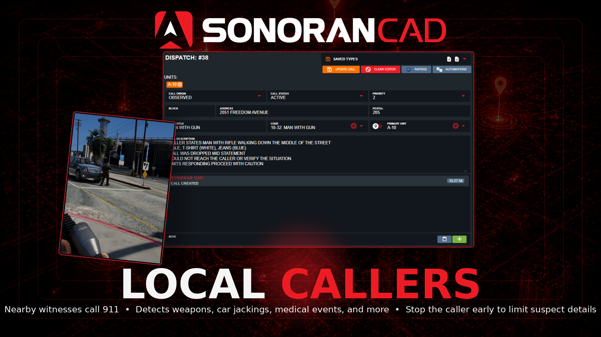

# Local Callers

<figure><figcaption></figcaption></figure>

## Promo Video



## Installation Guide

### 1. Download and Install the Resource


This submodule is already **enabled by default** when installing the [Sonoran CAD FiveM resource](../fivem-installation/).

\
The [locations submodule](locations.md) includes all logic required to send bodycam images to the CAD and is **already enabled by default**. Keep this submodule enabled to maintain functionality.


### 2. Adjust the Configuration

The bodycam settings are stored inside of the `/configuration/localcallers_config.lua` file.

### Configuration

<code>localcallers_config.lua</code>

<table><thead><tr><th align="center" valign="middle">Variable</th><th align="center">Type</th><th align="center">Description</th></tr></thead><tbody><tr><td align="center" valign="middle"><code>callCoolDown</code></td><td align="center"><code>int</code></td><td align="center">How long in between calls for the same player</td></tr><tr><td align="center" valign="middle"><code>clearRecordsAfter</code></td><td align="center"><code>int</code></td><td align="center">Time in minutes to clear records after a call is made | 0 will disable this feature</td></tr><tr><td align="center" valign="middle"><code>callTypes</code></td><td align="center"><code>table</code></td><td align="center">Events that will trigger a 911 call. <code>gun</code> Will trigger based on brandishing or shooting a firearm. <code>carJacking</code> will trigger if you are trying to steal a car. <code>death</code> will trigger if a player dies</td></tr><tr><td align="center" valign="middle"><code>localRunTime</code></td><td align="center"><code>int</code></td><td align="center">Time in seconds for how long "locals" will run towards the player to show interest in the call, <code>0</code> will disable this feature</td></tr><tr><td align="center" valign="middle"><code>callTimers</code></td><td align="center"><code>table</code></td><td align="center">How long each call type will take to put through</td></tr><tr><td align="center" valign="middle"><code>whitelistZones</code></td><td align="center"><code>table</code></td><td align="center">Zones where only specific call types will trigger. (I.e. A shooting range won't trigger a brandishing call)</td></tr><tr><td align="center" valign="middle"><code>language</code></td><td align="center"><code>table</code></td><td align="center">Translations</td></tr><tr><td align="center" valign="middle"><code>clothingConfig</code></td><td align="center"><code>table</code></td><td align="center">Configure clothing colors and names if you have custom EUP as well as whitelist certain EUP items or peds to not trigger calls</td></tr><tr><td align="center" valign="middle"><code>weaponConfig</code></td><td align="center"><code>table</code></td><td align="center">Configure custom caller descriptions for weapons.</td></tr></tbody></table>

## Usage

#### Emergency Calls

When near an AI "local/ped" in-game, they will automatically pull out their phone and begin to place an emergency call if you are spotted committing one of the configured crimes.

#### Emergency Call Information

While the local caller is placing the emergency call, killing them before the configured timer expires will only send a partial report—making it harder for police to get a full description of you.

Descriptions from the caller are based on clothing items. These can be configured and improved in the `clothingConfig` for custom items.
