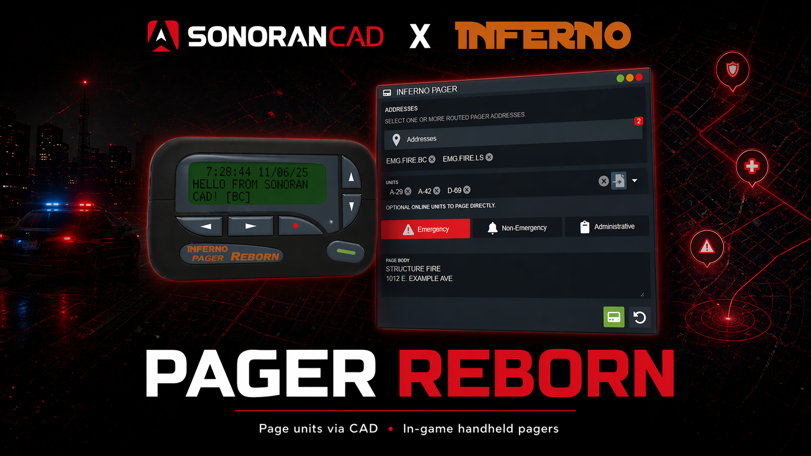

# Pager Reborn

<figure><figcaption></figcaption></figure>


This third-party resource from Inferno Collection is provided **free** only with the **Pro** version of Sonoran CAD and is a **separate download**.

If your community is not on the **Pro** version, you may still purchase the paid resource from Inferno Collection to use with any version of Sonoran CAD.


## Promotional Video <a href="#installation-guide" id="installation-guide"></a>

<details>

<summary>Promotional Video</summary>



</details>

## Installation Guide <a href="#installation-guide" id="installation-guide"></a>

### 1. Download the Resource <a href="#id-1.-download-the-resource" id="id-1.-download-the-resource"></a>

Users can get the Pager Reborn resource from Inferno Collection.

* For Sonoran CAD **Pro** users, [download the FREE Pager Reborn (Sonoran Edition) package](https://sonoran.link/zHDYzuDv).
* For all other Sonoran CAD users, [purchase the paid Pager Reborn package](https://sonoran.link/5cbe5kNZ).

This resource is managed through Tebex and will require you to login with FiveM. Be sure to login **using the account that has the keymaster license** for your server.

Once purchased you can [download the resource from the CFX.re portal](https://portal.cfx.re/assets/granted-assets?search=Pager+Reborn).

### 2. Install the Resource <a href="#id-2.-install-the-resource" id="id-2.-install-the-resource"></a>

We suggest installing the `inferno-pager-reborn` folder within the `[sonorancad]` folder your integration framework is installed in. The final result would look like the image below:

<figure><figcaption></figcaption></figure>

### 3. Start the Resource <a href="#id-3.-start-the-resource" id="id-3.-start-the-resource"></a>

In your `server.cfg` add the following new lines:

```
exec @inferno-pager-reborn/config.cfg
ensure inferno-pager-reborn
```

### 4. Configuration Options <a href="#id-4.-configuration-options" id="id-4.-configuration-options"></a>

#### Create a Pager Network

Before using the resource you will need to create a pager network under **Admin** > **Customization** > **Inferno Pagers**

Your configuration will automatically save after closing the popup modal.

<div><figure><figcaption></figcaption></figure> <figure><figcaption></figcaption></figure></div>

[Learn more about creating a pager network here.](https://docs.inferno-collection.com/resources/pager-reborn/developers/start-here/)

#### In-Game Usage

[View the Usage Quick Start Guide](https://docs.inferno-collection.com/resources/pager-reborn/usage/quick-start) to learn how to use the pager in-game.

#### Resource Configuration

[The configuration documentation](https://docs.inferno-collection.com/resources/pager-reborn/config) provides further customization options.

## Usage

### In-CAD

Access the **Inferno Pager** panel under **Unit Management** > **Inferno Pager**

**Addresses**

* Select specific pager nodes from the network to send the page to.

**Units**

* Optionally select specific units to page directly in-game.
* Active units can also be dragged-and-dropped into the pager panel.

**Type**

* Select the pager type of **Emergency**, **Non-Emergency**, or **Administrative**.

**Body**

* Enter the text to send to units in-game.

<div><figure><figcaption></figcaption></figure> <figure><figcaption></figcaption></figure></div>

### In-Game

Units in-game will receive the page with audio alerts.

<figure><figcaption></figcaption></figure>
