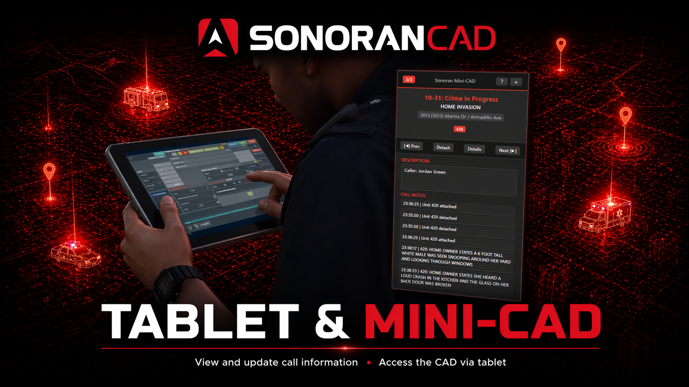

# Tablet & Mini-CAD

<figure><figcaption><p>Sonoran CAD - Mini-CAD</p></figcaption></figure>

## Activation Guide

### 1. Download and Install the Resource


This resource is already **enabled by default** inside of the `sonorancad.cfg` when installing the [Sonoran CAD FiveM resource](../fivem-installation.md).


### 2. Ensure Players are Linked

Ensure the player has already [linked their CAD](../link-user-in-game.md) for this integration to work.

## Configuration

<details>

<summary>Optional: URL Convar</summary>

If you wish to use a custom login page, you can set a convar in your server.cfg.\
\
The easiest way to show your [custom login page](../../../tutorials/customization/custom-login-page.md) is to use a query string.

`"https://sonorancad.com/?comid=YOUR_COMMUNITY_ID_HERE"`

Simply replace `YOUR_COMMUNITY_ID_HERE` in the URL with your [community ID](../../../tutorials/getting-started/finding-your-community-id-and-authentication-code.md).\
EX: `https://app.sonorancad.com/?comid=midwestrp`

Add the following to your server.cfg **before** starting the tablet resource:

```
setr sonorantablet_cadUrl "YOUR_URL_HERE"
```

Fill in with your actual URL above with the comid you want.

</details>

## Keybinds

Users can customize a keybinds for the tablet and mini-cad.

Navigate to **Settings** > **Keybinds** > **FiveM** and look for the keybinds under the resource `tablet`.

<figure><figcaption></figcaption></figure>

## Commands

In-game commands can be used to

* `/tablet open` Opens the in-game tablet
* `/tablet size [width] [height]` Resize the tablet to best fit your screen. This size persists on reload of the client.
* `/tablet checklink` Refreshes your account link
* `/tablet refresh` Force-refresh the page when it's not loading properly.
* `/tablet mini open` Opens the mini-CAD
* `/tablet mini help` Displays a list of commands for the mini-CAD
* `/tablet mini prev` Pages to the previous dispatch call on the mini-CAD
* `/tablet mini next` Pages to the next dispatch call on the mini-CAD
* `/tablet mini attach` Attaches to the dispatch call on the mini-CAD
* `/tablet mini detail` Toggles expanded information on the mini-CAD
* `/tablet mini refresh` Manually refresh the call information on the mini-CAD
* `/tablet mini size [width] [height]` Resize the mini-CAD to best fit your screen. This size persists on reload of the client.

<figure><figcaption></figcaption></figure>

## Mini-CAD Usage

The mini-CAD displays as an overlay in-game.

<figure><figcaption></figcaption></figure>

#### Move and Close

You can close or move the Mini-CAD by opening the tablet, and interacting with the Mini-CAD window.

#### Controls

* Use the `Left Arrow Key` to display the previous call.
* Use the `Right Arrow Key` to display the next call.
* Use the `K` key to attach or detach to/from the displayed call.
* Use the `L` key to toggle display of the call details.
* **All these commands can be edited from the Keybinds menu.**

## Tablet Usage

<figure><figcaption></figcaption></figure>

When in-game, the tablet can be used to view your unit's Sonoran CAD police, fire, ems, or dispatch panel.

The tablet will show your real CAD screen to everyone else nearby when using the [CAD Display submodule](cad-display.md).

## Auto User Link

When a user signs into the CAD using the in-game tablet, their account will be [automatically linked](../link-user-in-game.md).

## Known Issues

### Timeout SonoranCAD::mini:CallSync

<details>

<summary>Timeout SonoranCAD::mini:CallSync</summary>

Some users may see `SonoranCAD::mini:CallSync` listed multiple times after recieving a timeout.

When your client recieves a timeout from the server for any reason, it will display a list of the most recent requests. Because Sonoran's Mini-CAD runs frequent sync requests, these will consequenty be displayed.

**This is not an issue with or related to Sonoran CAD**. This is a general timeout between the client and server listing all recent calls as diagnostic information.


</details>

### Tablet Showing Grey

<details>

<summary>Tablet Showing Grey</summary>

Some users may get a grey, black or blank screen when using the Sonoran Login method before and then opening the tablet and it just being a grey screen.

To resolve this, close FiveM, then to go to your `FiveM Application Data` folder then to `data` and then delete the `nui-storage` folder.

If you still are having issues reach out to our [support team](https://support.sonoransoftware.com).


</details>
