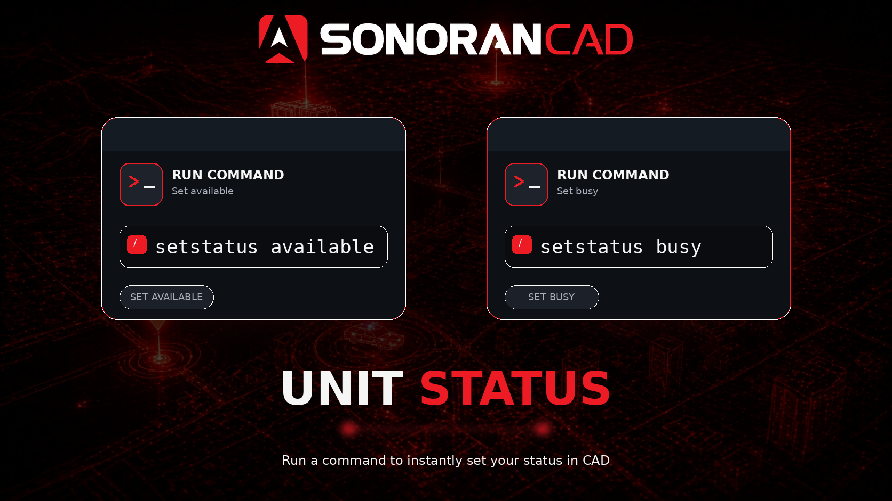

# Unit Status

<figure><figcaption></figcaption></figure>

## Activation Guide

### 1. Download and Install the Resource


This submodule is already **enabled by default** when installing the [Sonoran CAD FiveM resource](../fivem-installation.md).


### 2. Adjust the Configuration

The bodycam settings are stored inside of the `/configuration/unitstatus_config.lua` file.

<details>

<summary><code>unitstatus_config.lua</code></summary>

| Option           | Description                                                  | Default                  |
| ---------------- | ------------------------------------------------------------ | ------------------------ |
| setStatusCommand | Command that will allow units to set their own status.       | setstatus                |
| statusCodes      | Array of status codes, configurable to be community-specific | Default SonoranCAD setup |

</details>

### 3. Ensure Players are Linked

Ensure the player has already [linked their CAD](../link-user-in-game.md) for this integration to work.

### 4. Setup User Permissions

This script provides a status set command by default. Players will need the `command.setstatus` [ACE permission](https://forum.cfx.re/t/basic-aces-principals-overview-guide/90917) (or whatever you configure the command to be).

**Example**

`add_ace builtin.everyone command.setstatus allow`

This line in your `config.cfg` file will allow everyone to access the command. We highly reccomend creating [proper ace permission groups](https://forum.cfx.re/t/basic-aces-principals-overview-guide/90917) to prevent users from spamming.

## Commands

In-game commands can be used to

* `/setstatus [status]` Set your unit status in the CAD.

<figure><figcaption></figcaption></figure>

## Function

This is a server-side function only and is exported as `cadSetUnitStatus`. Use `setUnitStatus` if using with other submodules.

```lua
cadSetUnitStatus(<apiId>, <status>, [player])
```

* apiId: The identifier attached to the unit
* status: A status, can be the actual string or a number, based on configuration
* player (optional): server ID of the player, used to send a client event

## Event

```lua
--[[
    Event Name: SonoranCAD::unitstatus:UpdateStatus
    Arguments:
        statusText: Text or number of the status to set
]]

```
