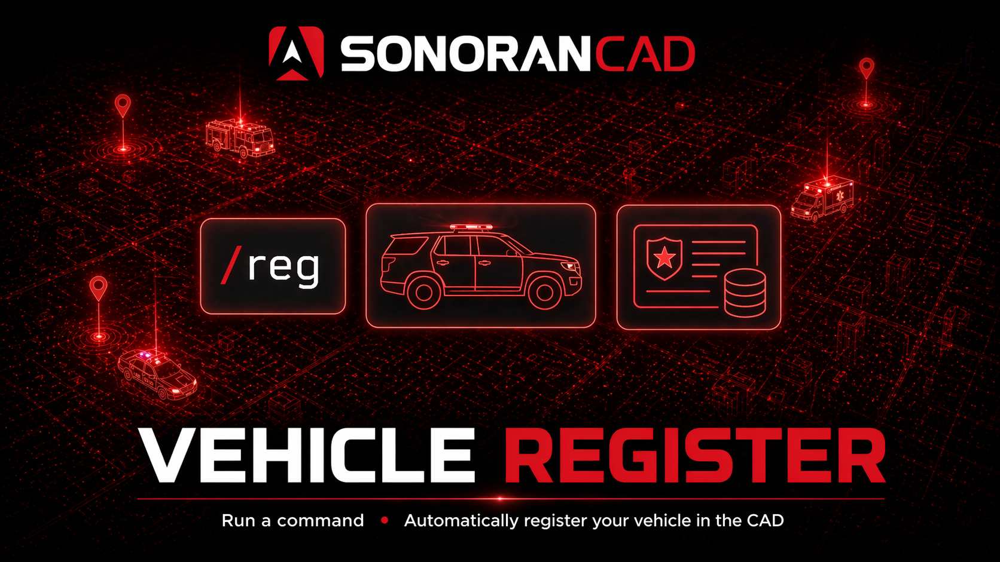

# Vehicle Register (VehReg)

<figure><figcaption></figcaption></figure>

## Activation Guide

### 1. Download and Install the Resource


This submodule is already **enabled by default** when installing the [Sonoran CAD FiveM resource](../fivem-installation.md).


### 2. Adjust the Configuration

The bodycam settings are stored inside of the `/configuration/vehreg_config.lua` file.

<code>vehreg_config.lua</code>

<table><thead><tr><th>Option</th><th width="276">Description</th><th width="351">Default</th></tr></thead><tbody><tr><td>reigsterCommand</td><td>The command used to register current vehicle</td><td>reg</td></tr><tr><td>defaultRegExpire</td><td>The default date that all registrations will expire</td><td>01/02/2030</td></tr><tr><td>defaultRegStatus</td><td>The default status that all registrations will have | MUST BE IN CAPS</td><td>VALID</td></tr><tr><td>language</td><td>Array of language used within the script</td><td>English</td></tr><tr><td>recordData</td><td>Array of field UID's based on your vehicle registration record</td><td>Default from CAD</td></tr><tr><td>customData</td><td>Array of preset vehicle information, commonly used for addon vehicles where names may not be present</td><td><pre class="language-lua"><code class="lang-lua">customData = {
    {
        spawncode = "adder",
        model = "Adder",
    },
    {
        spawncode = "blista",
        model = "Blista",
    }
}
</code></pre></td></tr></tbody></table>

### 3. Ensure Players are Linked

Ensure the player has already [linked their CAD](../link-user-in-game.md) for this integration to work.

### 4. Configure Custom Record Fields

When a player registers a vehicle in-game, the submodule must know what fields in your custom vehicle registration to enter the vehicle information into. The `recordData` portion of the config contains the `Field Mapping ID` for the default vehicle record template.

Custom record templates are found in `Admin` > `Customization` > `Custom Records`

If you have modified the [vehicle registration template](../../../tutorials/customization/creating-custom-record-and-report-types.md), update the `recordData` configuration accordingly.

<figure><figcaption>
Vehreg: Custom Record Field Mapping
</figcaption></figure>

## Commands

In-game commands can be used to

* `/reg` Registers the vehicle you are currently sitting inside to your currently selected CAD character

<figure><figcaption></figcaption></figure>

## Developer Documentation

You can now implement our vehicle registration system into your own scripts by simply calling a server event! See our [Server Events documentation](../framework-development-documentation/server-events.md#sonorancad-registervehicle) for usage.
