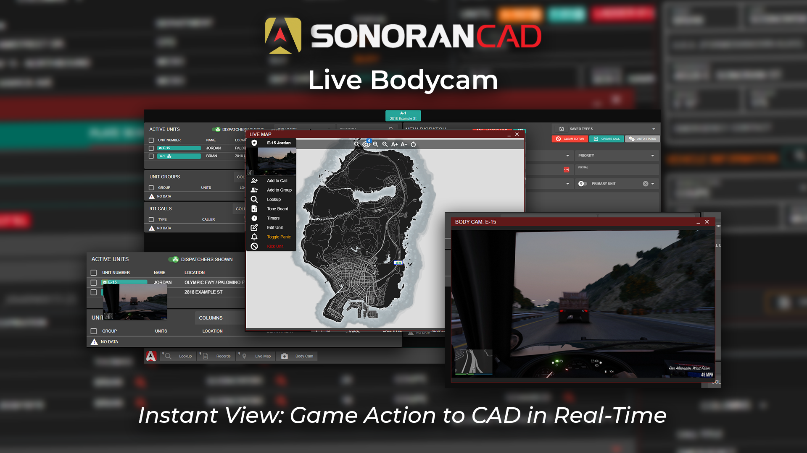

# Body Camera


This submodule utilizes API endpoints that require the **Pro** version of Sonoran CAD or higher. For more information, view our [pricing ](../../../../pricing/faq/)page.



Looking for VPS, web, or dedicated hosting? Check out our official [server hosting](broken-reference)!


<figure><figcaption></figcaption></figure>

## What is the live Body Camera?

Sonoran CAD is the only external CAD system offering live image feeds from in-game users accessible through the [live map](bodycam.md#live-map), [active units preview](bodycam.md#preview), or a [dedicated window](bodycam.md#window).

This feature updates the image feed at intervals that can be configured by the user (1-10 seconds).

[Learn more about the technology and limitations of this system.](bodycam.md#technology-and-limitations)

## Activation Guide

### 1. Download and Install the Core

If you haven't already, be sure to install and configure the [SonoranCAD Core](../) first.

### 2. Activate Locations

The [locations submodule](locations.md) includes all logic required to send bodycam images to the CAD.

### 3. Adjust the Core Configuration

The bodycam settings are stored inside of the core configuration file.

| Variable                        | Description                                                                                                                                                                                                                             |
| ------------------------------- | --------------------------------------------------------------------------------------------------------------------------------------------------------------------------------------------------------------------------------------- |
| `bodycamEnabled`                | 
Enables or disables the body camera command. Default: <code>true</code>
                                                                                                                                                       |
| `bodycamBeepFrequency`          | 
Adjusts the frequency at which unit body camera beeps when turned on(in milliseconds). Default: <code>30000</code> (30 seconds)
                                                                                               |
| `bodycamPlayBeeps`              | 
Enables or disables the body camera beeping when turned on. Default: <code>true</code>
                                                                                                                                        |
| `bodycamScreenshotFrequency`    | 
Adjusts the frequency at which unit body cameras update (in milliseconds). Default: <code>2000</code> (2 seconds)
                                                                                                             |
| `bodycamOverlayEnabled`         | 
Enables or disables the blinking body camera image on screen when enabled. Default <code>true</code>
                                                                                                                          |
| `bodycamOverlayLocation`        | 
The position (corner) of the screen where the body camera image is displayed. Options: <code>top-left</code>, <code>top-right</code>, <code>bottom-left</code>, <code>bottom-right</code>  Default: <code>top-right</code>
 |
| `bodycamCommandToggle`          | 
The command name to toggle your body camera on or off. Default: <code>bodycam</code>
                                                                                                                                          |
| `bodycamCommandChangeFrequency` | 
The command to adjust your individual body camera screenshot frequency to be different than the server's <code>bodycamScreenshotFrequency</code> value. Default: <code>bodycamFreq</code>
                                     |

## In-Game Usage

When in-game, units must also be actively signed into the dispatch, police, fire, or EMS panel.

Use the `/bodycam` command to toggle your body camera on or off.

#### Body Camera Overlay

If enabled in your framework configuration, a periodic beep and blinking body camera logo will appear on your screen reflecting that your body camera is active.

<figure><figcaption></figcaption></figure>

### Beeps

You can configure the frequency or the bodycam beeps via the configuration option `beepFrequency` and you can also configure the range at which beeps are heard via the command option `beepRange`

### Automatic Activation

Bodycam can now automatically activate when an officer activates their lights or draws a firearm. This automatic activation can be disabled by setting `autoEnableWithWeapons` or `autoEnableWithLights` to `false` for the respected cases

### Unit Duty Requirement

You can enable or disable the requirement for a unit to have to be logged into the Police, EMS or Fire portions of CAD in order to activate their bodycam

### Keybind

Units can now set their preferred keybind to manually toggle their bodycams on and off. To set this keybind please navigate to Settings --> Keybinds --> FiveM and look for the keybind "Toggle BodyCam" under the resource `sonorancad`

### Animation

Users can now toggle on and off the new animation for activating and deactivating their bodycam.

## CAD Usage

### Active Units

In the active units panel, units with their body camera enabled will show a pulsing camera icon.

#### Preview:

Hover over this icon to see a preview image of their body camera.

<figure><figcaption></figcaption></figure>

#### Window:

Click the icon to open an adjustable window of their body camera.

<figure><figcaption></figcaption></figure>

### Live Map

In the live map, units with their body camera enabled will show a pulsing camera icon.

#### Preview:

Click on the unit blip to view a live preview of their body camera in the unit action menu.

<figure><figcaption></figcaption></figure>

## Troubleshooting

### No such export requestClientScreenshot in resource screenshots-basic

Some servers may see the following error print in their console:

`SCRIPT ERROR: @sonorancad/core/screenshot.lua:15: No such export requestClientScreenshot in resource screenshots-basic`

This means that you do not have the [screenshot-basic](https://github.com/citizenfx/screenshot-basic) resource installed on your server.&#x20;

We recommend that you update your server artifacts, as newer versions come with this resource installed by default. Alternatively, you can manually install it from [GitHub](https://github.com/citizenfx/screenshot-basic).

### No Images/Loading on ZAP Hosting

We are aware of an issue with the CFX proxy being unreachable on ZAP Hosting, a required piece for the body camera functionality.

Your CFX proxy URL is formatted as `https://someCFXUsernameHere.users.cfx.re/` with `someCFXUsernameHere` being your CFX username. This proxy is native functionality to all FiveM servers.

We suggest contacting ZAP hosting directly (your game server provider) to try and resolve this issue.

## Technology and Limitations

### The Goal:

* Real-time video streams from in-game, right in the CAD panel.

### The Limitations:

* Individual users require significantly upgraded PC hardware and networking to transcode and upload live video feeds.
* The infrastructure to host and share these streams would require massive amounts of new hardware, making the service unaffordable for gaming communities.

### The Resolution:

**Client Image Handling**

* Units in-game have local screenshots created and sent to the local game server for processing. These screenshots result in next to zero noticeable performance drop in comparison to transcoding live video streaming.
* The local game server stores and serves these images to Sonoran CAD when requested by a CAD user. An on-going "feed" of images is sent, stored, and replaced as newer images replace the old ones. When the body camera is toggled off, or the server restarts, these folders are completely wiped to ensure your game server isn't bloating with old images.

**CAD Image Requests**

* When a CAD dispatcher requests to look at a unit's body camera, they ask the game server for the screenshot and continually request new screenshots at the rate they're being generated. The current default is 2000ms (2 seconds) but can be lowered to as little as 1000ms (1 second).

### End Result:

* This "screenshot feed" system allows dispatchers to stay up-to-date without requiring massive amounts of bandwidth, expensive processing for the user's PCs, and ensures quick responsiveness within the CAD.

## Disclaimer

_Please note that this feature is in early development and may exhibit instability, influenced by server and network performance. Body camera images are generated by the client and temporarily stored on the community's server. Viewing these images, whether by dispatchers or units, involves active requests to your CFX nucleus proxy, leading to increased network traffic and processing demands._
