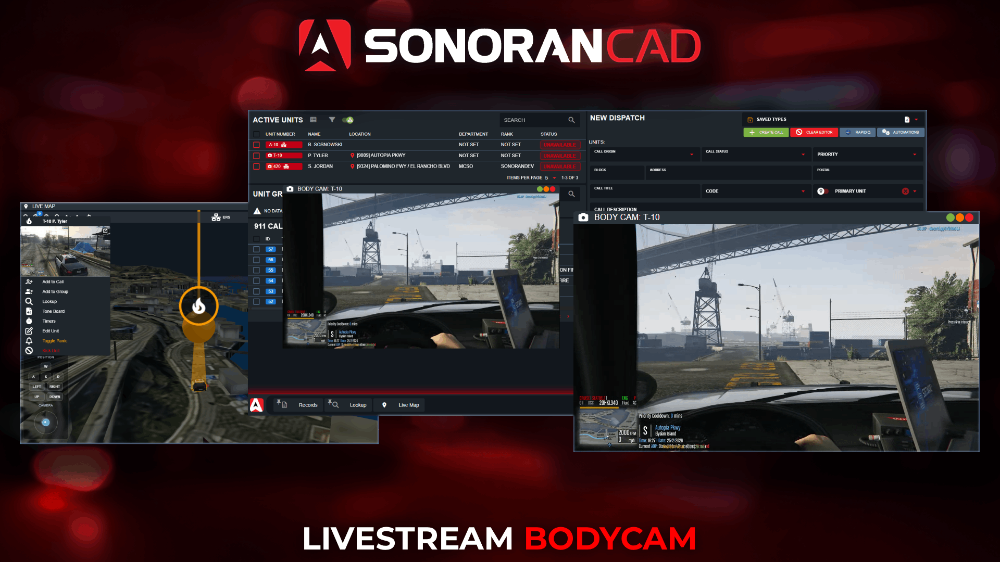

# Body Camera


This submodule utilizes API endpoints that require the **Pro** version of Sonoran CAD or higher. For more information, view our [pricing ](../../../../pricing/faq/)page.



Looking for VPS, web, or dedicated hosting? Check out our official [server hosting](https://docs.sonoransoftware.com/promotions/fivem-hosting)!


<figure><figcaption></figcaption></figure>

## What is the live Body Camera?

Sonoran CAD is the only external CAD system offering livestream video from in-game users accessible through the [live map](bodycam.md#live-map), [active units preview](bodycam.md#preview), or a [dedicated window](bodycam.md#window).

## Activation Guide

### 1. Download and Install the Core

If you haven't already, be sure to install and configure the [Sonoran CAD Core](../) first.

### 2. Activate Locations

The [locations submodule](locations.md) includes all logic required to send bodycam images to the CAD.

### 3. Adjust the Core Configuration

The bodycam settings are stored inside of the core configuration file.

Configuration Options

| Variable                        | Description                                                                                                                                                                                                                             |
| ------------------------------- | --------------------------------------------------------------------------------------------------------------------------------------------------------------------------------------------------------------------------------------- |
| `command`                       | The command name to toggle your body camera on or off.                                                                                                                                                                                  |
| `requireUnitDuty`               | If enabled, the player must be logged into the CAD to use the body camera.                                                                                                                                                              |
| `enableAnimation`               | Play an in-game animation when activating or deactivating the body camera.                                                                                                                                                              |
| `enableOverlay`                 | 
Enables or disables the blinking body camera image on screen when enabled. Default <code>true</code>
                                                                                                                          |
| `overlayLocation`               | 
The position (corner) of the screen where the body camera image is displayed. Options: <code>top-left</code>, <code>top-right</code>, <code>bottom-left</code>, <code>bottom-right</code>  Default: <code>top-right</code>
 |
| `enableBeeps`                   | 
Enables or disables the body camera beeping when turned on. Default: <code>true</code>
                                                                                                                                        |
| `beepType`                      | 
Type of audio that the beeps use.

<code>native</code> = GTAV Native Sounds

<code>nui</code> = Custom Sound File
                                                                                                      |
| `beepFrequency`                 | 
Adjusts the frequency at which unit body camera beeps when turned on(in milliseconds). Default: <code>30000</code> (30 seconds)
                                                                                               |
| `beepRange`                     | The range at which a person can hear the bodycam beeps                                                                                                                                                                                  |
| `screenshotFrequency`           | 
Adjusts the frequency at which unit body cameras update (in milliseconds). Default: <code>2000</code> (2 seconds)
                                                                                                             |
| `defaultKeybind`                | The default keybind for toggling the bodycam.                                                                                                                                                                                           |
| `autoEnableWithLights`          | Automatically enable bodycam when emergency lights are enabled/disabled.                                                                                                                                                                |
| `autoEnableWithWeapons`         | Automatically enable bodycam when a weapon is drawn.                                                                                                                                                                                    |
| `clothing`                      | Clothing items that must be worn in order to have a body camera.                                                                                                                                                                        |
| `weapons`                       | Weapons that when drawn enable bodycam.                                                                                                                                                                                                 |
| `bodycamCommandChangeFrequency` | 
The command to adjust your individual body camera screenshot frequency to be different than the server's <code>screenshotFrequency</code> value. Default: <code>bodycamFreq</code>
                                            |

## In-Game Usage

When in-game, units must also be actively signed into the dispatch, police, fire, or EMS panel.

Use the `/bodycam` command to toggle your body camera on or off.

On first usage, players will be prompted to grant permission for the bodycam:

<figure><figcaption></figcaption></figure>

#### Body Camera Overlay

When your bodycam is on and being viewed in the CAD a periodic beep and blinking body camera logo will appear on your screen reflecting that your body camera is active.

<figure><figcaption></figcaption></figure>

### Beeps

The body camera plays server-sided beeps periodically while activated.

* `beepFrequency` determines how often these beeps are played
* `beepRange` determines how far away these beeps are heard

### Automatic Activation

The body camera will automatically activate when an officer activates their lights or draws a firearm.

* &#x20;`autoEnableWithWeapons` enables automatic activation when one of the `weapons` items are used.
* &#x20;`autoEnableWithLights` to enabled automatic activation when emergency lights are enabled.

### Force Off&#x20;

You can now force your body camera off using `/bodycam forceoff` until you manually turn it back on via the `/bodycam` command. While in the forced-off state, the body camera will no longer automatically turn on when someone is viewing, or based upon any automatic events.&#x20;

### Unit Duty Requirement

You can enable or disable the requirement for a unit to have to be logged into the Police, EMS or Fire portions of CAD in order to activate their bodycam by setting `requireUnitDuty` to `true`.

### Keybind

Users can customize a keybind to toggle their bodycams on and off.&#x20;

Navigate to Settings > Keybinds > FiveM and look for the keybind "Toggle BodyCam" under the resource `sonorancad`

### Animation

When toggling your body camera on or off, an animation will play if `enableAnimation` is `true`.

### In-Game Recording

By default, each recording includes a 30-second shadow buffer followed by 1 minute 30 seconds of video, for a maximum total length of 2 minutes. The shadow buffer length can be adjusted with `recording.shadowBufferSeconds`, but the total recording length cannot exceed 2 minutes.

Recording can be started manually using a configurable keybind located under **Keybinds -> FiveM -> SonoranCAD**. You can also enable automatic bodycam recording through `recording.autoRecordEvents`.

Developers can also trigger bodycam recordings with a [client event](../../framework-development-documentation/client-events.md#bodycam-record-toggle).

## CAD Usage

<figure><figcaption></figcaption></figure>

### Active Units

In the active units panel, hover over the camera icon to view a preview of their bodycam.

<figure><figcaption></figcaption></figure>

### Window

Click on the active unit preview or the pop out button on the live map to open a dedicated bodycam viewer window.

<figure><figcaption></figcaption></figure>

### Live Map

In the live map, selecting a unit or hovering near a unit in the 3D map will show the bodycam.

<figure><figcaption></figcaption></figure> <figure><figcaption></figcaption></figure>

