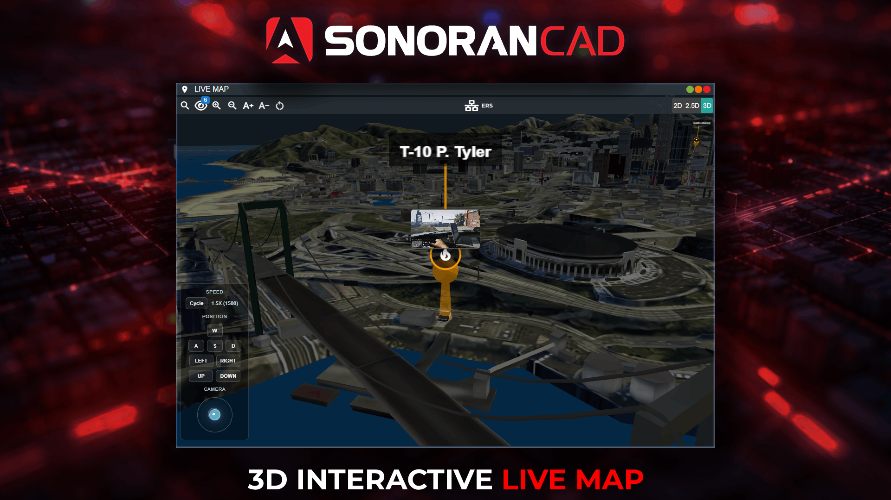
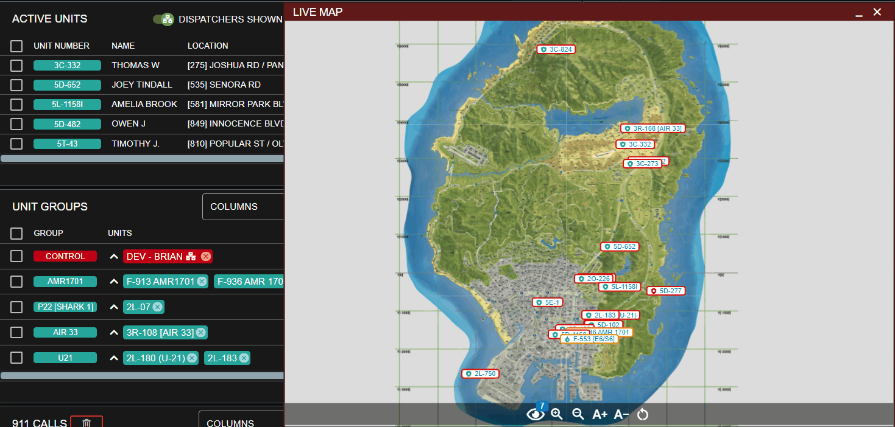
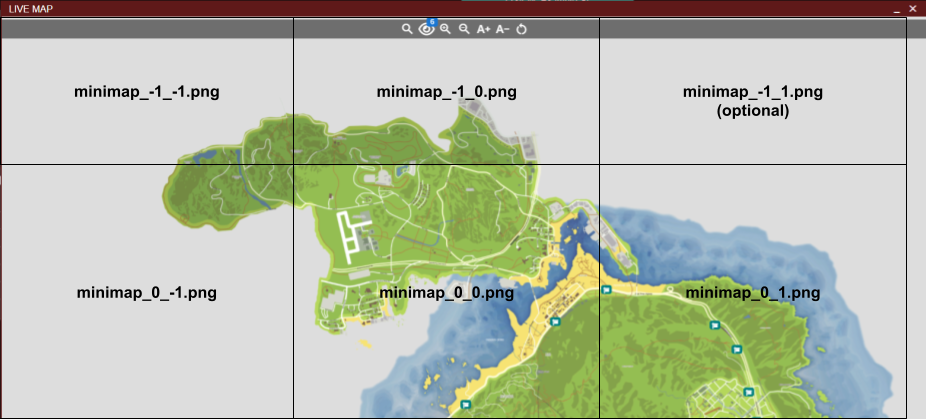

# Live Map

<figure><figcaption>
Sonoran CAD - Live Map
</figcaption></figure>


This submodule is built into the Sonoran CAD FiveM resource and requires no additional configuration.


### 1. 2D Map Selection

In the admin panel, navigate to **Advanced** > **In-Game Integration** > **Live Map**

Here, you can enable and select a default map option for GTA, Roblox, or others. Additionally, pro communities can [upload a custom map](live-map.md#using-a-custom-map-fivem).

<figure><figcaption>
Sonoran CAD - Live Map Type Selection
</figcaption></figure>

### 2. Set Your API ID

Don't forget to have each community member set their account [API ID](../../../../api-integration/getting-started/setting-your-api-id.md) to properly link their in-game user to the CAD.

### 3. User Access Permission

Users will need to be granted access to view the live map. This can be done via [Discord role sync](../../../discord-bot-integration.md), [permission key](../../../../tutorials/getting-started/permissions.md#permission-keys), or by [manually granting permissions](../../../../tutorials/getting-started/permissions.md#manually-granting-permissions) in the admin menu.

### **4. Enjoy!**

In the Police, Fire, EMS, or Dispatch window you can now click the "Live Map" button to view your new live map! Selecting a blip will show it's updated position and unit information.

This is found in the task bar's start menu under **Unit Management** > **Live Map**\
You can also [pin the live map button to your taskbar](../../../../tutorials/customization/customizing-your-layout.md#7-tab-system) for easy access.


The live map will only show units that are in your server and also actively logged into the police, fire, or EMS panel in the CAD. Be sure to have your [API ID](../../../../api-integration/getting-started/setting-your-api-id.md) set.


<figure><figcaption></figcaption></figure>

## **Using the Live Map**

### **Map Controls**

#### **Postal and Location Search**


The postal search functionality requires the **Pro** version of Sonoran CAD.

For more information, view our [pricing](../../../../pricing/faq/) page.


With the [postals](postals.md) submodule configured, you can manually enter and search for a postal code on the live map.

Units, emergency calls, and dispatch calls with locations will also display a red pin icon. Clicking the icon will open the map and zoom to the location.

<figure><figcaption></figcaption></figure>

#### Blip Customization

You can toggle specific blips visibility and outline colors for police, fire, EMS, and dispatch.

 (1).png>)

### **Unit Blips**

Unit blips display the live location of all police, fire, EMS, and dispatch units in-game. You can hover over a unit for brief details, or click on one for more options.

You can also easily filter the map to specific units by selecting them in the active units panel.

#### Menu Options

Clicking on a unit blip allows you to add the unit to a call, add the unit to a group, send the unit lookup results, edit the unit's information, toggle their panic state, and more.

.png>)

#### Drag-and-Drop



Unit Blips Support:

* Drag to the call editor
* Drag to an active call
* Drag to a unit group
* Drag to the unit group header to create a new group
* Drag to the lookup window or minimized tab
* Drag to the timer window or minimized tab
* Drag to the tone board window or minimized tab



* Drag-and-drop an ERS Callout
* Drag-and-drop a dispatch call to a location
* Drag-and-drop a dispatch call to the editor



* Drag-and-drop an ERS Callout
* Drag-and-drop a dispatch call



### Emergency Call Blips

Emergency calls placed in-game will also appear on the live map. You can hover over the blip for the call details.

#### Menu Options

Clicking on the emergency blip allows you to import the call to your editor or remove the emergency call.

 (1).png>)

### Smart Sign Blips

[Smart signs](smart-signs.md) will also appear as blips on the map. You can click on these to edit the signs in-game.

.png>)

## FiveM Custom Map


This feature requires the **pro** version of Sonoran CAD.\
For more information, view our [pricing](/broken/pages/-M58UiyBWsbVztn6Dbn7) page.


Sonoran CAD allows communities to upload custom map images to the integrated, hosted live map. If your community does not use one of the map types provided, you can upload the images manually.

Extract Images

Extract the images from the YTD files with a program like OpenIV.\
**You will need six files named exactly as follows:**\
`minimap_sea_0_0.png`\
`minimap_sea_0_1.png`\
`minimap_sea_1_0.png`\
`minimap_sea_1_1.png`\
`minimap_sea_2_0.png`\
`minimap_sea_2_1.png`

.png>)

.png>)

Upload Images

Navigate to Admin > Advanced > In-Game Integration > Live Map and Push Events\
Select "Upload Custom" and upload all six correctly named files.

.png>)

File Size

Custom map images are limited to 30MB each. **However, if you are uploading more than 100MB of images total, you will need to upload in separate batches.**

### Roxwood Expansion

Roxwood Expansion

If your community is utilizing the Roxwood map expansion, there will be additional tiles to upload.

* `minimap_sea_-1_-1.png`
* `minimap_sea_-1_0.png`
* `minimap_sea_-1_1.png` (Optional, blank tile to the right)

Additionally, two existing map tiles will need to be updated, as they contain parts of both the main island and the Roxwood expansion.

* `minimap_sea_0_-1.png`
* `minimap_sea_0_0.png`
* `minimap_sea_0_1.png`

<figure><figcaption></figcaption></figure>

### Cayo Perico Expansion

Cayo Perico Expansion

If your community is utilizing the Cayo Perico map expansion, there will be extra tiles to upload. Ensure these are named as:

* `minimap_sea_2_1.png`&#x20;
  * Bottom right of the main island + top right of Cayo Perico
* `minimap_sea_2_2.png`&#x20;
* `minimap_sea_3_1.png`&#x20;
* `minimap_sea_3_2.png`&#x20;

<figure><figcaption></figcaption></figure>

## Roblox Custom Maps

Roblox Custom Maps

Sonoran CAD allows any Roblox game to also send and update live map positions.

* [ER:LC](../../../roblox-er-lc/)
  * ER:LC map option available in the admin panel, or - upload a modified map with the same dimensions 3120x3120
* [Maple County | Fall Update](https://www.roblox.com/games/8416011646/Maple-County-FALL-UPDATE)
  * Requires a custom map upload from the game

For Roblox Developers

Maple County has recently added Sonoran CAD live map access to their Roblox game mode.\
To do the same for your game:

1. Send Unit Location API updates with the `coordinate` `x` and `y` values
2. Convert (if needed) your `coordinate` `x` and `y` values so that the top left of your map image is `{0,0}`
3. Export your square map to a single image and upload to the Sonoran CAD community in the admin panel under `In-Game Integration` > `Live Map` > Game as `Roblox` > Type as `Custom` > `Upload` > `Save`

 (1) (1) (1) (1).png>)

For more help, reach out to our [support team](https://support.sonoransoftware.com).

## Troubleshooting

### 3D Live Map not Loading

The 3D live map uses WebGL, an open source something.

In Chrome, navigate to `chrome://gpu/` and check if `WebGL` is **Disabled**. If so, try the following steps:

<figure><figcaption></figcaption></figure>

* **Chrome** > **Settings** > **System** > **Use Graphics Acceleration When Available**
* Ensure Graphics Drivers are Up-to-Date
* Fully restart your web browser
