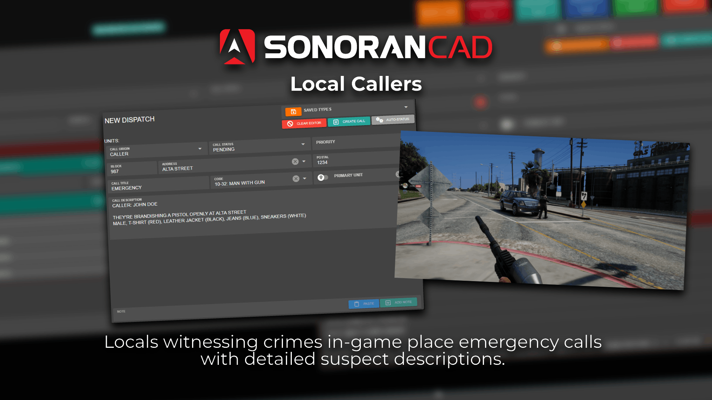

# Local Callers


This submodule utilizes API endpoints that require the **standard** version of Sonoran CAD or higher. For more information, view our [pricing ](../../../../pricing/faq/)page.



Looking for VPS, web, or dedicated hosting? Check out our official [server hosting](../../../../other-products/server-hosting.md)!


<figure><figcaption></figcaption></figure>

## Promo Video



## Installation Guide


**This submodule is not yet released.**

Expected release date: EOD June 12th, 2025.


### 1. Download and Install the Core

If you haven't already, be sure to install and configure the [SonoranCAD Core](../) first.

### 2. Activate the Submodule and all Dependencies

Follow the [submodule activation guide](../submodule-configuration/#activating-a-submodule) for the required submodules.

### 3. Configuration

<table><thead><tr><th align="center" valign="middle">Variable</th><th align="center">Type</th><th align="center">Description</th></tr></thead><tbody><tr><td align="center" valign="middle"><code>callCoolDown</code></td><td align="center"><code>int</code></td><td align="center">How long in between calls for the same player</td></tr><tr><td align="center" valign="middle"><code>callTypes</code></td><td align="center"><code>table</code></td><td align="center">Events that will trigger a 911 call. <code>gun</code> Will trigger based on brandishing or shooting a firearm. <code>carJacking</code> will trigger if you are trying to steal a car. <code>death</code> will trigger if a player dies</td></tr><tr><td align="center" valign="middle"><code>callTimers</code></td><td align="center"><code>table</code>  </td><td align="center">How long each call type will take to put through</td></tr><tr><td align="center" valign="middle"><code>whitelistZones</code></td><td align="center"><code>table</code> </td><td align="center">Zones where only specific call types will trigger. (I.e. A shooting range won't trigger a brandishing call)</td></tr><tr><td align="center" valign="middle"><code>language</code></td><td align="center"><code>table</code></td><td align="center">Translations </td></tr><tr><td align="center" valign="middle"><code>clothingConfig</code></td><td align="center"><code>table</code></td><td align="center">Configure clothing colors and names if you have custom EUP as well as whitelist certain EUP items or peds to not trigger calls</td></tr></tbody></table>

### 4. Usage

Utilization is easy, simply go near an AI ped while commiting one of the configured offenses and you should see them begin to run towards you, pull out their phone and begin to call 911. If you kill this AI before the configured timer is up, only a partial call will be put through. This is useful to help prevent police from getting a full description of you.&#x20;
