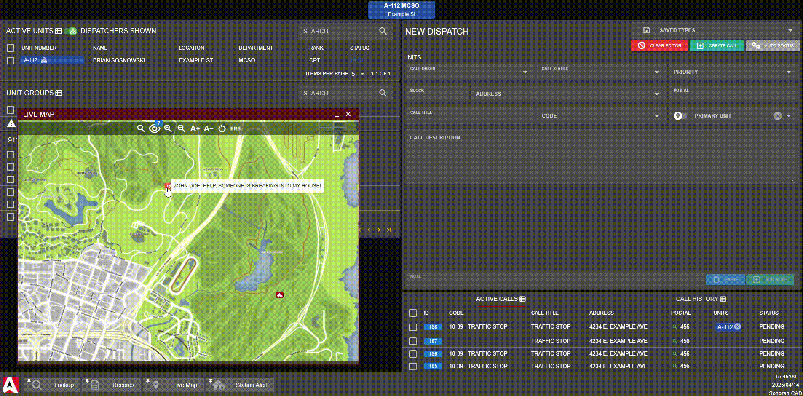

# Station Alert

<figure><figcaption><p>Sonoran CAD x Inferno Collection</p></figcaption></figure>


This resource utilizes API endpoints that require the **Plus** version of Sonoran CAD or higher. For more information, view our [pricing](../../../../pricing/faq/) page.



Looking for VPS, web, or dedicated hosting? Check out our official [server hosting](https://docs.sonoransoftware.com/promotions/fivem-hosting)!


## Installation Guide

### 1. Download the Resource

Users can get the Station Alert resource from Inferno Collection.

* For Sonoran CAD **Pro** users, [download the FREE Station Alert (Sonoran Edition) package](https://sonoran.link/FtMqEnXF).
* For Sonoran CAD **Plus** users, [purchase the paid Station Alert package](https://sonoran.link/AUd3Abat).

This resource is managed through Tebex and will require you to login with FiveM. Be sure to login **using the account that has the keymaster license** for your server.

Once purchased you can [download the resource from the CFX.re portal](https://portal.cfx.re/assets/granted-assets?search=Station+Alert).

### 2. Install the Resource

We suggest installing the `inferno-station-alert` folder within the `[sonorancad]` folder your integration framework is installed in. The final result would look like the image below:

<figure><figcaption><p>Station Alert: CAD Installation</p></figcaption></figure>

### 3. Start the Resource

In your `server.cfg` add the following new lines:

```lua
exec @inferno-station-alert/config.cfg
ensure inferno-station-alert
```

### 4. Configuration Options

Information on adding stations, lights, speakers, and more can be found in the [quick start guide](https://docs.inferno-collection.com/resources/station-alert/usage/).

The [configuration documentation](https://docs.inferno-collection.com/resources/station-alert/config/) provides further customization options.&#x20;

## Usage

### 🌎 Live Map

On the live map, ensure you toggle station blips on. Clicking on a station will open the alert panel.

The following example:

* Opens the `Engine 19`  door at station `Davis`
* Closes the `Ambo 61`  door at station `Davis`
* Sets the station indicator light to `Blue`
* Plays `Example Message`  as text-to-speech at station `Davis`&#x20;
* Plays `Tone1` from the station alert resource tones at station `Davis`&#x20;

<figure><figcaption><p>Station Alert: Live Map</p></figcaption></figure>

### 🚨 Station Alert Panel

Dispatchers can also access the dedicated `Station Alert` panel under `Unit Management`.

Here, you can type-to-filter and select multiple stations at once.

<figure><figcaption><p>Station Alert: Panel</p></figcaption></figure>

### 📞 Dispatch Call Editor

The dispatch call editor has a shortcut to quickly access nearby stations from an emergency call.

When an emergency call from in-game is imported into the dispatch editor, the `Nearby Stations` icon will be available. Selecting one of these nearby stations opens the station alert builder with the `Message` box prefilled with call information.

<figure><figcaption><p>Station Alert: Call Editor</p></figcaption></figure>

