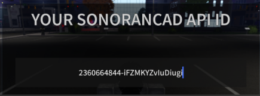

# Station Alert


This resource is not yet available - coming soon!


<figure><figcaption><p>Sonoran CAD x Inferno Collection</p></figcaption></figure>


This resource utilizes API endpoints that require the **Plus** version of Sonoran CAD or higher. For more information, view our [pricing](../../../../pricing/faq/) page.



Looking for VPS, web, or dedicated hosting? Check out our official [server hosting](../../../../other-products/server-hosting.md)!


## Installation Guide

### 1. Download the Resource

[Purchase the resource for free](https://www.sonoran.store/package/4913039) from Inferno Collection.

* For Sonoran CAD Pro users, purchase the FREE `SOME_NAME_TODO`  package
* For Sonoran CAD Plus users, purchase the paid `SOME_NAME_TODO`  package

This resource is managed through Tebex and will require you to login with FiveM. Be sure to login **using the account that has the keymaster license** for your server.

Once purchased you can [download the asset from your keymaster account](https://keymaster.fivem.net/asset-grants).

### 2. Install the Resource

We suggest installing the `TODO` folders within the `[sonorancad]` folder your integration framework is installed in. The final result would look like the image below:

TODO

<figure><figcaption><p>Smartsigns installed to [sonorancad] folder</p></figcaption></figure>

### 3. Add Requirements to Server.cfg file

In your `server.cfg` add the following new line:

```lua
ensure TODO!
```

### 4. Configure options to your liking

TODO

## How to use

### In-Game Usage

TODO: Link to Inferno Collection Documentation

### Live Map

On the live map, ensure you toggle station blips on. Clicking on a station will open the alert panel.

The following example:

* Opens the `Engine 19`  door at station `Davis`
* Closes the `Ambo 61`  door at station `Davis`
* Sets the station indicator light to `Blue`
* Plays `Example Message`  as text-to-speech at station `Davis`&#x20;
* Plays `Tone1` from the station alert resource tones at station `Davis`&#x20;

<figure><figcaption><p>Station Alert: Live Map</p></figcaption></figure>

### Station Alert Panel

Dispatchers can also access the dedicated `Station Alert` panel under `Unit Management`.

Here, you can type-to-filter and select multiple stations at once.

<figure><figcaption><p>Station Alert: Panel</p></figcaption></figure>

### Dispatch Call Editor

The dispatch call editor has a shortcut to quickly access nearby stations from an emergency call.

When an emergency call from in-game is imported into the dispatch editor, the `Nearby Stations` icon will be available.

<figure><figcaption><p>Station Alert: Call Editor</p></figcaption></figure>

