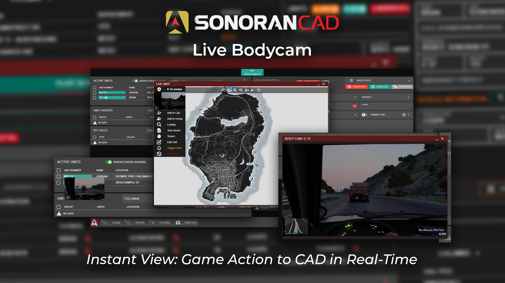

# Body Camera


This plugin utilizes API endpoints that require the **Pro** version of Sonoran CAD or higher. For more information, view our [pricing ](../../../pricing/faq/)page.



Looking for VPS, web, or dedicated hosting? Check out our official [server hosting](../../../other-products/server-hosting.md)!


<figure><figcaption></figcaption></figure>

## Installation Guide

### 1. Download and Install the Framework

If you haven't already, be sure to install and configure the [plugin framework](../framework-installation.md) first.

### 2. Install Locations

The [locations plugin](locations.md) includes all logic required to send bodycam images to the CAD.

### 3. Adjust the Framework Configuration

The bodycam settings are stored inside of the framework configuration file.

| Variable                        | Description                                                                                                                                                                                                                             |
| ------------------------------- | --------------------------------------------------------------------------------------------------------------------------------------------------------------------------------------------------------------------------------------- |
| `bodycamEnabled`                | 
Enables or disables the body camera command. Default: <code>true</code>
                                                                                                                                                       |
| `bodycamBeepFrequency`          | 
Adjusts the frequency at which unit body camera beeps when turned on(in milliseconds). Default: <code>30000</code> (30 seconds)
                                                                                               |
| `bodycamPlayBeeps`              | 
Enables or disables the body camera beeping when turned on. Default: <code>true</code>
                                                                                                                                        |
| `bodycamScreenshotFrequency`    | 
Adjusts the frequency at which unit body cameras update (in milliseconds). Default: <code>2000</code> (2 seconds)
                                                                                                             |
| `bodycamOverlayEnabled`         | 
Enables or disables the blinking body camera image on screen when enabled. Default <code>true</code>
                                                                                                                          |
| `bodycamOverlayLocation`        | 
The position (corner) of the screen where the body camera image is displayed. Options: <code>top-left</code>, <code>top-right</code>, <code>bottom-left</code>, <code>bottom-right</code>  Default: <code>top-right</code>
 |
| `bodycamCommandToggle`          | 
The command name to toggle your body camera on or off. Default: <code>bodycam</code>
                                                                                                                                          |
| `bodycamCommandChangeFrequency` | 
The command to adjust your individual body camera screenshot frequency to be different than the server's <code>bodycamScreenshotFrequency</code> value. Default: <code>bodycamFreq</code>
                                     |

## In-Game Usage

When in-game, units must also be actively signed into the dispatch, police, fire, or EMS panel.

Use the `/bodycam` command to toggle your body camera on or off.

#### Body Camera Overlay

If enabled in your framework configuration, a periodic beep and blinking body camera logo will appear on your screen reflecting that your body camera is active.

<figure><figcaption></figcaption></figure>

## CAD Usage

### Active Units

In the active units panel, units with their body camera enabled will show a pulsing camera icon.

#### Preview:

Hover over this icon to see a preview image of their body camera.

<figure><figcaption></figcaption></figure>

#### Window:

Click the icon to open an adjustable window of their body camera.

<figure><figcaption></figcaption></figure>

### Live Map

In the live map, units with their body camera enabled will show a pulsing camera icon.

#### Preview:

Click on the unit blip to view a live preview of their body camera in the unit action menu.

<figure><figcaption></figcaption></figure>

## Troubleshooting

### No such export requestClientScreenshot in resource screenshots-basic

Some servers may see the following error print in their console:

`SCRIPT ERROR: @sonorancad/core/screenshot.lua:15: No such export requestClientScreenshot in resource screenshots-basic`

This means that you do not have the [screenshot-basic](https://github.com/citizenfx/screenshot-basic) resource installed on your server.&#x20;

We recommend that you update your server artifacts, as newer versions come with this resource installed by default. Alternatively, you can manually install it from [GitHub](https://github.com/citizenfx/screenshot-basic).

## Disclaimer

_Please note that this feature is in early development and may exhibit instability, influenced by server and network performance. Body camera images are generated by the client and temporarily stored on the community's server. Viewing these images, whether by dispatchers or units, involves active requests to your CFX nucleus proxy, leading to increased network traffic and processing demands._
