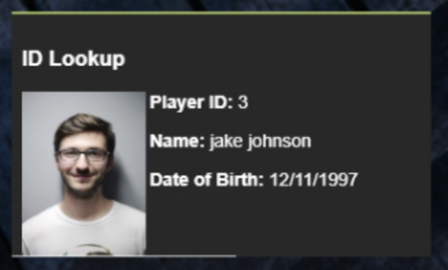

# Civilian Integration


This plugin utilizes API endpoints that require the **plus** version of Sonoran CAD or higher. For more information, view our [pricing ](../../../pricing/faq/)page.



Looking for VPS, web, or dedicated hosting? Check out our official [server hosting](../../../other-products/server-hosting.md)!


This plugin allows players to fetch their character information from the CAD. Basic functionality is provided with the /showid command, but developers are encouraged to use the export for their own creations.



## Installation

### 1. Download and Install the Framework

If you haven't already, be sure to install and configure the [plugin framework](../framework-installation.md) first.

### 2. Download the Plugin and all Dependencies

1. Click [HERE](https://github.com/Sonoran-Software/sonoran\_civintegration/releases/tag/latest) to download the `civilianintegration` plugin .zip file.

### 3. Install the Plugin and all Dependencies

1. Follow the [standard plugin installation guide](../plugin-installation/) for the locations and API check plugin.

### 4. Set Your API ID

Don't forget to set your account [API ID](../../../sonoran-cad/api-integration/getting-started/setting-your-api-id.md) to properly link your in-game user to the CAD.

## Further Configuration

| Option         | Description                                                                 | Default Value |
| -------------- | --------------------------------------------------------------------------- | ------------- |
| cacheTime      | Time to cache characters in seconds                                         | 3600          |
| allowCustomIds | Allow players to use /setid to set a custom name.                           | true          |
| allowPurge     | Allow players to use /refreshid to "purge" their character list from cache. | true          |
| enableIDCardUI | **Recommended**: Allows for a more realistic identification ui with /showid | false         |

## Usage

### Commands

The plugin comes with a few basic commands to show off the functionality.

| Command       | Description                                                                                                                                                  |
| ------------- | ------------------------------------------------------------------------------------------------------------------------------------------------------------ |
| /showid \[id] | Shows the current ID of the specified player ID. If not specified, will show the current player's ID. Currently, it is displayed only to the calling client. |
| /setid        | Sets a custom ID (first/last name, and date of birth). Overrides the currently selected CAD ID. Can be disabled in configuration.                            |
| /resetid      | Resets the custom ID specified above.                                                                                                                        |
| /refreshid    | Removes the "cached" characters for the client. This allows players to swap characters in the CAD without relogging or waiting for the cache timer.          |

### Export

You can use this export to fetch all characters for a specific player ID. This is a server-side export only.

```lua
Function: "GetCharacters"
Parameters:
    player: the player ID
    callback: function to call after fetching the data. Returns an array of character objects.

Example:
    exports["sonorancad"]:GetCharacters(playerId, function(result)
        -- do stuff with result, an array of character objects
    end)
```

This function can also be used in other plugins (without the export bit).
