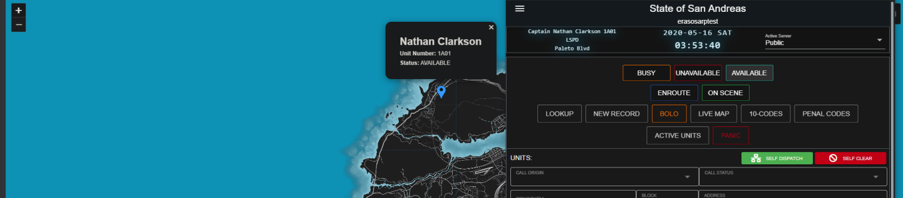
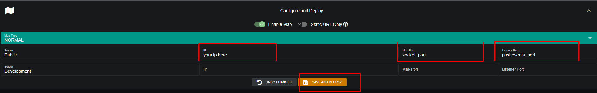
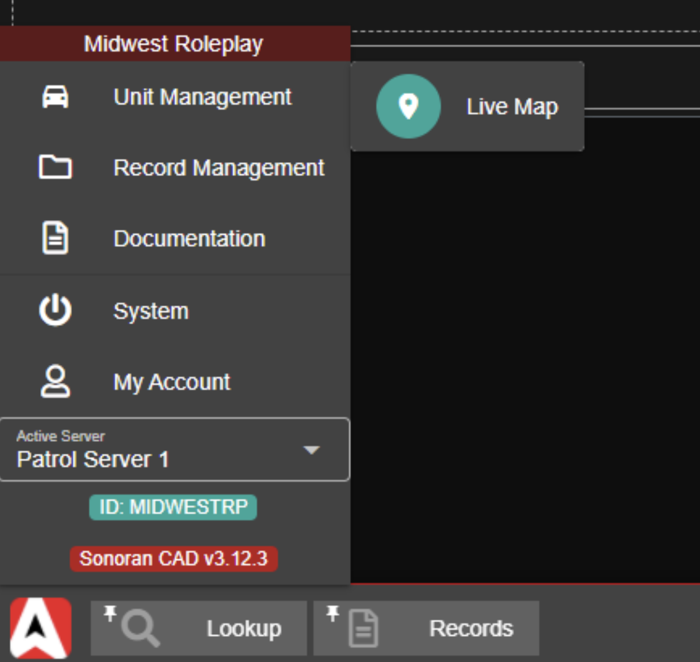

# Live Map


This plugin utilizes API endpoints that require the **plus** version of SonoranCAD or higher. For more information, view our [pricing ](../../../../pricing/faq/)page.



The live map will require you to open **one additional port** on your server.  
**You will need to contact your hosting provider if you are unsure how to do this.**



Looking for VPS, web, or dedicated hosting? Check out our official [server hosting](../../../../sonoran-servers/server-hosting.md)!


## Installation Video

Click to view our [live map installation video](https://youtu.be/dhUCfvdLZ_U).

**Be sure you have already installed our** [**plugin framework**](../../framework-installation.md)**!**

**The live map will only show units that are in your server and also actively logged into the police, fire, or EMS panel in the CAD. Be sure to have your** [**API ID**](../../../../sonoran-cad/api-integration/getting-started/setting-your-api-id.md) **set.**

## Installation Guide

### 1. Download and Install the Framework

If you haven't already, be sure to install and configure the [plugin framework](../../framework-installation.md) first.

### 2. Download the Plugin and all Dependencies

Click [HERE ](https://github.com/Sonoran-Software/sonoran_livemap/releases)to download the live map plugin .zip file.

### 3. Install the Plugin and all Dependencies

Follow the [standard plugin installation guide](../../plugin-installation/) for the live map plugin.

### 4. Configuration

This requires the resource `sonoran_livemap` to be loaded. This is bundled with the base resource.

1. Add a new line for `ensure sonoran_livemap` into your `server.cfg` file.

#### ERROR: Couldn't start resource sonoran\_livemap

Particularly with **Linux**, some users have an additional installation step.

First, run `start webpack` in your server console _before_ running `start sonoran_livemap` in order to build it for the first time. You can `stop webpack` after it has been built.

You will have to do this step whenever the `sonoran_livemap` resource is updated.

#### A. Live Map Configuration

**Convars:**

| Name | Type | Default Value | Description |
| :--- | :--- | ---: | :--- |
| socket\_port | int | 30121 | Sets the port the live map socket server should listen on |
| livemap\_debug | int | 0 | Sets how much information gets printed to the console \(0 = none, 1 = basic information, 2 = all\) |
| blip\_file | string | "server/blips.json" | Sets the file that will contain the generated blips that is exposed via HTTP |
| livemap\_access\_control | string | "\*" | Sets the domain that is allowed to access the blips.json file \(E.g. "[https://example.com](https://example.com)" will only allow the UI on [http://example.com](http://example.com) to get the blips\), "\*" will allow everyone |

All above convars are set via the `set` command in your server config, such as `set socket_port 30000` if you wanted to change the port to 30000. **You DO NOT need to add any of these to your server config if you are not changing them from their default values**, they will use the defaults if there is no convar set.

#### Config File Options

| Config Option | Description |
| :--- | :--- |
| hideNonUnits | If the player isn't logged into the CAD, don't show them |
| refreshTimer | How often to check if units change state \(ms\) |
| enableCallerBlips | Show incoming calls on the map? |
| useCadName | Use in-CAD name for online units? false uses in-game name or ESX name \(if [esxsupport plugin](../esx-support.md) is loaded\) |
| infoDisplayNames | Localization/translation options |

#### B. Admin Panel Configuration


IMPORTANT: You must use an unused port for the map port. It cannot be the same as the port used to connect to your server \(which is by default 30120\).


1. IP: Set IP to the **public** IP address of your server, 
2. Map Port: The port you specified via `socket_port` above or the default, which is `30121`.
3. Click "Save and Deploy" to deploy your live map.

Click Save And Deploy. After a few seconds, the live map should appear as a button on most CAD screens \(Police, Dispatch, etc\) and will auto-update with your unit positions.

#### C. Port Forwarding

You will need to port forward specified in the Map Port.  
This port is accessed by Sonoran CAD to serve position data and view the blips.  
**If you are unsure how to port forward, you will need to contact your hosting provider.**

You can use a [port checker](https://www.yougetsignal.com/tools/open-ports/) to ensure you have properly opened your map port.

### **5**. Set Your API ID

Don't forget to have each community member set their account [API ID](../../../../sonoran-cad/api-integration/getting-started/setting-your-api-id.md) to properly link their in-game user to the CAD.

### **6. Enjoy!**

In the Police, Fire, EMS, or Dispatch window you can now click the "Live Map" button to view your new live map! Selecting a blip will show it's updated position and unit information.

This is found in the task bar's start menu under Unit Management &gt; Live Map  
You can also [pin the live map button to your taskbar](../../../../tutorials/customization/customizing-your-layout.md#7-tab-system) for easy access.

**The live map will only show units that are in your server and also actively logged into the police, fire, or EMS panel in the CAD. Be sure to have your** [**API ID**](../../../../sonoran-cad/api-integration/getting-started/setting-your-api-id.md) **set.**

## When are Player Blips Displayed?

Players will only show on the map when **ALL** of the following conditions are met:

1. The player has their [API ID set in the CAD](../../../../sonoran-cad/api-integration/getting-started/setting-your-api-id.md).
2. The player actively is logged into the police, fire, or EMS page.
3. The player has the [correct server selected in the CAD](../../../../tutorials/customization/configuring-multiple-servers.md), on the top right of the page.
4. The player is actively logged into the server.
5. The player has Steam, Discord, or other identifier type program running:
   * If the server API IDs are based on the Steam HEX, **the player must have Steam running**.
   * If the server API IDs are based on Discord IDs, **the player must have Discord running**.

## Using a Custom Map


This feature requires the **pro** version of SonoranCAD.  
For more information, view our [pricing ](../../../../pricing/faq/)page.


Sonoran CAD allows communities to upload custom map images to the integrated, hosted live map. If your community does not use one of the map types provided, you can upload the images manually.

### 1. Extract Images

Extract the images from the YTD files with a program like OpenIV.  
**You will need six files named exactly as follows:**

`minimap_sea_0_0.png  
minimap_sea_0_1.png  
minimap_sea_1_0.png  
minimap_sea_1_1.png  
minimap_sea_2_0.png  
minimap_sea_2_1.png`

### 2. Upload Images

Navigate to Admin &gt; Advanced &gt; In-Game Integration &gt; Live Map and Push Events  
Select "Upload Custom" and upload all six correctly named files.

### 3. File Size

Custom map images are limited to 30MB each. **However, if you are uploading more than 100MB of images total, you will need to upload in separate batches.**

## Using Different Ports

If you are not using the default map port `30121` you will need to change the configuration.

Your hosting provider may give you other ports, or you may have services already running on these default ports. You will need **one** additional open port not being used by any other service.

1. Navigate to your server's `server.cfg` file.
2. Add the lines to set the convar values to the ports you are using
   * Ex: Your hosting provider opens port `8000` for you to use.
     * `set socket_port 8000` for the live map port.
       * **Make this line is BEFORE/ABOVE your `ensure sonoran_livemap` and `ensure sonorancad` lines in the `server.cfg`.**
3. Update the port in the [admin panel](../../framework-installation.md#5-configure-push-events) setting the new map and listener ports.
4. Save everything, restart your server, and deploy the live map.

**If you are unsure how to open additional ports, you will need to contact your hosting provider.**

You can use a [port checker](https://www.yougetsignal.com/tools/open-ports/) to ensure you have properly opened these ports.

## Troubleshooting

If you're still having issues, check out our troubleshooting steps below:



