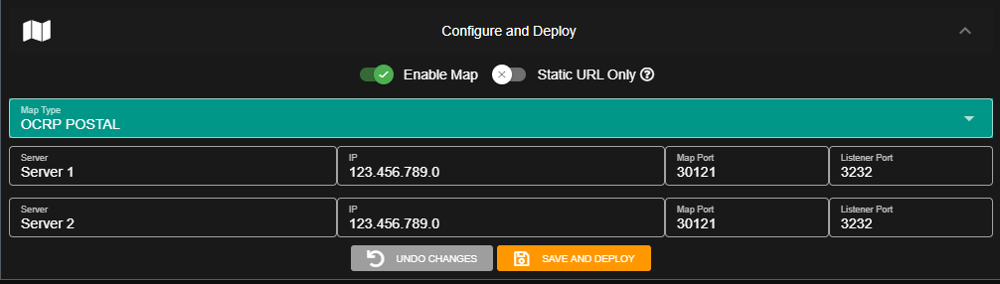

# Push Events


All push events require the **Plus** version of Sonoran CAD or higher. For more information, see our [pricing ](../../../pricing/faq/)page.


This plugin has no end-user functionality and is simply a dependency for other plugins. All features are listed in its [API Integration documentation](../../../sonoran-cad/api-integration/push-events/).

## Installation

### 1. Download and Install the Framework

If you haven't already, be sure to install and configure the [plugin framework](../framework-installation.md) first.

### 2. Download the Plugin

1. Click [HERE ](https://github.com/Sonoran-Software/sonoran_pushevents/releases)to download the push events plugin .zip file.

### 3. Install the Plugin

1. Follow the [standard plugin installation guide](../plugin-installation.md) for the push events plugin.

### 4. Admin Panel Configuration

In the admin panel, navigate to: Advanced &gt; In-Game Integration  
Expand the "Server Events and Integrated Live Map" section.

Enter your server's public IP address and your new listener port. By default, this is port `3232`.

If you have multiple servers you must have a UNIQUE listener port. Changing the default port can be set via the `set` command in your server config, such as `set SonoranListenPort 30000` if you wanted to change the port to 30000.

#### A. Convars

| Name | Type | Default Value | Description |
| :--- | :--- | ---: | :--- |
| SonoranListenPort | int | 3232 | Sets the port the push events listener should listen on |

####  B. Admin Panel Configuration

Set your Listener Port in the admin panel of Sonoran CAD to the default port or the port you changed it to. Learn more about [configuring multiple servers](../../../tutorials/customization/configuring-multiple-servers.md).

### 5. Port Forward

You will need to properly port forward your listener port, by default this is `3232`.  
If you are unsure how to do this, you will need to **contact your hosting provider**.

