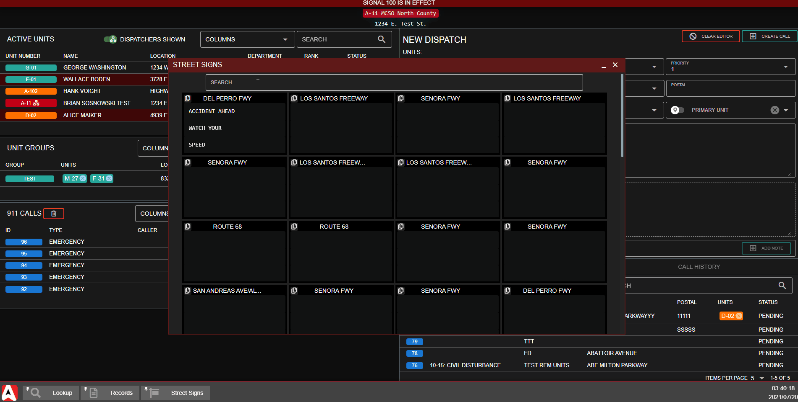

# Smart Signs


This plugin utilizes API endpoints that require the **Pro** version of Sonoran CAD or higher. For more information, view our [pricing ](../../../pricing/faq/)page.



Looking for VPS, web, or dedicated hosting? Check out our official [server hosting](../../../other-products/server-hosting.md)!


## Installation Guide

### 1. Download and Install the Framework

If you haven't already, be sure to install and configure the [plugin framework](../framework-installation.md) first.

### 2. Download the Plugin and all Dependencies

1. Click [HERE ](https://londonstudios.net/smart-signs-sonoran/)to download the free Sonoran CAD Smart Sign plugin .zip file from London Studios.

### 3. Install the Plugin and all Dependencies

1. Follow the [standard plugin installation guide](../plugin-installation/) for the Smart Signs plugin.

### 4. Configure your Sign Locations

In the `config_smartsigns.lua` file, you can specify sign locations and labels.

The smart signs plugin also has support with ESX, VRP, Discord logging, ace permissions, and more. [View the documentation](https://docs.londonstudios.net/#document-6).

### 5. Copy the Stream Assets Folder

The downloaded zip file contains both the `smartsigns` plugin and the `stream` assets folder.

The `stream` assets folder must be copied over to the `[sonorancad]/sonorancad` directory.

### 5.5 TEMPORARY FIX: Update SonoranCAD FXManifest File Manually


The v2.6.3 `fxmanifest.lua` file has a small error in it and the updated file is going to be released soon in v2.6.4.


Please manually update `[sonorancad]/sonorancad/fxmanifest.lua` with the [following file](https://raw.githubusercontent.com/Sonoran-Software/SonoranCADLuaIntegration/v2.6.4-StreamFolder_FolderStructurer_fixes/sonorancad/fxmanifest.lua).

### 6. Set your Game Server IP/Port

In the Admin panel, navigate to Advanced &gt; In-Game Integration &gt; Push Events and Live Map

Ensure your game server's IP and game port are set. The CAD will use this to push sign updates to your server.

### 7. Modifying Signs in the CAD

The street sign panel can be found in both the Dispatch and DMV pages. Users will need the `Modify Street Signs` permissions in order to update them.

Here, you can easily search to filter sign labels. Sign text can also be easily duplicated from one sign to another.

