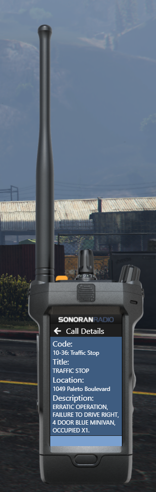

# Sonoran Radio (sonrad)


This plugin utilizes API endpoints that require the **plus **version of Sonoran CAD or higher. For more information, view our [pricing ](../../../pricing/faq/)page.



Looking for VPS, web, or dedicated hosting? Check out our official [server hosting](../../../other-products/server-hosting.md)!


This plugin allows Sonoran Radio customers to connect the radio with the Sonoran CAD. View your unit status, dispatch call information, toggle a panic, and more!

## Installation

### 1. Download and Install the Framework

If you haven't already, be sure to install and configure the [plugin framework](../framework-installation.md) first.

### 2. Download the Plugin and all Dependencies

1. Click [HERE](https://github.com/Sonoran-Software/sonoran\_sonrad/releases/tag/latest) to download the `sonrad` plugin .zip file.
2. Download and install the[ locations ](locations.md)plugin.
3. (Optional) Download and install the[ postal ](postals.md)plugin.

### 3. Install the Plugin and all Dependencies

1. Follow the [standard plugin installation guide](../plugin-installation/) for the locations and API check plugin.

### 4. Set Your API ID

Don't forget to set your account [API ID](../../../sonoran-cad/api-integration/getting-started/setting-your-api-id.md) to properly link your in-game user to the CAD.

## Usage

When you have installed and enabled the plugin in the configuration file, your panic button in the Sonoran Radio will activate your unit's panic on Sonoran CAD. This will also synchronize your current unit status onto the main screen of the Sonoran Radio UI.
