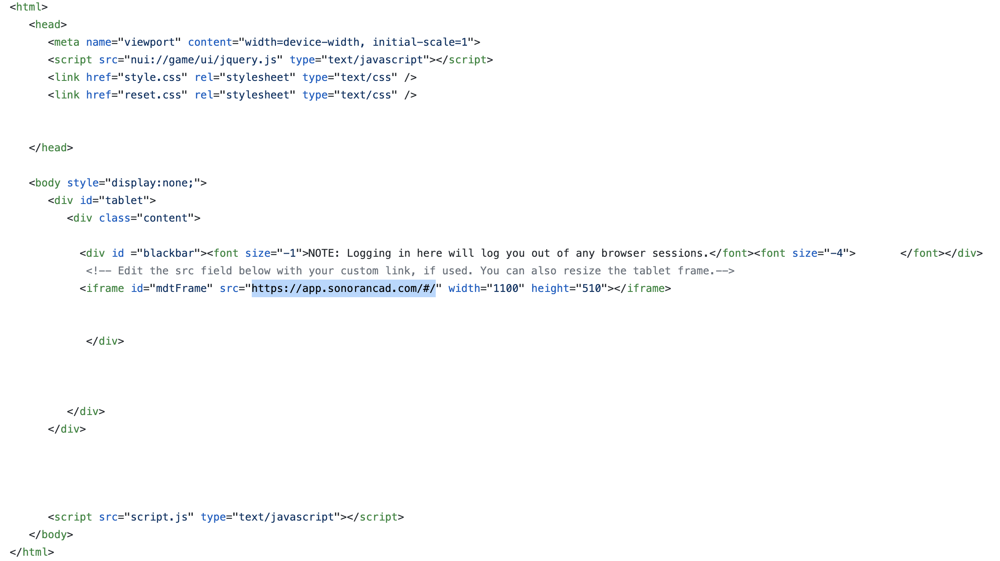

# Tablet


Looking for VPS, web, or dedicated hosting? Check out our official [server hosting](../../../sonoran-servers/server-hosting.md)!


## Installation

### 1. Download and Install the Framework

If you haven't already, be sure to install and configure the [plugin framework](../framework-installation.md) first.  
This resource is included in the base framework.

### 2. Start the Resource

In your `server.cfg` file add the following new line:  
`ensure tablet`

### 3. Edit the index.html File

Open the `tablet/html/index.html` file and paste your custom community URL.  
The easiest way to show your [custom login page](../../../tutorials/customization/custom-login-page.md) is to use a query string.  
  
`https://app.sonorancad.com/#/?comid=YOUR_COMMUNITY_ID_HERE`

Simply replace `YOUR_COMMUNITY_ID_HERE` in the URL with your [community ID](../../../tutorials/getting-started/finding-your-community-id-and-authentication-code.md).  
EX: `https://app.sonorancad.com/#/comid?=dojrp`

### 4. In-Game Command

Use the `/showcad` command in-game to toggle your tablet. You can also add a custom keybind to open the tablet by going to `GTA Settings > Keybinds > FiveM`

### 5. Auto API ID

When a user signs into the CAD using the in-game tablet, their[ API ID](../../../sonoran-cad/api-integration/getting-started/setting-your-api-id.md) can be automatically be set in the CAD.

To enable this, open the [check API plugin](api-id-checker.md)'s config and set `forceSetApiId` to `true`.

