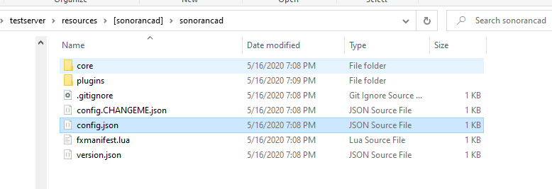

# Framework Installation


All Sonoran CAD integration plugins require the **standard** version of Sonoran CAD or higher. For more information, see our [pricing ](../../pricing/faq/)page.


## Installation Video

View our [installation tutorial video](https://youtu.be/EsQWGnyrvm8) for help on installing our framework.

## Installation Guide

### 1. Download Release

Download the[ latest zip file from our Github.](https://github.com/Sonoran-Software/SonoranCADLuaIntegration/releases)

### 2. Extract

![Extract the zip file into your resources directory. Keep the \[sonorancad\] folder intact.](../../.gitbook/assets/2.png)


If you already have `pNotify` or the `wk_wars2x` resource, remove them from your resources folder and use the Sonoran CAD plugin version.


### 3. Configure and Rename

Open `sonorancad\config.CHANGEME.json`, update the values, then save it as `config.json`. Default configuration is below:

```javascript
{
    "communityID": "",
    "apiKey": "",
    "apiUrl": "https://api.sonorancad.com/",
    "postTime": 5000,
    "serverId": "1",
    "serverType": "standalone",
    "primaryIdentifier": "steam",
    "apiSendEnabled": true,
    "debugMode": false,
    "updateBranch": "master",
    "statusLabels": ["UNAVAILABLE", "BUSY", "AVAILABLE", "ENROUTE", "ON_SCENE"]
}
```



#### Configuration Details

| Option | Description |
| :--- | :--- |
| communityID | Your SonoranCAD [Community ID](../../tutorials/getting-started/finding-your-community-id-and-authentication-code.md). |
| apiKey | [API Key](../../sonoran-cad/api-integration/getting-started/retrieving-your-credentials.md) from your In-Game Integration settings. |
| postTime | Update locations every x ms. Default 5000. It is recommend to not set this lower than 5000 ms due to rate limiting. |
| serverId | If using [multiple servers](../../tutorials/customization/configuring-multiple-servers.md) in Sonoran CAD, specify the ID here. |
| serverType | Can be `"standalone"`or `"esx"`, which enables some ESX-specific configuration. |
| primaryIdentifier | The identifier type your community uses in the CAD to enter their API IDs. Valid values are: `license`, `steam`, or `discord.` |
| apiSendEnabled | When disabled, the integration will not send any API requests to SonoranCAD. |
| debugMode | When set to `true`, useful debugging information it outputted to the console. Keep disabled in production due to console spam. This can be toggled by entering `sonoran debugmode` in console. |
| updateBranch | Use this branch when checking for updates. Keep `master` unless you know what you're doing. |
| statusLabels | Should match what you have set in your CAD's [unit status code](../../tutorials/customization/unit-status-codes.md) settings. |

### 4. Server Config

Add the following to your `server.cfg` \(if you don't want pNotify or wraith, leave those out\):

```javascript
ensure pNotify
ensure wk_wars2x
ensure sonorancad
```


If you are **NOT**using **ESX**, modify `fxmanifest.lua` and remove `mysql-async`.


### 5. Installing Plugins

Check out our [Available Plugins](available-plugins/) to make the integration useful.  
For basic functionality, we recommend at least the [`locations`](available-plugins/locations.md), [`callcommands`](available-plugins/call-commands.md), and [`postals`](available-plugins/postals.md) plugins.  
You can also view our [standard plugin installation guide](plugin-installation/).

