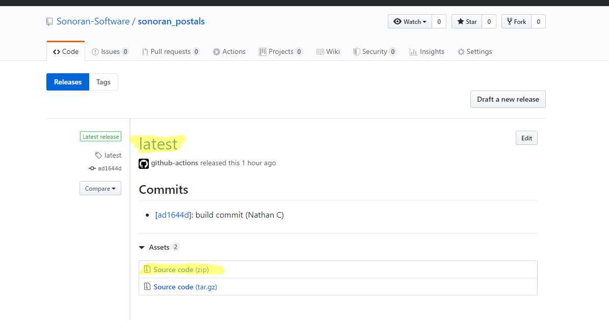
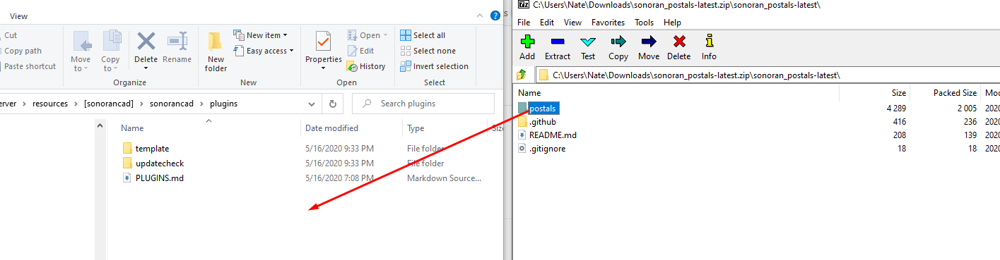
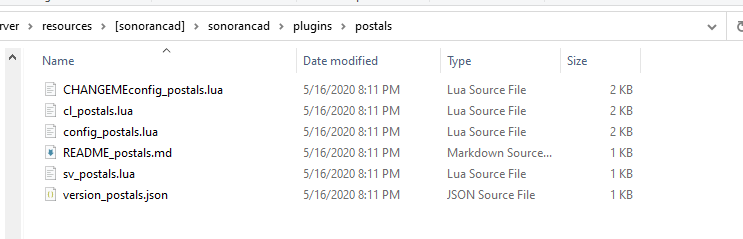

# Plugin Installation


All Sonoran CAD integration plugins require the **standard** version of Sonoran CAD or higher. For more information, see our [pricing ](../../pricing/faq/)page.


## Installing a Plugin

This example uses the postals plugin.

**If you have not already installed the** [**plugin framework**](framework-installation.md)**, please do so before continuing.**

### 1. Download

Download the plugin from its repository. These are found under its plugin page, like [here](available-plugins/postals.md) for the postals plugin.

### 2. Extract

Extract the plugins to your `sonorancad\plugins` folder.

### 3. Configure and Enable the Config

1. Open the `CHANGEMEconfig_postals.lua` file \(name depends on the plugin\) and configure as desired. The files are usually commented, and more details are on its [plugin page](available-plugins/postals.md). 
2. Enable the plugin by uncommenting the last line in the plugin config.


**Be sure to un-comment the last line of the config file to enable it!**  
To un-comment the last line, remove the -- characters.  
  
**Change:**  
`--Config.RegisterPluginConfig(config.pluginName, config)`  
**To:**  
`Config.RegisterPluginConfig(config.pluginName, config)`


2. Rename and remove the `CHANGEME` from the file to`config_postals.lua` \(depending on name of plugin\).

### 4. Restart Sonoran CAD

Restart the `sonorancad` resource by entering `restart sonorancad` in the console and enjoy your new plugin!

