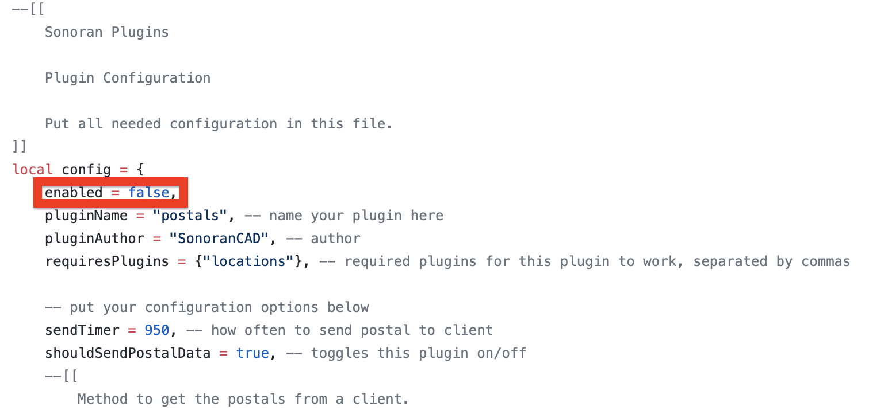

# Plugin Installation


All Sonoran CAD integration plugins require the **standard** version of Sonoran CAD or higher. For more information, see our [pricing ](../../../pricing/faq/)page.



Looking for VPS, web, or dedicated hosting? Check out our official [server hosting](../../../other-products/server-hosting.md)!  
Sonoran Servers customers receive **free plugin installation** and **30% off** their monthly CAD subscription!


## Installation Video

View our [framework installation](https://youtu.be/EsQWGnyrvm8) video also covers the installation of a standard plugin \([Unit Status](../available-plugins/unit-status.md)\).

## Installing a Plugin

This example uses the postals plugin.

**If you have not already installed the** [**plugin framework**](../framework-installation.md)**, please do so before continuing.**

### 1. Download

Download the plugin from its repository. These are found under its plugin page, like [here](../available-plugins/postals.md) for the postals plugin.

### 2. Extract

Extract the plugins to your `sonorancad\plugins` folder.

### 3. Configure and Enable the Config

1. **Open** the `CHANGEMEconfig_postals.lua` file \(name depends on the plugin\) and configure as desired. The files are usually commented, and more details are on its [plugin page](../available-plugins/postals.md). 
2. **Enable** the plugin by changing the `enabled` variable from `false` to `true` in the plugin config.

2. **Rename** and remove the `CHANGEME` from the file to`config_postals.lua` \(depending on name of plugin\).

### 4. Restart Sonoran CAD

Restart the `sonorancad` resource by entering `restart sonorancad` in the console and enjoy your new plugin!

## Updates

Sonoran CAD's integration framework and plugins will automatically update with the latest features, fixes, and changes!

Or, run `sonoran pluginupdate` to instantly check and update all plugins.

## Having Trouble?

If you're having trouble installing a plugin, check out our common troubleshooting guide:



