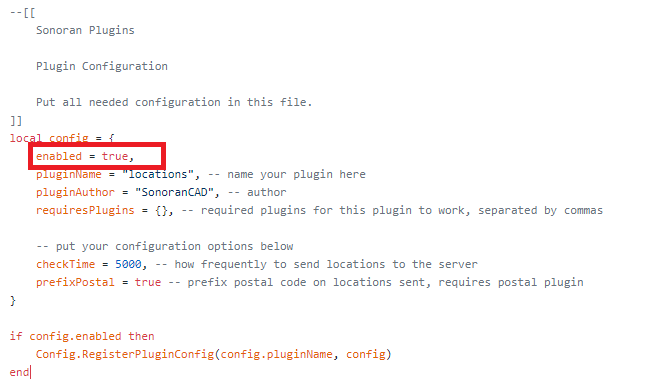
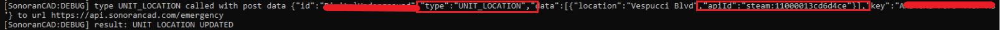

# Plugin Troubleshooting

## Quick Checks

### 1. Ensure your community is on a paid version.

Your community's subscription may have expired and failed to renew. Do a quick check on your [community limits](../../../tutorials/getting-started/view-your-limits.md) to make sure your community version includes the plugin you are trying to install.


Each plugin install guide lists the required subscription version at the top.


### 2. Ensure your plugin is enabled in the configuration file.

Be sure to follow the [framework installation](../framework-installation.md) and [plugin installation](./) guides thoroughly, depending on the plugin you are trying to install.  
Make sure you have not forgotten to enable the plugin!

### 3. Ensure your plugin is up-to-date and download the latest release.

### 4. Ensure your API ID is set correctly.

Ensure you have set your [API ID in the CAD](../../../sonoran-cad/api-integration/getting-started/setting-your-api-id.md) using the value from the [API ID plugin](../available-plugins/api-id-checker.md).

## Debug Mode

The plugin framework includes a powerful debug mode. Enable this by entering `caddebug` into your server console.

Debug mode will print out additional error information and JSON data for all API calls or push events.

### 1. Check your API ID:

For plugins that require your individual CAD user account to have the API ID set \(live map, unit locations, panic, etc.\) you can view this data in the console output.

The image below shows an API Call being made from the server to Sonoran CAD. This API call is type `UNIT_LOCATION` and includes all the data necessary.

Ensure the `APIID` listed in the API call matches the [API ID set in your CAD's user account](../../../sonoran-cad/api-integration/getting-started/setting-your-api-id.md).

### 2. Check the Community ID and API Key

Your community ID and API key is also listed in the debug API call information. Be sure that the [community ID and API key](../../../sonoran-cad/api-integration/getting-started/retrieving-your-credentials.md) are correct.

## Live Map and Push Events

For live map and push event troubleshooting, see our dedicated guide here:



## Still Having Trouble?

If you're still having trouble, our dedicated support team is here to help.

[Reach out to us and generate a support ticket at any time](https://support.sonoransoftware.com).

