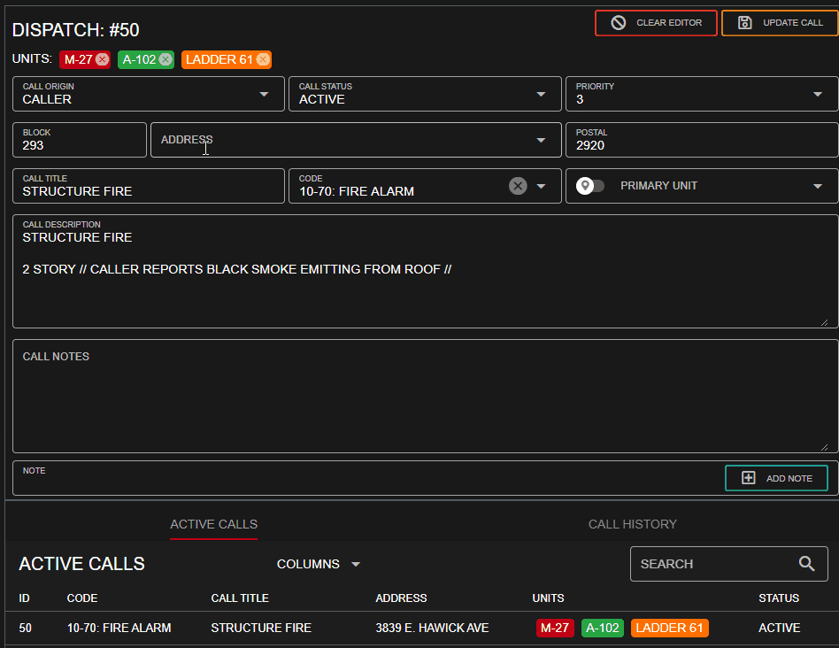

# 🎮 Roblox ER:LC

.png>)


These **** features utilize API endpoints that require the **standard** version of Sonoran CAD or higher. You can view the specific version requirements [listed under each feature](roblox-er-lc.md#in-game-commands-and-features), or [view our pricing page](../pricing/faq/) for more information.


## What is ER:LC?

Emergency Response Liberty County is the largest Roblox RP game mode. Play as a Civilian, criminal, transportation worker, police officer, sheriff deputy, or firefighter!

We're excited to support the following in-game integration options with ER:LC

* Live Map
* Live unit locations
* Traffic stop command
* In-game plate search
* In-game name search
* Panic command
* Automated emergency calls for fires and robberies
* In-game 911 calls sent to Sonoran CAD
* and more!

## Getting Started

### ER:LC Video Tutorial

Check out ER:LC's official Sonoran CAD tutorial for more info!



### For Server Owners


ER:LC's Sonoran CAD integration can only be setup by the **server owner** on a **private server**.


#### 1. Retrieve your Community ID and API Key

In Sonoran CAD, navigate to the admin menu > `Advanced` > `In-Game Integration` > `Web API`

Copy your community ID and API key, you'll need to enter these in Roblox.

 (1).png>)

.png>)

#### 2. Access the Server Owner Menu

Once you've joined your private server as the owner, click the menu on the top right of your screen.

.png>)

#### 3. Edit the Server Settings

Select `Edit Server Settings` in the menu.

.png>)

#### 4. Enter your Community ID and API Key

Select `Edit` and paste in your Sonoran CAD community ID and API key.

 (1).png>)

 (1) (1).png>)

### For Community Members

#### 1. Access the Local Settings Menu

At the top right of your screen, select the gear icon to open your local settings menu.

 (1) (1).png>)

#### 2. Copy your API ID

Then, select `View Your API ID` and copy your in-game API ID.

 (1).png>)

 (1).png>)

#### 3. Add Your API ID to Sonoran CAD

From the community menu select the `Settings` modal.

Select `New` under API ID and paste in your Roblox API ID.

.png>)

.png>)

## In-Game Commands and Features

### Live Map


This feature utilizes API endpoints that require the **plus** version of Sonoran CAD or higher.

Please [view our pricing page](../pricing/faq/) for more information.


#### 1. Set the Map Type

In the admin menu, navigate to > `Advanced` > `Server Events and Integrated Live Map`

Enable the map and set the type to `ER:LC ROBLOX`.

#### 2. View the Live Map

In the dispatch page (or with self-dispatch enabled) you can open the live map window under `Unit Management` > `Live Map`

The map allows you to zoom in or out, select different street, building, and postal overlays, and more! Hover over a unit icon for more information.

Once you have [added your Roblox API ID](roblox-er-lc.md#for-community-members) to the CAD, your unit location in-game will be updated as you move around the map.

.png>)

### Unit Locations


This feature utilizes API endpoints that require the **standard** version of Sonoran CAD or higher.

Please [view our pricing page](../pricing/faq/) for more information.


Once you have [added your Roblox API ID](roblox-er-lc.md#for-community-members) to the CAD, your unit location in-game will be updated as you move around the map.

### Plate Search


This feature utilizes API endpoints that require the **plus** version of Sonoran CAD or higher.

Please [view our pricing page](../pricing/faq/) for more information.


| Command                | Description        |
| ---------------------- | ------------------ |
| `/sp <plate>`          | Run a plate search |
| `/searchplate <plate>` | Run a plate search |

Ex: `/sp abc1234`

Once you have [added your Roblox API ID](roblox-er-lc.md#for-community-members) to the CAD, running a pate search in-game will automatically pop up the results on your CAD screen.

### Name Search


This feature utilizes API endpoints that require the **plus** version of Sonoran CAD or higher.

Please [view our pricing page](../pricing/faq/) for more information.


| Command              |                   |
| -------------------- | ----------------- |
| `/sn <name>`         | Run a name lookup |
| `/searchname <name>` | Run a name lookup |

Ex: `/sn Brian Sauce`

Once you have [added your Roblox API ID](roblox-er-lc.md#for-community-members) to the CAD,  running a name search in-game will automatically pop up the results on your CAD screen.

### Traffic Stop


This feature utilizes API endpoints that require the **plus** version of Sonoran CAD or higher.

Please [view our pricing page](../pricing/faq/) for more information.


| Command               | Description                                          |
| --------------------- | ---------------------------------------------------- |
| `/ts <info>`          | Creates and attaches you to a traffic stop dispatch  |
| `/trafficstop <info>` | Creates and attaches you to a traffic stop dispatch  |

Ex: `/ts Red Tahoe, ABC123`

Once you have [added your Roblox API ID](roblox-er-lc.md#for-community-members) to the CAD, running the traffic stop command will automatically create and attach you to a new dispatch call with your information.

Note: Don't include your location in the traffic stop info, the command will automatically add this to the call.

### 911 Calls


This feature utilizes API endpoints that require the **standard** version of Sonoran CAD or higher.

Please [view our pricing page](../pricing/faq/) for more information.


| Command           | Description                                 |
| ----------------- | ------------------------------------------- |
| `/setname <name>` | Sets a roleplay name used when calling 911. |

Using your cell phone in-game, you can call emergency services. This 911 call will be sent directly to Sonoran CAD.

### Automated Alarms


This feature utilizes API endpoints that require the **plus** version of Sonoran CAD or higher.

Please [view our pricing page](../pricing/faq/) for more information.


Automated alarms from fire alarms or robberies will also be automatically sent to the CAD's emergency call section.

### Panic


This feature utilizes API endpoints that require the **standard** version of Sonoran CAD or higher.

Please [view our pricing page](../pricing/faq/) for more information.


| Command  | Description                      |
| -------- | -------------------------------- |
| `/panic` | Toggles your unit's panic status |

Additionally, you can also use the desktop application's [panic hotkey](../tutorials/other-features/configurable-hotkeys.md).

## Auto-Complete Street Addresses


This feature utilizes API endpoints that require the **plus** version of Sonoran CAD or higher.

Please [view our pricing page](../pricing/faq/) for more information.


Sonoran CAD allows you to import the street addresses from your game to auto-complete in new dispatch calls, custom reports, and more!

We've [created a list](https://docs.google.com/spreadsheets/u/1/d/1jDUxfCffxyGHoXQ-rpzrWRNFEhDmMs3-TA9U-mdNBjg/copy) specifically for ER:LC! [Learn more about importing these street addresses](roblox-er-lc.md#undefined).

