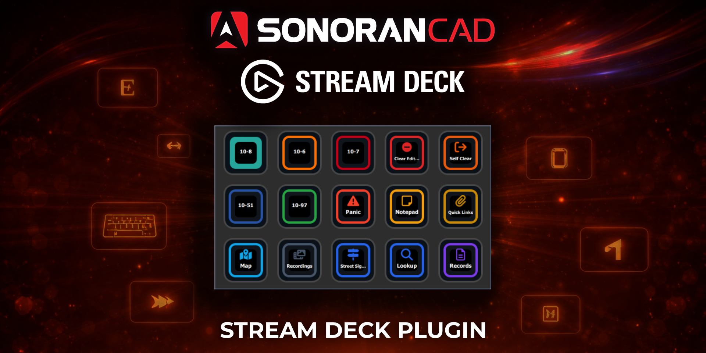
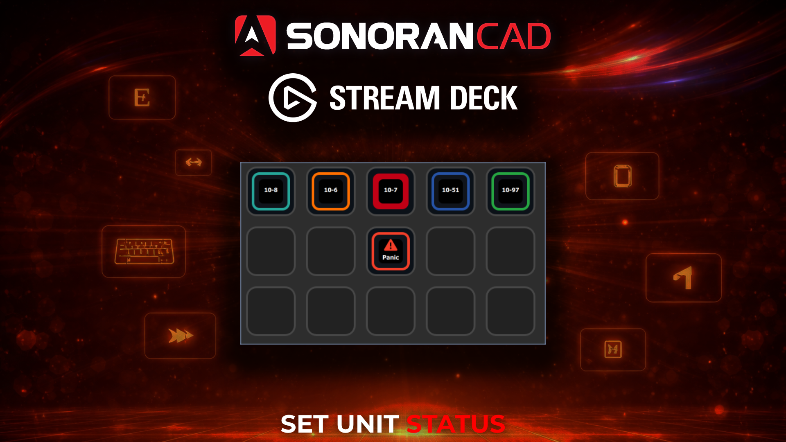
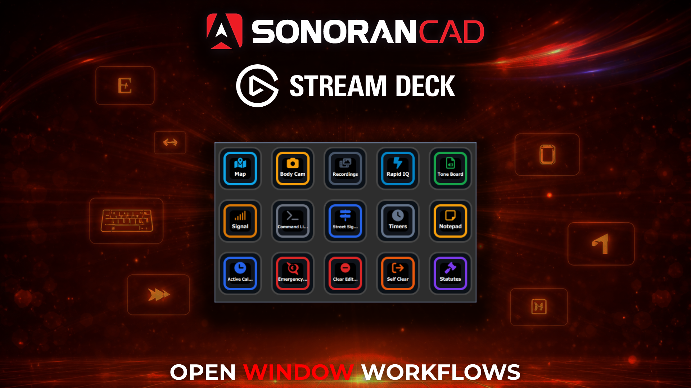
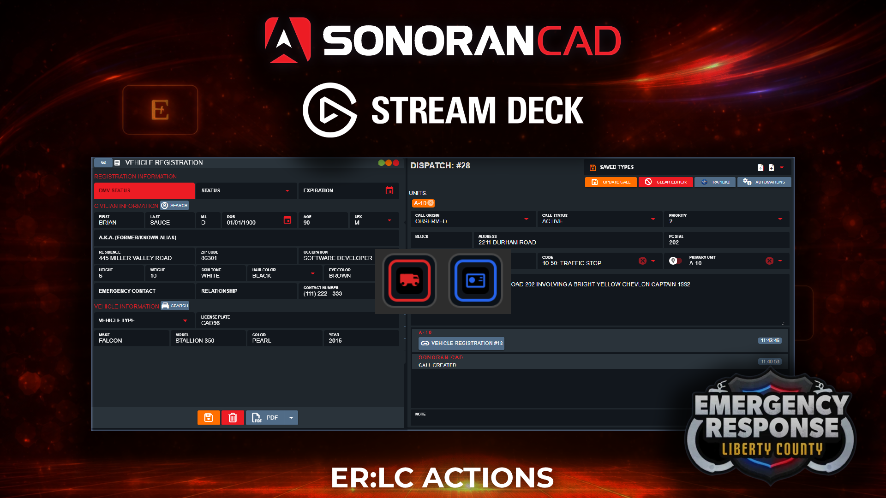

# ⌨️ Stream Deck Plugin

<figure><figcaption></figcaption></figure>

<figure><figcaption></figcaption></figure> <figure><figcaption></figcaption></figure> <figure><figcaption></figcaption></figure>

## Introduction

Sonoran CAD's MacOS and Windows desktop applications offer direct integration with Stream Deck hardware. By installing our official Stream Deck plugin, users can customize layouts and buttons to control their CAD faster than ever before.

## Installation

### 1. Download and Install the Plugin

Download the official Sonoran CAD Stream Deck plugin.

### Via Stream Deck Plugin Store


Coming soon!


### Via Manual Download Link

[Click to download the Stream Deck plugin.](https://download.sonoransoftware.com/sonoransoftware/sonorancad/streamdeck-plugin/sonoran-cad.streamDeckPlugin)

### Install The Plugin

Once downloaded, click on the plugin to install it on your Stream Deck desktop application.

<figure><figcaption></figcaption></figure>

### 2. Configure Actions

Using the Stream Deck desktop application search for **Sonoran CAD** in the **Keys** section.

Drag-and-drop actions like status changes, call editor buttons, or other window macros to your Stream Deck layout.

<figure><figcaption></figcaption></figure>

## Action Capabilities

### Status

Status buttons will automatically change labels based on your community's custom status buttons. Your current status option will show as a filled outline when selected.

* **Available**
* **Busy**
* **Unavailable**
* **Enroute**
* **On Scene**

### Panic

The **Panic** button will toggle your unit's panic status.

The button will change from outlined to filled when a panic mode is active.

### Open Window

When pressed, these actions will open the corresponding window in the CAD.

* **3D Live Map -** [**FiveM**](in-game-integration/fivem-installation/available-plugins/live-map.md) **or** [**ER:LC**](erlc/3d-live-map.md)
* [**Body Cam**](erlc/bodycam.md)
* [**Body Cam Recordings**](erlc/bodycam.md#recording)
* [**Tone Board**](../tutorials/customization/tone-board.md)
* [**Rapid IQ**](../tutorials/dispatching/rapid-iq.md)
* [**Command Line**](../tutorials/dispatching/command-line-interface-cli.md)
* [**Street Signs**](in-game-integration/fivem-installation/available-plugins/smart-signs.md)
* [**Lookup**](../tutorials/records-management/searching-for-records.md)
* [**Records**](../tutorials/records-management/)
* [**10-Codes**](../tutorials/customization/10-codes.md)
* [**Penal Codes**](../tutorials/customization/penal-codes.md)
* [**Quick Links**](../tutorials/customization/quick-links.md)
* **BOLOs**
* **Active Calls** (When in Self Dispatch Mode)
* **Emergency Calls** (When in Self Dispatch Mode)
* **Signal**
* **Timers**
* **Notepad**
* **Clear Dispatch Editor**
* **Self-Clear (Detach from Call)**

### ER:LC Actions

Pressing these action buttons will perform the ER:LC integration action

* [**Traffic Stop**](erlc/traffic-stops.md)
* [**Plate Reader**](erlc/plate-reader.md)
